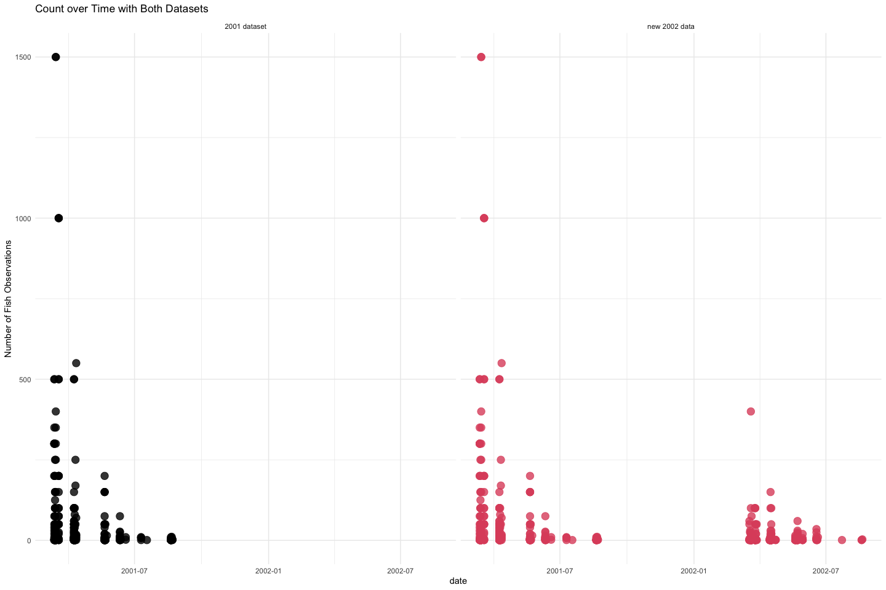
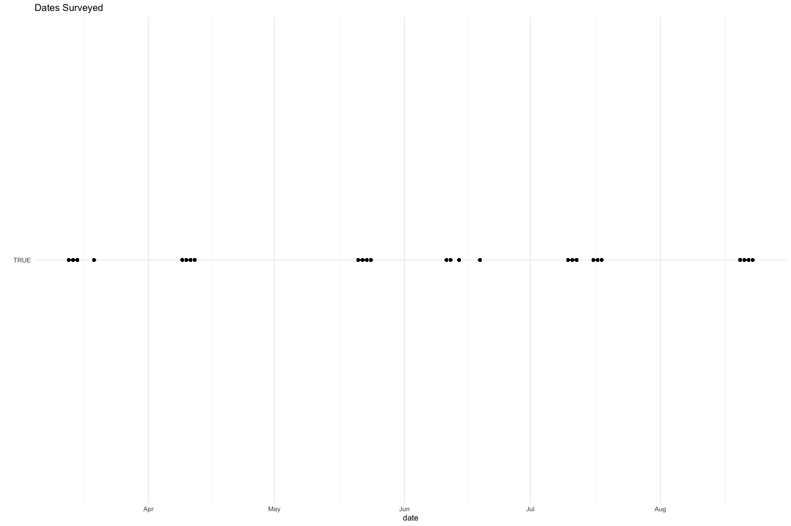
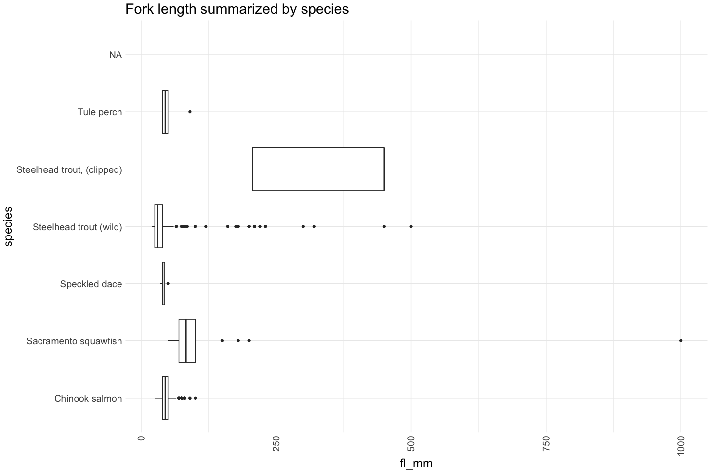
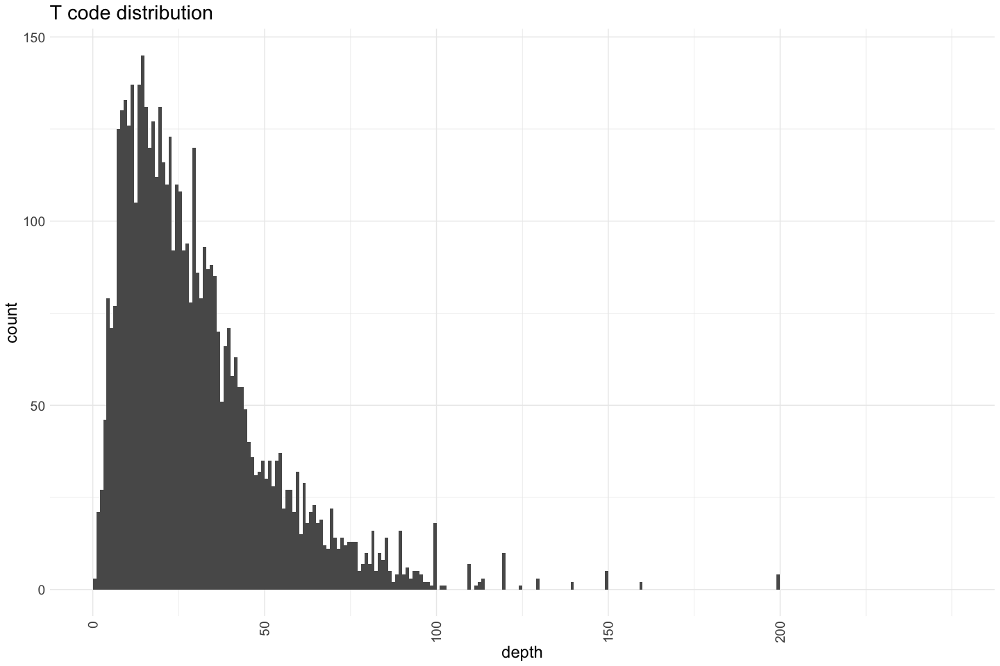
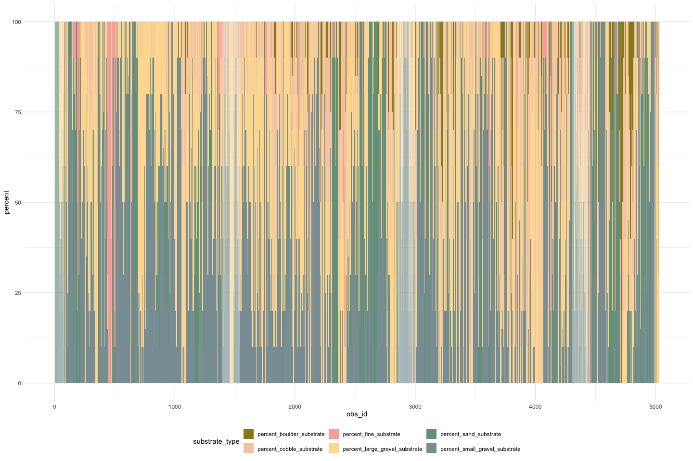
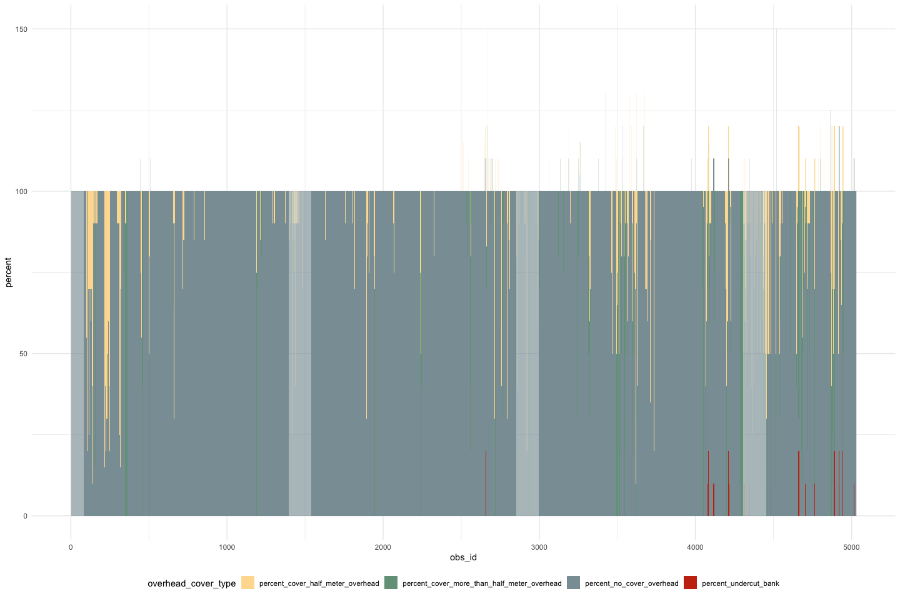
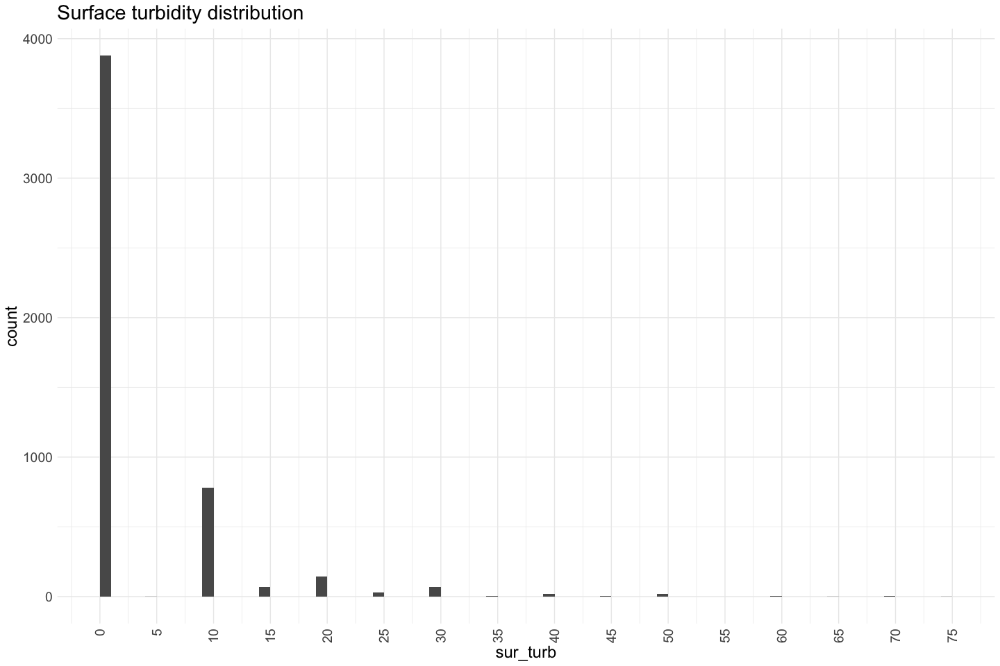
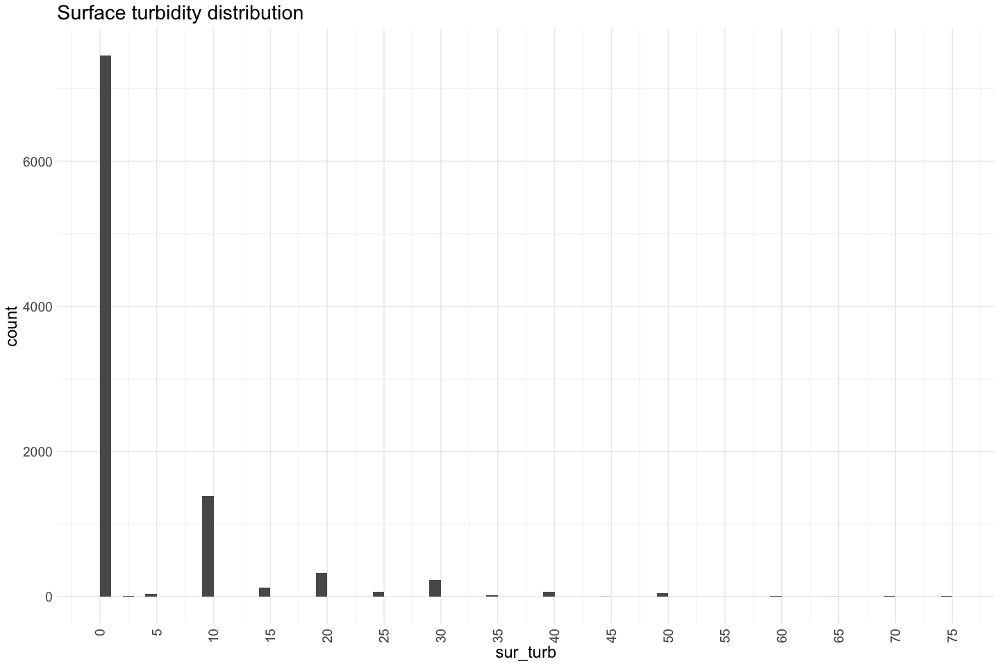
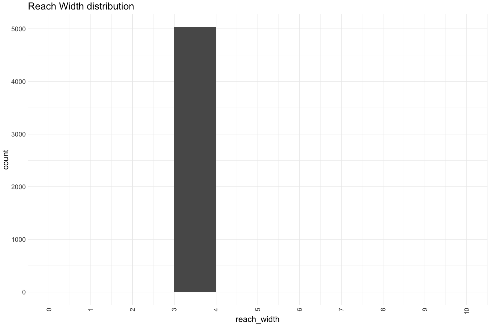

Feather River Mini Snorkel Data QC
================
Erin Cain; Maddee Rubenson
03/24; updated: July 23, 2024

# Feather River Mini Snorkel Data - 2001

## Description of Monitoring Data

Two databases were provided containing data for 2001 and 2002 with some
overlap. This markdown will reconcile these datasets into one complete
dataset.

**Timeframe:** March 2001 - August 2001 & March 2001 - August 2002

**Completeness of Record throughout timeframe:** fairly complete

**Sampling Location:** Feather River

**Data Contact:** Ryon Kurth

## Source Database pull

``` r
source(here::here('data-raw', 'query_4mac.R'))
```

    ## 
    ## Attaching package: 'Hmisc'

    ## The following objects are masked from 'package:dplyr':
    ## 
    ##     src, summarize

    ## The following objects are masked from 'package:base':
    ## 
    ##     format.pval, units

    ## Rows: 378
    ## Columns: 31
    ## $ PhysDataTblID  <labelled> 11, 11, 11, 11, 11, 11, 11, 11, 11, 11, 11, 11, 11…
    ## $ Location       <labelled> "hatchery ditch", "hatchery ditch", "hatchery ditc…
    ## $ Date           <labelled> 2001-03-14, 2001-03-14, 2001-03-14, 2001-03-14, 20…
    ## $ RiverMile      <labelled> 66.6, 66.6, 66.6, 66.6, 66.6, 66.6, 66.6, 66.6, 66…
    ## $ SpeciesCode    <labelled> "CHN", "RBTS", "CHN", "CHN", "RBTS", "CHN", "CHN",…
    ## $ Count          <labelled> 1, 1, 50, 6, 3, 8, 15, 2, 5, 75, 2, 3, 1, 2, 3, 10…
    ## $ FL..mm.        <labelled> 40, 25, 40, 75, 25, 50, 40, 25, 45, 45, 35, 35, 25…
    ## $ DistToBottom   <labelled> 5.0, 1.0, 5.0, 5.0, 1.0, 1.0, 1.0, 1.0, 1.0, 5.0, …
    ## $ Focal.Velocity <labelled> 0.51, 0.64, 1.08, 0.80, 0.44, 0.18, 0.50, 0.50, 0.…
    ## $ TCode          <labelled> 3.4, 6.4, 6.4, 6.4, 9.4, 12.4, 12.4, 12.4, 18.4, 2…
    ## $ Depth          <labelled> 9, 37, 37, 37, 15, 19, 19, 19, 23, 13, 17, 17, 17,…
    ## $ Velocity       <labelled> 1.97, 0.91, 0.91, 0.91, 2.17, 1.01, 1.01, 1.01, 0.…
    ## $ Sub1           <labelled> 0, 0, 0, 0, 0, 0, 0, 0, 0, 0, 0, 0, 0, 0, 0, 0, 0,…
    ## $ Sub2           <labelled> 0, 65, 65, 65, 10, 40, 40, 40, 15, 0, 40, 40, 40, …
    ## $ Sub3           <labelled> 70, 25, 25, 25, 90, 60, 60, 60, 70, 85, 20, 20, 20…
    ## $ Sub4           <labelled> 30, 10, 10, 10, 0, 0, 0, 0, 15, 15, 30, 30, 30, 20…
    ## $ Sub5           <labelled> 0, 0, 0, 0, 0, 0, 0, 0, 0, 0, 10, 10, 10, 0, 0, 0,…
    ## $ Sub6           <labelled> 0, 0, 0, 0, 0, 0, 0, 0, 0, 0, 0, 0, 0, 0, 0, 0, 0,…
    ## $ IcovA          <labelled> 100, 100, 100, 100, 100, 100, 100, 100, 100, 90, 7…
    ## $ IcovB          <labelled> 0, 0, 0, 0, 0, 0, 0, 0, 0, 0, 15, 15, 15, 0, 20, 0…
    ## $ IcovC          <labelled> 0, 0, 0, 0, 0, 0, 0, 0, 0, 0, 0, 0, 0, 0, 40, 0, 0…
    ## $ IcovE          <labelled> 0, 0, 0, 0, 0, 0, 0, 0, 0, 10, 10, 10, 10, 0, 30, …
    ## $ IcovF          <labelled> 0, 0, 0, 0, 0, 0, 0, 0, 0, 0, 0, 0, 0, 0, 0, 0, 0,…
    ## $ Ocov0          <labelled> 100, 100, 100, 100, 100, 100, 100, 100, 100, 100, …
    ## $ Ocov1          <labelled> 0, 0, 0, 0, 0, 0, 0, 0, 0, 0, 0, 0, 0, 0, 0, 0, 0,…
    ## $ Ocov2          <labelled> 0, 0, 0, 0, 0, 0, 0, 0, 0, 0, 0, 0, 0, 0, 0, 0, 0,…
    ## $ SurTurb        <labelled> 10, 30, 30, 30, 20, 30, 30, 30, 10, 10, 20, 20, 20…
    ## $ CGU            <labelled> "g", "g", "g", "g", "g", "g", "g", "g", "g", "g", …
    ## $ Distance       <labelled> 4, 4, 4, 4, 4, 4, 4, 4, 4, 4, 1, 1, 1, 3, 1, 4, 4,…
    ## $ FishAge        <labelled> 0, 0, 0, 0, 0, 0, 0, 0, 0, 0, 0, 0, 0, 0, 0, 0, 0,…
    ## $ SpecAge        <labelled> "chn0", "rbt0", "chn0", "chn0", "rbt0", "chn0", "c…

    ## Rows: 378 Columns: 31

    ## ── Column specification ────────────────────────────────────────────────────────
    ## Delimiter: ","
    ## chr   (4): Location, SpeciesCode, CGU, SpecAge
    ## dbl  (26): PhysDataTblID, RiverMile, Count, FL..mm., DistToBottom, Focal.Vel...
    ## date  (1): Date
    ## 
    ## ℹ Use `spec()` to retrieve the full column specification for this data.
    ## ℹ Specify the column types or set `show_col_types = FALSE` to quiet this message.

    ## Rows: 378
    ## Columns: 31
    ## $ PhysDataTblID  <dbl> 11, 11, 11, 11, 11, 11, 11, 11, 11, 11, 11, 11, 11, 11,…
    ## $ Location       <chr> "hatchery ditch", "hatchery ditch", "hatchery ditch", "…
    ## $ Date           <date> 2001-03-14, 2001-03-14, 2001-03-14, 2001-03-14, 2001-0…
    ## $ RiverMile      <dbl> 66.6, 66.6, 66.6, 66.6, 66.6, 66.6, 66.6, 66.6, 66.6, 6…
    ## $ SpeciesCode    <chr> "CHN", "RBTS", "CHN", "CHN", "RBTS", "CHN", "CHN", "RBT…
    ## $ Count          <dbl> 1, 1, 50, 6, 3, 8, 15, 2, 5, 75, 2, 3, 1, 2, 3, 10, 20,…
    ## $ FL..mm.        <dbl> 40, 25, 40, 75, 25, 50, 40, 25, 45, 45, 35, 35, 25, 35,…
    ## $ DistToBottom   <dbl> 5.0, 1.0, 5.0, 5.0, 1.0, 1.0, 1.0, 1.0, 1.0, 5.0, 1.0, …
    ## $ Focal.Velocity <dbl> 0.51, 0.64, 1.08, 0.80, 0.44, 0.18, 0.50, 0.50, 0.50, 0…
    ## $ TCode          <dbl> 3.4, 6.4, 6.4, 6.4, 9.4, 12.4, 12.4, 12.4, 18.4, 24.4, …
    ## $ Depth          <dbl> 9, 37, 37, 37, 15, 19, 19, 19, 23, 13, 17, 17, 17, 19, …
    ## $ Velocity       <dbl> 1.97, 0.91, 0.91, 0.91, 2.17, 1.01, 1.01, 1.01, 0.78, 1…
    ## $ Sub1           <dbl> 0, 0, 0, 0, 0, 0, 0, 0, 0, 0, 0, 0, 0, 0, 0, 0, 0, 40, …
    ## $ Sub2           <dbl> 0, 65, 65, 65, 10, 40, 40, 40, 15, 0, 40, 40, 40, 30, 7…
    ## $ Sub3           <dbl> 70, 25, 25, 25, 90, 60, 60, 60, 70, 85, 20, 20, 20, 50,…
    ## $ Sub4           <dbl> 30, 10, 10, 10, 0, 0, 0, 0, 15, 15, 30, 30, 30, 20, 0, …
    ## $ Sub5           <dbl> 0, 0, 0, 0, 0, 0, 0, 0, 0, 0, 10, 10, 10, 0, 0, 0, 0, 0…
    ## $ Sub6           <dbl> 0, 0, 0, 0, 0, 0, 0, 0, 0, 0, 0, 0, 0, 0, 0, 0, 0, 0, 0…
    ## $ IcovA          <dbl> 100, 100, 100, 100, 100, 100, 100, 100, 100, 90, 75, 75…
    ## $ IcovB          <dbl> 0, 0, 0, 0, 0, 0, 0, 0, 0, 0, 15, 15, 15, 0, 20, 0, 0, …
    ## $ IcovC          <dbl> 0, 0, 0, 0, 0, 0, 0, 0, 0, 0, 0, 0, 0, 0, 40, 0, 0, 0, …
    ## $ IcovE          <dbl> 0, 0, 0, 0, 0, 0, 0, 0, 0, 10, 10, 10, 10, 0, 30, 0, 0,…
    ## $ IcovF          <dbl> 0, 0, 0, 0, 0, 0, 0, 0, 0, 0, 0, 0, 0, 0, 0, 0, 0, 0, 0…
    ## $ Ocov0          <dbl> 100, 100, 100, 100, 100, 100, 100, 100, 100, 100, 100, …
    ## $ Ocov1          <dbl> 0, 0, 0, 0, 0, 0, 0, 0, 0, 0, 0, 0, 0, 0, 0, 0, 0, 25, …
    ## $ Ocov2          <dbl> 0, 0, 0, 0, 0, 0, 0, 0, 0, 0, 0, 0, 0, 0, 0, 0, 0, 0, 0…
    ## $ SurTurb        <dbl> 10, 30, 30, 30, 20, 30, 30, 30, 10, 10, 20, 20, 20, 20,…
    ## $ CGU            <chr> "g", "g", "g", "g", "g", "g", "g", "g", "g", "g", "g", …
    ## $ Distance       <dbl> 4, 4, 4, 4, 4, 4, 4, 4, 4, 4, 1, 1, 1, 3, 1, 4, 4, 1, 2…
    ## $ FishAge        <dbl> 0, 0, 0, 0, 0, 0, 0, 0, 0, 0, 0, 0, 0, 0, 0, 0, 0, 0, 0…
    ## $ SpecAge        <chr> "chn0", "rbt0", "chn0", "chn0", "rbt0", "chn0", "chn0",…

    ## Rows: 136 Columns: 16
    ## ── Column specification ────────────────────────────────────────────────────────
    ## Delimiter: ","
    ## chr   (3): Location, Crew, GPS.Coordinate
    ## dbl  (10): PhysDataTblID, WaterTemp, Weather, RiverMile, Flow, NumberOfDiver...
    ## date  (3): Date, StartTime, EndTime
    ## 
    ## ℹ Use `spec()` to retrieve the full column specification for this data.
    ## ℹ Specify the column types or set `show_col_types = FALSE` to quiet this message.

    ## Rows: 136
    ## Columns: 16
    ## $ PhysDataTblID  <dbl> 92, 93, 94, 95, 96, 97, 98, 99, 100, 101, 102, 103, 104…
    ## $ Location       <chr> "Herringer Riffle", "Herringer Riffle", "Shallow Riffle…
    ## $ Date           <date> 2001-05-24, 2001-08-23, 2001-08-22, 2001-08-23, 2001-0…
    ## $ StartTime      <date> 1999-12-30, 1999-12-30, 1999-12-30, 1999-12-30, 1999-1…
    ## $ EndTime        <date> 1999-12-30, NA, 1999-12-30, 1999-12-30, 1999-12-30, 19…
    ## $ Crew           <chr> "do,ph, at", "BR, CR, TV", "TV, BR, CR", "TV, BR, CR", …
    ## $ WaterTemp      <dbl> 0.0, 70.0, 68.0, 68.0, 52.5, 53.0, 69.0, 68.5, 68.5, 67…
    ## $ Weather        <dbl> 1, 1, 1, 1, 1, 1, 1, 1, 1, 1, 1, 1, 1, 1, 1, 1, 1, 1, 1…
    ## $ RiverMile      <dbl> 46.0, 0.0, 0.0, 0.0, 66.5, 66.5, 52.5, 54.5, 56.0, 56.0…
    ## $ Flow           <dbl> 2000, 0, 0, 0, 600, 600, 0, 2000, 2000, 2000, 2000, 200…
    ## $ NumberOfDivers <dbl> 3, 2, 2, 2, 2, 2, 2, 2, 2, 2, 2, 2, 2, 2, 2, 2, 2, 2, 2…
    ## $ ReachLength    <dbl> 25, 25, 25, 25, 25, 25, 25, 25, 25, 25, 25, 25, 25, 25,…
    ## $ ReachWidth     <dbl> 4, 4, 4, 4, 4, 4, 4, 4, 4, 4, 4, 4, 4, 4, 4, 4, 4, 4, 4…
    ## $ ChannelType    <dbl> 1, 0, 3, 2, 2, 2, 1, 1, 2, 1, 3, 2, 2, 2, 1, 1, 1, 3, 3…
    ## $ ChannelWidth   <dbl> 96, 115, 33, 48, 32, 51, 40, 73, 147, 33, 0, 0, 0, 20, …
    ## $ GPS.Coordinate <chr> "N 39°19.068\" W 121°37.256", "N 39°19.068\" W 121°37.2…
    ## Rows: 410
    ## Columns: 8
    ## $ PDatID         <labelled> 11, 11, 11, 11, 11, 11, 11, 11, 11, 11, 11, 11, 11…
    ## $ FishDataID     <labelled> 11, 12, 13, 14, 15, 16, 17, 18, 19, 20, 21, 22, 23…
    ## $ Species        <labelled> 3, 1, 3, 3, 1, 3, 3, 1, 3, 3, 3, 3, 1, 3, 1, 3, 3,…
    ## $ Count          <labelled> 1, 1, 50, 6, 3, 8, 15, 2, 5, 75, 2, 3, 1, 2, 3, 10…
    ## $ FL..mm.        <labelled> 40, 25, 40, 75, 25, 50, 40, 25, 45, 45, 35, 35, 25…
    ## $ DistToBottom   <labelled> 5.0, 1.0, 5.0, 5.0, 1.0, 1.0, 1.0, 1.0, 1.0, 5.0, …
    ## $ Focal.Velocity <labelled> 0.51, 0.64, 1.08, 0.80, 0.44, 0.18, 0.50, 0.50, 0.…
    ## $ TCode          <labelled> 3.4, 6.4, 6.4, 6.4, 9.4, 12.4, 12.4, 12.4, 18.4, 2…

    ## Rows: 410 Columns: 8
    ## ── Column specification ────────────────────────────────────────────────────────
    ## Delimiter: ","
    ## dbl (8): PDatID, FishDataID, Species, Count, FL..mm., DistToBottom, Focal.Ve...
    ## 
    ## ℹ Use `spec()` to retrieve the full column specification for this data.
    ## ℹ Specify the column types or set `show_col_types = FALSE` to quiet this message.

    ## Rows: 410
    ## Columns: 8
    ## $ PDatID         <dbl> 11, 11, 11, 11, 11, 11, 11, 11, 11, 11, 11, 11, 11, 11,…
    ## $ FishDataID     <dbl> 11, 12, 13, 14, 15, 16, 17, 18, 19, 20, 21, 22, 23, 24,…
    ## $ Species        <dbl> 3, 1, 3, 3, 1, 3, 3, 1, 3, 3, 3, 3, 1, 3, 1, 3, 3, 1, 3…
    ## $ Count          <dbl> 1, 1, 50, 6, 3, 8, 15, 2, 5, 75, 2, 3, 1, 2, 3, 10, 20,…
    ## $ FL..mm.        <dbl> 40, 25, 40, 75, 25, 50, 40, 25, 45, 45, 35, 35, 25, 35,…
    ## $ DistToBottom   <dbl> 5.0, 1.0, 5.0, 5.0, 1.0, 1.0, 1.0, 1.0, 1.0, 5.0, 1.0, …
    ## $ Focal.Velocity <dbl> 0.51, 0.64, 1.08, 0.80, 0.44, 0.18, 0.50, 0.50, 0.50, 0…
    ## $ TCode          <dbl> 3.4, 6.4, 6.4, 6.4, 9.4, 12.4, 12.4, 12.4, 18.4, 24.4, …
    ## Rows: 4,895
    ## Columns: 24
    ## $ MicroHabDataTblID <int> 18, 19, 20, 21, 22, 23, 24, 25, 26, 27, 28, 29, 30, …
    ## $ PDatID            <int> 11, 11, 11, 11, 11, 11, 11, 11, 11, 11, 11, 11, 11, …
    ## $ TCode             <dbl> 0.1, 0.2, 0.3, 0.4, 3.1, 3.2, 3.3, 3.4, 6.1, 6.2, 6.…
    ## $ Depth             <int> 17, 19, 11, 12, 11, 10, 8, 9, 10, 19, 19, 37, 16, 14…
    ## $ Velocity          <dbl> 0.22, 0.35, 1.95, 2.14, 1.19, 1.54, 1.26, 1.97, 0.75…
    ## $ Sub1              <int> 0, 0, 0, 0, 0, 0, 0, 0, 40, 0, 0, 0, 0, 0, 0, 0, 15,…
    ## $ Sub2              <int> 40, 50, 25, 0, 70, 30, 0, 0, 0, 60, 30, 65, 80, 0, 0…
    ## $ Sub3              <int> 20, 40, 75, 80, 30, 50, 60, 70, 40, 30, 50, 25, 20, …
    ## $ Sub4              <int> 30, 10, 0, 20, 0, 20, 40, 30, 20, 10, 20, 10, 0, 15,…
    ## $ Sub5              <int> 10, 0, 0, 0, 0, 0, 0, 0, 0, 0, 0, 0, 0, 0, 0, 0, 0, …
    ## $ Sub6              <int> 0, 0, 0, 0, 0, 0, 0, 0, 0, 0, 0, 0, 0, 0, 0, 0, 0, 0…
    ## $ IcovA             <int> 75, 100, 100, 100, 10, 100, 100, 100, 50, 100, 100, …
    ## $ IcovB             <int> 15, 0, 0, 0, 20, 0, 0, 0, 10, 0, 0, 0, 10, 0, 0, 0, …
    ## $ IcovC             <int> 0, 0, 0, 0, 40, 0, 0, 0, 0, 0, 0, 0, 0, 0, 0, 0, 0, …
    ## $ IcovE             <int> 10, 0, 0, 0, 30, 0, 0, 0, 40, 0, 0, 0, 0, 0, 0, 0, 0…
    ## $ IcovF             <int> 0, 0, 0, 0, 0, 0, 0, 0, 0, 0, 0, 0, 0, 0, 0, 0, 20, …
    ## $ Ocov0             <int> 100, 100, 100, 100, 100, 100, 100, 100, 75, 100, 100…
    ## $ Ocov1             <int> 0, 0, 0, 0, 0, 0, 0, 0, 25, 0, 0, 0, 50, 0, 0, 0, 0,…
    ## $ Ocov2             <int> 0, 0, 0, 0, 0, 0, 0, 0, 0, 0, 0, 0, 0, 0, 0, 0, 0, 0…
    ## $ SurTurb           <int> 20, 30, 30, 30, 10, 10, 10, 10, 0, 10, 20, 30, 0, 0,…
    ## $ CGU               <chr> "g", "g", "g", "g", "gm", "g", "g", "g", "gm", "gm",…
    ## $ SubSum            <int> 100, 100, 100, 100, 100, 100, 100, 100, 100, 100, 10…
    ## $ ICovSum           <int> 100, 100, 100, 100, 100, 100, 100, 100, 100, 100, 10…
    ## $ OCovSum           <int> 100, 100, 100, 100, 100, 100, 100, 100, 100, 100, 10…
    ## Rows: 136
    ## Columns: 12
    ## $ PhysDataTblID <int> 11, 12, 13, 14, 15, 16, 17, 18, 19, 20, 21, 22, 23, 24, …
    ## $ AvgOfDepth    <dbl> 14.72222, 31.19444, 40.05556, 12.50000, 21.02778, 20.277…
    ## $ AvgOfVelocity <dbl> 1.04222222, 0.14777778, 1.00833333, 0.75583333, 0.748888…
    ## $ AvgOfIcovA    <dbl> 91.52778, 42.91667, 90.13889, 89.44444, 86.38889, 96.666…
    ## $ AvgOfIcovB    <dbl> 3.3333333, 7.9166667, 4.4444444, 2.5000000, 0.6944444, 2…
    ## $ AvgOfIcovC    <dbl> 1.1428571, 1.6666667, 0.0000000, 0.2777778, 0.0000000, 0…
    ## $ AvgOfIcovE    <dbl> 2.9166667, 47.5000000, 4.0277778, 7.7777778, 12.9166667,…
    ## $ AvgOfIcovF    <dbl> 1.1111111, 0.0000000, 1.3888889, 0.0000000, 0.0000000, 0…
    ## $ AvgOfOcov0    <dbl> 90.69444, 93.47222, 91.25000, 95.55556, 100.00000, 97.77…
    ## $ AvgOfOcov1    <dbl> 4.3055556, 3.3333333, 5.0000000, 4.4444444, 0.0000000, 2…
    ## $ AvgOfOcov2    <dbl> 5.0000000, 3.1944444, 3.7500000, 0.0000000, 0.0000000, 0…
    ## $ AvgOfSurTurb  <dbl> 11.5277778, 0.0000000, 1.6666667, 0.0000000, 1.3888889, …
    ## Rows: 67
    ## Columns: 11
    ## $ PDatID        <int> 11, 13, 14, 15, 18, 19, 20, 21, 22, 17, 35, 36, 38, 40, …
    ## $ CanopyCoverID <int> 1, 2, 3, 4, 5, 6, 7, 8, 9, 10, 11, 12, 13, 14, 15, 16, 1…
    ## $ Canopy1       <int> 79, 4, 100, 0, 0, 0, 100, 0, 0, 0, 100, 18, 46, 0, 0, 0,…
    ## $ Canopy2       <int> 66, 25, 100, 0, 0, 0, 25, 84, 0, 0, 100, 22, 80, 3, 0, 4…
    ## $ Canopy3       <int> 68, 66, 80, 0, 0, 0, 85, 40, 0, 0, 100, 17, 20, 0, 0, 5,…
    ## $ Canopy4       <int> 48, 100, 75, 0, 0, 0, 100, 4, 0, 0, 100, 24, 0, 0, 0, 10…
    ## $ Canopy5       <int> 32, 75, 84, 0, 0, 0, 100, 24, 0, 0, 100, 40, 0, 0, 0, 90…
    ## $ Canopy6       <int> 64, 19, 48, 0, 0, 0, 0, 20, 0, 80, 95, 42, 17, 0, 6, 15,…
    ## $ Canopy7       <int> 88, 20, 50, 0, 0, 0, 10, 100, 0, 0, 85, 78, 0, 0, 7, 10,…
    ## $ Canopy8       <int> 48, 29, 70, 0, 0, 50, 40, 24, 0, 0, 100, 46, 16, 0, 10, …
    ## $ Canopy9       <int> 68, 50, 100, 0, 0, 80, 0, 4, 0, 0, 100, 49, 0, 100, 2, 0…
    ## Rows: 81
    ## Columns: 2
    ## $ PDatID   <int> 94, 95, 96, 97, 111, 112, 112, 112, 114, 114, 114, 115, 116, …
    ## $ Comments <chr> "No flow or river mile recorded", "Flow and river mile not re…
    ## Rows: 617
    ## Columns: 18
    ## $ Month        <chr> "April/May", "April/May", "April/May", "April/May", "Apri…
    ## $ UnitNum      <int> 338, 337, 333, 327, 337, 239, 229, 191, 193, 216, 218, 22…
    ## $ UnitCode     <chr> "338", "337", "333", "327", "337", "239", "229", "191", "…
    ## $ SideChannel  <int> 0, 0, 0, 0, 0, 0, 0, 0, 0, 0, 0, 0, 0, 0, 0, 1, 0, 0, 0, …
    ## $ RiverMile    <dbl> 56.9, 57.0, 57.0, 57.1, 57.0, 59.5, NA, 60.9, 60.9, 60.2,…
    ## $ Number       <int> 1, 4, 1, 2, 2, 2, 1, 1, 1, 8, 2, 1, 1, 1, 1, 3, 6, 1, 2, …
    ## $ MinFL        <int> 50, 60, 25, 40, 50, 45, 40, 50, 40, 50, 45, 35, 40, 40, 4…
    ## $ MaxFL        <int> 50, 75, 25, 40, 65, 45, 50, 50, 50, 75, 55, 45, 50, 50, 5…
    ## $ Depth        <dbl> 0.50, 0.60, 1.00, 0.30, 0.40, 0.40, 0.30, 0.30, 0.20, 0.5…
    ## $ DepthCat     <chr> "", "0.5 to 1.0", "", "0 to 0.5", "0 to 0.5", "0 to 0.5",…
    ## $ FishDepth    <dbl> 0.30, 0.40, 0.80, 0.20, 0.35, 0.30, 0.10, 0.25, 0.20, 0.3…
    ## $ HUCsubstrate <int> 2, 2, 2, 2, 2, 2, 1, 2, 3, 2, 2, 3, 2, 2, 1, 2, 2, 2, 2, …
    ## $ HUCunit      <chr> "G", "G", "G", "G", "G", "G", "G", "G", "", "R", "", "P",…
    ## $ HUCcover     <chr> "A", "A", "A", "A", "A", "A", "BD", "A", "B", "B", "DF", …
    ## $ Velocity     <dbl> NA, NA, NA, NA, NA, NA, NA, NA, NA, NA, NA, NA, NA, NA, N…
    ## $ VelocityCat  <chr> "", "", "", "", "", "", "", "", "", "", "", "", "", "", "…
    ## $ BankDistance <int> NA, 1, NA, NA, NA, NA, NA, NA, NA, NA, NA, NA, NA, NA, NA…
    ## $ BankDistCat  <lgl> NA, NA, NA, NA, NA, NA, NA, NA, NA, NA, NA, NA, NA, NA, N…
    ## Rows: 417
    ## Columns: 21
    ## $ SurveyID            <labelled> 3, 4, 5, 6, 7, 10, 11, 12, 13, 14, 15, 17, 18…
    ## $ Date                <labelled> 1999-06-30, 1999-06-30, 1999-07-01, 1999-07-0…
    ## $ SnorkelCrew         <labelled> "PH DG", "PH DG", "PH JK TS", "PH, TS, JK", "…
    ## $ ShoreCrew           <labelled> "TV", "TV", "BC", "BC", "BC", "PH", "PH", "JK…
    ## $ Recorder            <labelled> "TV", "TV", "BC", "BC", "BC", "PH", "PH", "JK…
    ## $ RiverFlow           <labelled> 7788, 7788, 8050, 8050, 8050, 621, 621, 628, …
    ## $ Weather             <labelled> "CLR", "CLR", "CLR", "CLR", "CLR", "CLR", "CL…
    ## $ VisibilityComments  <labelled> "", "", "", "", "", "", "", "EXCELLENT VIS.",…
    ## $ TempTime            <labelled> 1999-12-30, 1999-12-30, 1999-12-30, 1999-12-3…
    ## $ Location            <labelled> "G95", "Big Hole Island", "McFarland Bend", "…
    ## $ SnorkelTimeStart    <labelled> 1999-12-30, 1999-12-30, 1999-12-30, 1999-12-3…
    ## $ SnorkelTimeStop     <labelled> 1999-12-30, 1999-12-30, 1999-12-30, 1999-12-3…
    ## $ Comments            <labelled> "Units 323 A+B", "Units 300, 301, 303, 305", …
    ## $ SurveyType          <labelled> "Unit", "Unit", "Unit", "Unit", "Unit", "Unit…
    ## $ SectionType         <labelled> "Permanent", "Permanent", "Permanent", "Rando…
    ## $ Units               <labelled> "", "", "", "", "", "", "", "", "", "", "", "…
    ## $ X..of.Divers        <labelled> NA, NA, NA, NA, NA, NA, NA, NA, NA, NA, NA, N…
    ## $ X..of.Center.Passes <labelled> NA, NA, NA, NA, NA, NA, NA, NA, NA, NA, NA, N…
    ## $ Pass.width          <labelled> NA, NA, NA, NA, NA, NA, NA, NA, NA, NA, NA, N…
    ## $ Visibility          <labelled> NA, NA, 1.5, 1.5, NA, 3.5, 3.5, 4.1, 4.1, NA,…
    ## $ Temperature         <labelled> 64.0, 64.0, 65.0, 64.0, 64.5, 61.5, 60.5, 62.…
    ## Rows: 11,212
    ## Columns: 18
    ## $ ObsID        <int> 2, 3, 5, 6, 7, 8, 9, 10, 11, 12, 13, 14, 17, 18, 19, 20, …
    ## $ SurveyID     <int> 2, 2, 2, 2, 2, 2, 2, 2, 2, 2, 2, 2, 3, 3, 3, 3, 3, 3, 3, …
    ## $ Snorkler     <chr> "DG", "PH", "DG", "DG", "PH", "PH", "PH", "DG", "DG", "DG…
    ## $ Unit         <chr> "335", "337", "335", "335", "337", "337", "337", "335", "…
    ## $ Species      <chr> "SPD", "RBTS", "SASQ", "MIN", "RBTS", "SASU", "SASQ", "RB…
    ## $ Number       <int> 6, 2, 1, 1, 3, 6, 1, 1, 1, 1, 1, 1, 2, 2, 2, 4, 5, 1, 1, …
    ## $ FL           <int> 35, 85, 90, 45, 95, 50, 150, 110, 90, 95, 115, 110, 65, 1…
    ## $ MaxFL        <int> 65, 90, 90, 45, 105, 60, 150, 110, 90, 95, 115, 110, 75, …
    ## $ FishDepth    <dbl> 0.35, 0.45, 0.20, 0.20, 0.45, 0.45, 0.55, 0.58, 0.53, 0.5…
    ## $ HUCsubstrate <int> 1, 3, 1, 1, 3, 2, 3, 2, 1, 1, 2, 2, 2, 3, 3, 3, 3, 3, NA,…
    ## $ HUCIcover    <chr> "E", "A", "E", "E", "A", "A", "A", "A", "A", "A", "A", "A…
    ## $ HUCunit      <chr> "RM", "GM", "RM", "RM", "RM", "GM", "GM", "G", "G", "G", …
    ## $ Velocity     <dbl> NA, 0.50, NA, NA, 2.00, NA, NA, 2.49, 2.48, 3.85, 2.65, 3…
    ## $ AdjVelocity  <dbl> NA, 3.27, NA, NA, 2.50, NA, NA, 3.44, 3.58, 5.16, NA, NA,…
    ## $ Comments     <chr> "", "", "", "", "", "", "", "", "", "", "", "", "", "", "…
    ## $ BankDistance <dbl> NA, NA, NA, NA, NA, NA, NA, NA, NA, NA, NA, NA, NA, NA, N…
    ## $ HUCOcover    <chr> "", "", "", "", "", "", "", "", "", "", "", "", "", "", "…
    ## $ Depth        <dbl> 0.40, 0.51, 0.40, 0.40, 0.50, 0.50, 0.60, 0.63, 0.58, 0.5…
    ## Rows: 671
    ## Columns: 19
    ## $ PDatID         <int> 11, 11, 11, 11, 11, 11, 11, 11, 11, 11, 11, 11, 11, 11,…
    ## $ FishDataID     <int> 11, 12, 13, 14, 15, 16, 17, 18, 19, 20, 21, 22, 23, 24,…
    ## $ Species        <int> 3, 1, 3, 3, 1, 3, 3, 1, 3, 3, 3, 3, 1, 3, 1, 3, 3, 1, 3…
    ## $ Count          <int> 1, 1, 50, 6, 3, 8, 15, 2, 5, 75, 2, 3, 1, 2, 3, 10, 20,…
    ## $ FL..mm.        <int> 40, 25, 40, 75, 25, 50, 40, 25, 45, 45, 35, 35, 25, 35,…
    ## $ WaterDepth     <dbl> NA, NA, NA, NA, NA, NA, NA, NA, NA, NA, NA, NA, NA, NA,…
    ## $ DistToBottom   <dbl> 0.5, 0.1, 0.5, 0.5, 0.1, 0.1, 0.1, 0.1, 0.1, 0.5, 1.0, …
    ## $ Focal.Velocity <dbl> 0.51, 0.64, 1.08, 0.80, 0.44, 0.18, 0.50, 0.50, 0.50, 0…
    ## $ AvVel          <dbl> NA, NA, NA, NA, NA, NA, NA, NA, NA, NA, NA, NA, NA, NA,…
    ## $ Substrate      <int> NA, NA, NA, NA, NA, NA, NA, NA, NA, NA, NA, NA, NA, NA,…
    ## $ I.CovCode      <int> NA, NA, NA, NA, NA, NA, NA, NA, NA, NA, NA, NA, NA, NA,…
    ## $ OCoverCodeID   <int> NA, NA, NA, NA, NA, NA, NA, NA, NA, NA, NA, NA, NA, NA,…
    ## $ X.SurfTurb     <int> NA, NA, NA, NA, NA, NA, NA, NA, NA, NA, NA, NA, NA, NA,…
    ## $ TCode          <dbl> 3.4, 6.4, 6.4, 6.4, 9.4, 12.4, 12.4, 12.4, 18.4, 24.4, …
    ## $ FishInTran     <int> 0, 0, 0, 0, 0, 0, 0, 0, 0, 0, 0, 0, 0, 0, 0, 0, 0, 0, 0…
    ## $ FocalClicks    <int> NA, NA, NA, NA, NA, NA, NA, NA, NA, NA, NA, NA, NA, NA,…
    ## $ AdjFocalVel    <dbl> NA, NA, NA, NA, NA, NA, NA, NA, NA, NA, NA, NA, NA, NA,…
    ## $ AvVelClicks    <int> NA, NA, NA, NA, NA, NA, NA, NA, NA, NA, NA, NA, NA, NA,…
    ## $ AdjAvVel       <dbl> NA, NA, NA, NA, NA, NA, NA, NA, NA, NA, NA, NA, NA, NA,…
    ## Rows: 275
    ## Columns: 16
    ## $ PhysDataTblID  <int> 11, 12, 13, 14, 15, 16, 17, 18, 19, 20, 21, 22, 23, 24,…
    ## $ Location       <chr> "hatchery ditch", "Hour Bar", "Hatchery riffle", "Hatch…
    ## $ Date           <labelled> 2001-03-14, 2001-03-15, 2001-08-20, 2001-08-20, 20…
    ## $ StartTime      <labelled> 1999-12-30, 1999-12-30, 1999-12-30, 1999-12-30, 19…
    ## $ EndTime        <labelled> 1999-12-30, 1999-12-30, 1999-12-30, 1999-12-30, 19…
    ## $ Crew           <chr> "rk, cd, jr,as", "rk, ph, sm", "tv, cr", "tv, cr", "tv,…
    ## $ WaterTemp      <dbl> 47.0, 56.0, 57.0, 55.0, 58.0, 58.0, 63.5, 59.5, 62.5, 6…
    ## $ Weather        <int> 1, 2, 1, 1, 1, 1, 1, 1, 1, 1, 1, 1, 1, 1, 1, 1, 1, 1, 1…
    ## $ RiverMile      <dbl> 66.6, 56.0, 66.5, 66.6, 64.0, 65.5, 61.0, 61.5, 61.0, 6…
    ## $ Flow           <int> 12, 1700, 600, 600, 600, 600, 600, 600, 600, 600, 1900,…
    ## $ NumberOfDivers <int> 3, 2, 2, 2, 2, 2, 2, 2, 2, 2, 2, 2, 2, 2, 2, 2, 2, 2, 2…
    ## $ ReachLength    <int> 25, 25, 25, 25, 25, 25, 25, 25, 25, 25, 25, 25, 25, 25,…
    ## $ ReachWidth     <int> 4, 4, 4, 4, 4, 4, 4, 4, 4, 4, 4, 4, 4, 4, 4, 4, 4, 4, 4…
    ## $ ChannelType    <int> 3, 2, 1, 3, 1, 1, 1, 3, 3, 1, 2, 1, 3, 2, 2, 2, 1, 1, 1…
    ## $ ChannelWidth   <int> 7, 160, 0, 0, 0, 0, 17, 14, 8, 31, 50, 50, 39, 45, 43, …
    ## $ GPS.Coordinate <chr> "", "", "n 39*30.950, w 21*33.212", "N 39* 30.952,  W 2…
    ## Rows: 671
    ## Columns: 19
    ## $ PDatID         <int> 11, 11, 11, 11, 11, 11, 11, 11, 11, 11, 11, 11, 11, 11,…
    ## $ FishDataID     <int> 11, 12, 13, 14, 15, 16, 17, 18, 19, 20, 21, 22, 23, 24,…
    ## $ Species        <int> 3, 1, 3, 3, 1, 3, 3, 1, 3, 3, 3, 3, 1, 3, 1, 3, 3, 1, 3…
    ## $ Count          <int> 1, 1, 50, 6, 3, 8, 15, 2, 5, 75, 2, 3, 1, 2, 3, 10, 20,…
    ## $ FL..mm.        <int> 40, 25, 40, 75, 25, 50, 40, 25, 45, 45, 35, 35, 25, 35,…
    ## $ WaterDepth     <dbl> NA, NA, NA, NA, NA, NA, NA, NA, NA, NA, NA, NA, NA, NA,…
    ## $ DistToBottom   <dbl> 0.5, 0.1, 0.5, 0.5, 0.1, 0.1, 0.1, 0.1, 0.1, 0.5, 1.0, …
    ## $ Focal.Velocity <dbl> 0.51, 0.64, 1.08, 0.80, 0.44, 0.18, 0.50, 0.50, 0.50, 0…
    ## $ AvVel          <dbl> NA, NA, NA, NA, NA, NA, NA, NA, NA, NA, NA, NA, NA, NA,…
    ## $ Substrate      <int> NA, NA, NA, NA, NA, NA, NA, NA, NA, NA, NA, NA, NA, NA,…
    ## $ I.CovCode      <int> NA, NA, NA, NA, NA, NA, NA, NA, NA, NA, NA, NA, NA, NA,…
    ## $ OCoverCodeID   <int> NA, NA, NA, NA, NA, NA, NA, NA, NA, NA, NA, NA, NA, NA,…
    ## $ X.SurfTurb     <int> NA, NA, NA, NA, NA, NA, NA, NA, NA, NA, NA, NA, NA, NA,…
    ## $ TCode          <dbl> 3.4, 6.4, 6.4, 6.4, 9.4, 12.4, 12.4, 12.4, 18.4, 24.4, …
    ## $ FishInTran     <int> 0, 0, 0, 0, 0, 0, 0, 0, 0, 0, 0, 0, 0, 0, 0, 0, 0, 0, 0…
    ## $ FocalClicks    <int> NA, NA, NA, NA, NA, NA, NA, NA, NA, NA, NA, NA, NA, NA,…
    ## $ AdjFocalVel    <dbl> NA, NA, NA, NA, NA, NA, NA, NA, NA, NA, NA, NA, NA, NA,…
    ## $ AvVelClicks    <int> NA, NA, NA, NA, NA, NA, NA, NA, NA, NA, NA, NA, NA, NA,…
    ## $ AdjAvVel       <dbl> NA, NA, NA, NA, NA, NA, NA, NA, NA, NA, NA, NA, NA, NA,…
    ## Rows: 9,645
    ## Columns: 26
    ## $ MicroHabDataTblID <int> 18, 19, 20, 21, 22, 23, 24, 25, 26, 27, 28, 29, 30, …
    ## $ PDatID            <int> 11, 11, 11, 11, 11, 11, 11, 11, 11, 11, 11, 11, 11, …
    ## $ TCode             <dbl> 0.1, 0.2, 0.3, 0.4, 3.1, 3.2, 3.3, 3.4, 6.1, 6.2, 6.…
    ## $ Depth             <dbl> 17, 19, 11, 12, 11, 10, 8, 9, 10, 19, 19, 37, 16, 14…
    ## $ Velocity          <dbl> 0.22, 0.35, 1.95, 2.14, 1.19, 1.54, 1.26, 1.97, 0.75…
    ## $ Sub1              <int> 0, 0, 0, 0, 0, 0, 0, 0, 40, 0, 0, 0, 0, 0, 0, 0, 15,…
    ## $ Sub2              <int> 40, 50, 25, 0, 70, 30, 0, 0, 0, 60, 30, 65, 80, 0, 0…
    ## $ Sub3              <int> 20, 40, 75, 80, 30, 50, 60, 70, 40, 30, 50, 25, 20, …
    ## $ Sub4              <int> 30, 10, 0, 20, 0, 20, 40, 30, 20, 10, 20, 10, 0, 15,…
    ## $ Sub5              <int> 10, 0, 0, 0, 0, 0, 0, 0, 0, 0, 0, 0, 0, 0, 0, 0, 0, …
    ## $ Sub6              <int> 0, 0, 0, 0, 0, 0, 0, 0, 0, 0, 0, 0, 0, 0, 0, 0, 0, 0…
    ## $ IcovA             <int> 75, 100, 100, 100, 10, 100, 100, 100, 50, 100, 100, …
    ## $ IcovB             <int> 15, 0, 0, 0, 20, 0, 0, 0, 10, 0, 0, 0, 10, 0, 0, 0, …
    ## $ IcovC             <int> 0, 0, 0, 0, 40, 0, 0, 0, 0, 0, 0, 0, 0, 0, 0, 0, 0, …
    ## $ IcovE             <int> 10, 0, 0, 0, 30, 0, 0, 0, 40, 0, 0, 0, 0, 0, 0, 0, 0…
    ## $ IcovF             <int> 0, 0, 0, 0, 0, 0, 0, 0, 0, 0, 0, 0, 0, 0, 0, 0, 20, …
    ## $ Ocov0             <int> 100, 100, 100, 100, 100, 100, 100, 100, 75, 100, 100…
    ## $ Ocov1             <int> 0, 0, 0, 0, 0, 0, 0, 0, 25, 0, 0, 0, 50, 0, 0, 0, 0,…
    ## $ Ocov2             <int> 0, 0, 0, 0, 0, 0, 0, 0, 0, 0, 0, 0, 0, 0, 0, 0, 0, 0…
    ## $ SurTurb           <int> 20, 30, 30, 30, 10, 10, 10, 10, 0, 10, 20, 30, 0, 0,…
    ## $ CGU               <chr> "g", "g", "g", "g", "gm", "g", "g", "g", "gm", "gm",…
    ## $ SubSum            <int> 100, 100, 100, 100, 100, 100, 100, 100, 100, 100, 10…
    ## $ ICovSum           <int> 100, 100, 100, 100, 100, 100, 100, 100, 100, 100, 10…
    ## $ OCovSum           <int> 100, 100, 100, 100, 100, 100, 100, 100, 100, 100, 10…
    ## $ VelClicks         <int> NA, NA, NA, NA, NA, NA, NA, NA, NA, NA, NA, NA, NA, …
    ## $ AdjVel            <dbl> NA, NA, NA, NA, NA, NA, NA, NA, NA, NA, NA, NA, NA, …
    ## Rows: 9
    ## Columns: 3
    ## $ SpeciesCodeID <int> 1, 2, 3, 4, 5, 6, 7, 8, 9
    ## $ SpeciesCode   <chr> "RBTS", "RBTC", "CHN", "SASQ", "HH", "TP", "SMB", "LMB",…
    ## $ Species       <chr> "Steelhead trout (wild)", "Steelhead trout, (clipped)", …
    ## Rows: 275
    ## Columns: 16
    ## $ PhysDataTblID  <int> 11, 12, 13, 14, 15, 16, 17, 18, 19, 20, 21, 22, 23, 24,…
    ## $ Location       <chr> "hatchery ditch", "Hour Bar", "Hatchery riffle", "Hatch…
    ## $ Date           <labelled> 2001-03-14, 2001-03-15, 2001-08-20, 2001-08-20, 20…
    ## $ StartTime      <labelled> 1999-12-30, 1999-12-30, 1999-12-30, 1999-12-30, 19…
    ## $ EndTime        <labelled> 1999-12-30, 1999-12-30, 1999-12-30, 1999-12-30, 19…
    ## $ Crew           <chr> "rk, cd, jr,as", "rk, ph, sm", "tv, cr", "tv, cr", "tv,…
    ## $ WaterTemp      <dbl> 47.0, 56.0, 57.0, 55.0, 58.0, 58.0, 63.5, 59.5, 62.5, 6…
    ## $ Weather        <int> 1, 2, 1, 1, 1, 1, 1, 1, 1, 1, 1, 1, 1, 1, 1, 1, 1, 1, 1…
    ## $ RiverMile      <dbl> 66.6, 56.0, 66.5, 66.6, 64.0, 65.5, 61.0, 61.5, 61.0, 6…
    ## $ Flow           <int> 12, 1700, 600, 600, 600, 600, 600, 600, 600, 600, 1900,…
    ## $ NumberOfDivers <int> 3, 2, 2, 2, 2, 2, 2, 2, 2, 2, 2, 2, 2, 2, 2, 2, 2, 2, 2…
    ## $ ReachLength    <int> 25, 25, 25, 25, 25, 25, 25, 25, 25, 25, 25, 25, 25, 25,…
    ## $ ReachWidth     <int> 4, 4, 4, 4, 4, 4, 4, 4, 4, 4, 4, 4, 4, 4, 4, 4, 4, 4, 4…
    ## $ ChannelType    <int> 3, 2, 1, 3, 1, 1, 1, 3, 3, 1, 2, 1, 3, 2, 2, 2, 1, 1, 1…
    ## $ ChannelWidth   <int> 7, 160, 0, 0, 0, 0, 17, 14, 8, 31, 50, 50, 39, 45, 43, …
    ## $ GPS.Coordinate <chr> "", "", "n 39*30.950, w 21*33.212", "N 39* 30.952,  W 2…
    ## Rows: 5
    ## Columns: 3
    ## $ WeatherCodeLookUpID <int> 1, 2, 3, 4, 5
    ## $ WeatherCode         <chr> "CLR", "CLD", "RAN", "FOG", "NIT"
    ## $ Weather             <chr> "Direct Sunlight", "Overcast", "Precipitation", "F…
    ## Rows: 3
    ## Columns: 3
    ## $ ChannelTypeCodeID <int> 1, 2, 3
    ## $ ChannelTypeCode   <int> 1, 2, 3
    ## $ ChannelType       <chr> "Mainchannel", "Mainchannel Branch", "Sidechannel"
    ## Rows: 6
    ## Columns: 3
    ## $ CGUCodeID <int> 1, 2, 3, 4, 5, 6
    ## $ CGUCode   <chr> "R", "G", "P", "W", "RM", "GM"
    ## $ CGU       <chr> "Riffle", "Glide", "Pool", "Backwater", "Riffle Edgewater", …

Read in data sourced from query script, glimpse raw data and domain
description sheet:

``` r
# read in data to clean 
microhabitat |> glimpse()
```

    ## Rows: 4,895
    ## Columns: 24
    ## $ MicroHabDataTblID <int> 18, 19, 20, 21, 22, 23, 24, 25, 26, 27, 28, 29, 30, …
    ## $ PDatID            <int> 11, 11, 11, 11, 11, 11, 11, 11, 11, 11, 11, 11, 11, …
    ## $ TCode             <dbl> 0.1, 0.2, 0.3, 0.4, 3.1, 3.2, 3.3, 3.4, 6.1, 6.2, 6.…
    ## $ Depth             <int> 17, 19, 11, 12, 11, 10, 8, 9, 10, 19, 19, 37, 16, 14…
    ## $ Velocity          <dbl> 0.22, 0.35, 1.95, 2.14, 1.19, 1.54, 1.26, 1.97, 0.75…
    ## $ Sub1              <int> 0, 0, 0, 0, 0, 0, 0, 0, 40, 0, 0, 0, 0, 0, 0, 0, 15,…
    ## $ Sub2              <int> 40, 50, 25, 0, 70, 30, 0, 0, 0, 60, 30, 65, 80, 0, 0…
    ## $ Sub3              <int> 20, 40, 75, 80, 30, 50, 60, 70, 40, 30, 50, 25, 20, …
    ## $ Sub4              <int> 30, 10, 0, 20, 0, 20, 40, 30, 20, 10, 20, 10, 0, 15,…
    ## $ Sub5              <int> 10, 0, 0, 0, 0, 0, 0, 0, 0, 0, 0, 0, 0, 0, 0, 0, 0, …
    ## $ Sub6              <int> 0, 0, 0, 0, 0, 0, 0, 0, 0, 0, 0, 0, 0, 0, 0, 0, 0, 0…
    ## $ IcovA             <int> 75, 100, 100, 100, 10, 100, 100, 100, 50, 100, 100, …
    ## $ IcovB             <int> 15, 0, 0, 0, 20, 0, 0, 0, 10, 0, 0, 0, 10, 0, 0, 0, …
    ## $ IcovC             <int> 0, 0, 0, 0, 40, 0, 0, 0, 0, 0, 0, 0, 0, 0, 0, 0, 0, …
    ## $ IcovE             <int> 10, 0, 0, 0, 30, 0, 0, 0, 40, 0, 0, 0, 0, 0, 0, 0, 0…
    ## $ IcovF             <int> 0, 0, 0, 0, 0, 0, 0, 0, 0, 0, 0, 0, 0, 0, 0, 0, 20, …
    ## $ Ocov0             <int> 100, 100, 100, 100, 100, 100, 100, 100, 75, 100, 100…
    ## $ Ocov1             <int> 0, 0, 0, 0, 0, 0, 0, 0, 25, 0, 0, 0, 50, 0, 0, 0, 0,…
    ## $ Ocov2             <int> 0, 0, 0, 0, 0, 0, 0, 0, 0, 0, 0, 0, 0, 0, 0, 0, 0, 0…
    ## $ SurTurb           <int> 20, 30, 30, 30, 10, 10, 10, 10, 0, 10, 20, 30, 0, 0,…
    ## $ CGU               <chr> "g", "g", "g", "g", "gm", "g", "g", "g", "gm", "gm",…
    ## $ SubSum            <int> 100, 100, 100, 100, 100, 100, 100, 100, 100, 100, 10…
    ## $ ICovSum           <int> 100, 100, 100, 100, 100, 100, 100, 100, 100, 100, 10…
    ## $ OCovSum           <int> 100, 100, 100, 100, 100, 100, 100, 100, 100, 100, 10…

## Data transformations

### first table reviewd is the All Fish Observation Table

All of the substrate and cover lookups are not true look ups. Substrate
and cover column indicate a percentage of cover or substrate of each
type. I updated the column names to reflect this and utilized the lookup
tables to understand which substrate or cover type each column was
referring to.

Columns removed: - SpecAge removed - just a combination of species and
age - i_cov_sum - removed because sum of other columns - o_cov_sum -
removed because sum of other columns - sub_sum - removed because sum of
other columns - start_time - just a date that seemed wrong - end_time -
also just a date that seemed wrong - crew - specific crew names do not
need to be present on public EDI dataset

``` r
# For different database tables, combine here
# 2001 data: 
joined_fish_obs <- microhabitat |> 
  left_join(fish_data, by = c("TCode" = "TCode", "PDatID" = "PDatID")) |> 
  left_join(species_code_lookup, by = c("Species" = "SpeciesCodeID")) |> # all codes are in the lookup
  select(-c(SpeciesCode, Species)) |>
  rename(species = Species.y, 
         percent_fine_substrate = Sub1, 
         percent_sand_substrate = Sub2, 
         percent_small_gravel_substrate = Sub3, 
         percent_large_gravel_substrate = Sub4, 
         percent_cobble_substrate = Sub5, 
         percent_boulder_substrate = Sub6,
         percent_no_cover_inchannel = IcovA, 
         percent_small_woody_cover_inchannel = IcovB, 
         percent_large_woody_cover_inchannel = IcovC, 
         percent_submerged_aquatic_veg_inchannel = IcovE, 
         percent_undercut_bank = IcovF,
         percent_no_cover_overhead = Ocov0,
         percent_cover_half_meter_overhead = Ocov1, 
         percent_cover_more_than_half_meter_overhead = Ocov2)|> 
  # Clean in separate file
  left_join(location_table, by = c("PDatID" = "PhysDataTblID")) |> 
  left_join(weather_code_lookup, by = c("Weather" = "WeatherCodeLookUpID")) |> # all codes are in the lookup
  select(-WeatherCode, -Weather) |> 
  rename(weather = Weather.y) |> 
  # note that there are 0 channel types which do not map to the lookup
  left_join(channel_lookup, by = c("ChannelType" = "ChannelTypeCode")) |> 
  select(-ChannelType, -ChannelTypeCodeID) |> 
  rename(channel_type = ChannelType.y) |> 
  janitor::clean_names() |> 
  # fixes issues with the codes so the CGU lookup will work
  mutate(cgu = tolower(cgu),
         cgu = case_when(cgu == "rm`" ~ "rm",
                         cgu == "gm." ~ "gm",
                         cgu == "" ~ NA,
                         T ~ cgu)) |> 
  left_join(cgu_code_lookup |> mutate(CGUCode = tolower(CGUCode)), by = c("cgu" = "CGUCode")) |> 
  select(-cgu, -CGUCodeID, -sub_sum, -i_cov_sum, -o_cov_sum, -start_time, -end_time, -crew) |> 
  rename(channel_geomorphic_unit = CGU) |> glimpse()
```

    ## Rows: 5,029
    ## Columns: 39
    ## $ micro_hab_data_tbl_id                       <int> 18, 18, 18, 19, 20, 21, 22…
    ## $ p_dat_id                                    <dbl> 11, 11, 11, 11, 11, 11, 11…
    ## $ t_code                                      <dbl> 0.1, 0.1, 0.1, 0.2, 0.3, 0…
    ## $ depth                                       <int> 17, 17, 17, 19, 11, 12, 11…
    ## $ velocity                                    <dbl> 0.22, 0.22, 0.22, 0.35, 1.…
    ## $ percent_fine_substrate                      <int> 0, 0, 0, 0, 0, 0, 0, 0, 0,…
    ## $ percent_sand_substrate                      <int> 40, 40, 40, 50, 25, 0, 70,…
    ## $ percent_small_gravel_substrate              <int> 20, 20, 20, 40, 75, 80, 30…
    ## $ percent_large_gravel_substrate              <int> 30, 30, 30, 10, 0, 20, 0, …
    ## $ percent_cobble_substrate                    <int> 10, 10, 10, 0, 0, 0, 0, 0,…
    ## $ percent_boulder_substrate                   <int> 0, 0, 0, 0, 0, 0, 0, 0, 0,…
    ## $ percent_no_cover_inchannel                  <int> 75, 75, 75, 100, 100, 100,…
    ## $ percent_small_woody_cover_inchannel         <int> 15, 15, 15, 0, 0, 0, 20, 0…
    ## $ percent_large_woody_cover_inchannel         <int> 0, 0, 0, 0, 0, 0, 40, 0, 0…
    ## $ percent_submerged_aquatic_veg_inchannel     <int> 10, 10, 10, 0, 0, 0, 30, 0…
    ## $ percent_undercut_bank                       <int> 0, 0, 0, 0, 0, 0, 0, 0, 0,…
    ## $ percent_no_cover_overhead                   <int> 100, 100, 100, 100, 100, 1…
    ## $ percent_cover_half_meter_overhead           <int> 0, 0, 0, 0, 0, 0, 0, 0, 0,…
    ## $ percent_cover_more_than_half_meter_overhead <int> 0, 0, 0, 0, 0, 0, 0, 0, 0,…
    ## $ sur_turb                                    <int> 20, 20, 20, 30, 30, 30, 10…
    ## $ fish_data_id                                <dbl> 21, 22, 23, NA, NA, NA, 25…
    ## $ count                                       <dbl> 2, 3, 1, NA, NA, NA, 3, NA…
    ## $ fl_mm                                       <dbl> 35, 35, 25, NA, NA, NA, 25…
    ## $ dist_to_bottom                              <dbl> 1.0, 1.5, 1.5, NA, NA, NA,…
    ## $ focal_velocity                              <dbl> 0.94, 0.16, 0.16, NA, NA, …
    ## $ species                                     <chr> "Chinook salmon", "Chinook…
    ## $ location                                    <chr> "hatchery ditch", "hatcher…
    ## $ date                                        <date> 2001-03-14, 2001-03-14, 2…
    ## $ water_temp                                  <dbl> 47, 47, 47, 47, 47, 47, 47…
    ## $ river_mile                                  <dbl> 66.6, 66.6, 66.6, 66.6, 66…
    ## $ flow                                        <dbl> 12, 12, 12, 12, 12, 12, 12…
    ## $ number_of_divers                            <dbl> 3, 3, 3, 3, 3, 3, 3, 3, 3,…
    ## $ reach_length                                <dbl> 25, 25, 25, 25, 25, 25, 25…
    ## $ reach_width                                 <dbl> 4, 4, 4, 4, 4, 4, 4, 4, 4,…
    ## $ channel_width                               <dbl> 7, 7, 7, 7, 7, 7, 7, 7, 7,…
    ## $ gps_coordinate                              <chr> NA, NA, NA, NA, NA, NA, NA…
    ## $ weather                                     <chr> "Direct Sunlight", "Direct…
    ## $ channel_type                                <chr> "Sidechannel", "Sidechanne…
    ## $ channel_geomorphic_unit                     <chr> "Glide", "Glide", "Glide",…

``` r
# HOW many have fish 
joined_fish_obs |> filter(count >= 0) |> nrow()
```

    ## [1] 393

``` r
# For different database tables, combine here
# 2001/2002 data: 
joined_fish_obs_2002 <- microhabitat_2002 |> 
  left_join(fish_data_2002, by = c("TCode" = "TCode", "PDatID" = "PDatID")) |> 
  left_join(species_code_lookup_2002, by = c("Species" = "SpeciesCodeID")) |> # all codes are in the lookup
  select(-c(SpeciesCode, Species)) |>
  rename(species = Species.y, 
         percent_fine_substrate = Sub1, 
         percent_sand_substrate = Sub2, 
         percent_small_gravel_substrate = Sub3, 
         percent_large_gravel_substrate = Sub4, 
         percent_cobble_substrate = Sub5, 
         percent_boulder_substrate = Sub6,
         percent_no_cover_inchannel = IcovA, 
         percent_small_woody_cover_inchannel = IcovB, 
         percent_large_woody_cover_inchannel = IcovC, 
         percent_submerged_aquatic_veg_inchannel = IcovE, 
         percent_undercut_bank = IcovF,
         percent_no_cover_overhead = Ocov0,
         percent_cover_half_meter_overhead = Ocov1, 
         percent_cover_more_than_half_meter_overhead = Ocov2)|> 
  # Clean in separate file
  left_join(location_table_2002, by = c("PDatID" = "PhysDataTblID")) |> 
  left_join(weather_code_lookup_2002, by = c("Weather" = "WeatherCodeLookUpID")) |> # all codes are in the lookup
  select(-WeatherCode, -Weather) |> 
  rename(weather = Weather.y) |> 
  # note that there are 0 channel types which do not map to the lookup
  left_join(channel_lookup_2002, by = c("ChannelType" = "ChannelTypeCode")) |> 
  select(-ChannelType, -ChannelTypeCodeID) |> 
  rename(channel_type = ChannelType.y) |> 
  janitor::clean_names() |> 
  # fixes issues with the codes so the CGU lookup will work
  mutate(cgu = tolower(cgu),
         cgu = case_when(cgu == "rm`" ~ "rm",
                         cgu == "gm." ~ "gm",
                         cgu == "" ~ NA,
                         T ~ cgu)) |> 
  left_join(cgu_code_lookup_2002 |> mutate(CGUCode = tolower(CGUCode)), by = c("cgu" = "CGUCode")) |> 
  select(-cgu, -CGUCodeID, -sub_sum, -i_cov_sum, -o_cov_sum, -start_time, -end_time, -crew) |> 
  rename(channel_geomorphic_unit = CGU) |> 
  write_csv('2002_fish_obs_tmp.csv') # annoying workaround to remove labeled date column 

joined_fish_obs_2002 <- read_csv('2002_fish_obs_tmp.csv')  |> glimpse()
```

    ## Rows: 9863 Columns: 52
    ## ── Column specification ────────────────────────────────────────────────────────
    ## Delimiter: ","
    ## chr   (6): species, location, gps_coordinate, weather, channel_type, channel...
    ## dbl  (45): micro_hab_data_tbl_id, p_dat_id, t_code, depth, velocity, percent...
    ## date  (1): date
    ## 
    ## ℹ Use `spec()` to retrieve the full column specification for this data.
    ## ℹ Specify the column types or set `show_col_types = FALSE` to quiet this message.

    ## Rows: 9,863
    ## Columns: 52
    ## $ micro_hab_data_tbl_id                       <dbl> 18, 18, 18, 19, 20, 21, 22…
    ## $ p_dat_id                                    <dbl> 11, 11, 11, 11, 11, 11, 11…
    ## $ t_code                                      <dbl> 0.1, 0.1, 0.1, 0.2, 0.3, 0…
    ## $ depth                                       <dbl> 17, 17, 17, 19, 11, 12, 11…
    ## $ velocity                                    <dbl> 0.22, 0.22, 0.22, 0.35, 1.…
    ## $ percent_fine_substrate                      <dbl> 0, 0, 0, 0, 0, 0, 0, 0, 0,…
    ## $ percent_sand_substrate                      <dbl> 40, 40, 40, 50, 25, 0, 70,…
    ## $ percent_small_gravel_substrate              <dbl> 20, 20, 20, 40, 75, 80, 30…
    ## $ percent_large_gravel_substrate              <dbl> 30, 30, 30, 10, 0, 20, 0, …
    ## $ percent_cobble_substrate                    <dbl> 10, 10, 10, 0, 0, 0, 0, 0,…
    ## $ percent_boulder_substrate                   <dbl> 0, 0, 0, 0, 0, 0, 0, 0, 0,…
    ## $ percent_no_cover_inchannel                  <dbl> 75, 75, 75, 100, 100, 100,…
    ## $ percent_small_woody_cover_inchannel         <dbl> 15, 15, 15, 0, 0, 0, 20, 0…
    ## $ percent_large_woody_cover_inchannel         <dbl> 0, 0, 0, 0, 0, 0, 40, 0, 0…
    ## $ percent_submerged_aquatic_veg_inchannel     <dbl> 10, 10, 10, 0, 0, 0, 30, 0…
    ## $ percent_undercut_bank                       <dbl> 0, 0, 0, 0, 0, 0, 0, 0, 0,…
    ## $ percent_no_cover_overhead                   <dbl> 100, 100, 100, 100, 100, 1…
    ## $ percent_cover_half_meter_overhead           <dbl> 0, 0, 0, 0, 0, 0, 0, 0, 0,…
    ## $ percent_cover_more_than_half_meter_overhead <dbl> 0, 0, 0, 0, 0, 0, 0, 0, 0,…
    ## $ sur_turb                                    <dbl> 20, 20, 20, 30, 30, 30, 10…
    ## $ vel_clicks                                  <dbl> NA, NA, NA, NA, NA, NA, NA…
    ## $ adj_vel                                     <dbl> NA, NA, NA, NA, NA, NA, NA…
    ## $ fish_data_id                                <dbl> 21, 22, 23, NA, NA, NA, 25…
    ## $ count                                       <dbl> 2, 3, 1, NA, NA, NA, 3, NA…
    ## $ fl_mm                                       <dbl> 35, 35, 25, NA, NA, NA, 25…
    ## $ water_depth                                 <dbl> NA, NA, NA, NA, NA, NA, NA…
    ## $ dist_to_bottom                              <dbl> 1.0, 1.5, 1.5, NA, NA, NA,…
    ## $ focal_velocity                              <dbl> 0.94, 0.16, 0.16, NA, NA, …
    ## $ av_vel                                      <dbl> NA, NA, NA, NA, NA, NA, NA…
    ## $ substrate                                   <dbl> NA, NA, NA, NA, NA, NA, NA…
    ## $ i_cov_code                                  <dbl> NA, NA, NA, NA, NA, NA, NA…
    ## $ o_cover_code_id                             <dbl> NA, NA, NA, NA, NA, NA, NA…
    ## $ x_surf_turb                                 <dbl> NA, NA, NA, NA, NA, NA, NA…
    ## $ fish_in_tran                                <dbl> 0, 0, 0, NA, NA, NA, 0, NA…
    ## $ focal_clicks                                <dbl> NA, NA, NA, NA, NA, NA, NA…
    ## $ adj_focal_vel                               <dbl> NA, NA, NA, NA, NA, NA, NA…
    ## $ av_vel_clicks                               <dbl> NA, NA, NA, NA, NA, NA, NA…
    ## $ adj_av_vel                                  <dbl> NA, NA, NA, NA, NA, NA, NA…
    ## $ species                                     <chr> "Chinook salmon", "Chinook…
    ## $ location                                    <chr> "hatchery ditch", "hatcher…
    ## $ date                                        <date> 2001-03-14, 2001-03-14, 2…
    ## $ water_temp                                  <dbl> 47, 47, 47, 47, 47, 47, 47…
    ## $ river_mile                                  <dbl> 66.6, 66.6, 66.6, 66.6, 66…
    ## $ flow                                        <dbl> 12, 12, 12, 12, 12, 12, 12…
    ## $ number_of_divers                            <dbl> 3, 3, 3, 3, 3, 3, 3, 3, 3,…
    ## $ reach_length                                <dbl> 25, 25, 25, 25, 25, 25, 25…
    ## $ reach_width                                 <dbl> 4, 4, 4, 4, 4, 4, 4, 4, 4,…
    ## $ channel_width                               <dbl> 7, 7, 7, 7, 7, 7, 7, 7, 7,…
    ## $ gps_coordinate                              <chr> NA, NA, NA, NA, NA, NA, NA…
    ## $ weather                                     <chr> "Direct Sunlight", "Direct…
    ## $ channel_type                                <chr> "Sidechannel", "Sidechanne…
    ## $ channel_geomorphic_unit                     <chr> "Glide", "Glide", "Glide",…

**NA and Unknown Date Values**

There are 36 NA values- TODO: do we want to remove these NA date values?

### Checking Overlap

``` r
# 2001 dataset: 
min(joined_fish_obs$date)
```

    ## [1] "2001-03-13"

``` r
max(joined_fish_obs$date)
```

    ## [1] "2001-08-23"

``` r
# 2001/2002 dataset
min(joined_fish_obs_2002$date, na.rm = TRUE)
```

    ## [1] "2001-03-13"

``` r
max(joined_fish_obs_2002$date, na.rm = TRUE)
```

    ## [1] "2002-08-20"

### View overlap

``` r
ggplot(data = joined_fish_obs_2002) +
  geom_point(aes(x = date, y = count), color = "2002", size = 4, alpha = .5, shape = 17) + 
  geom_point(data = joined_fish_obs, aes(x=date, y = count), color = "2001", size = 4, alpha = .5, shape = 11)+
  theme_minimal()+
  labs(title = "Count over Time with Both Datasets",
       y = "Number of Fish Observations")
```

<!-- -->

### Combine datasets and remove duplicates

``` r
# nrow(joined_fish_obs)
# nrow(joined_fish_obs_2002)

all_fish_data <- bind_rows(joined_fish_obs, joined_fish_obs_2002) |> distinct()

ggplot(data = all_fish_data) +
  geom_point(aes(x = date, y = count), size = 4, alpha = .5) + 
  theme_minimal()+
  labs(title = "Count over Time with Both Datasets",
       y = "Number of Fish Observations")
```

<!-- -->

## Explore Numeric Variables:

``` r
# Filter clean data to show only numeric variables 
all_fish_data %>% select_if(is.numeric) %>% colnames()
```

    ##  [1] "micro_hab_data_tbl_id"                      
    ##  [2] "p_dat_id"                                   
    ##  [3] "t_code"                                     
    ##  [4] "depth"                                      
    ##  [5] "velocity"                                   
    ##  [6] "percent_fine_substrate"                     
    ##  [7] "percent_sand_substrate"                     
    ##  [8] "percent_small_gravel_substrate"             
    ##  [9] "percent_large_gravel_substrate"             
    ## [10] "percent_cobble_substrate"                   
    ## [11] "percent_boulder_substrate"                  
    ## [12] "percent_no_cover_inchannel"                 
    ## [13] "percent_small_woody_cover_inchannel"        
    ## [14] "percent_large_woody_cover_inchannel"        
    ## [15] "percent_submerged_aquatic_veg_inchannel"    
    ## [16] "percent_undercut_bank"                      
    ## [17] "percent_no_cover_overhead"                  
    ## [18] "percent_cover_half_meter_overhead"          
    ## [19] "percent_cover_more_than_half_meter_overhead"
    ## [20] "sur_turb"                                   
    ## [21] "fish_data_id"                               
    ## [22] "count"                                      
    ## [23] "fl_mm"                                      
    ## [24] "dist_to_bottom"                             
    ## [25] "focal_velocity"                             
    ## [26] "water_temp"                                 
    ## [27] "river_mile"                                 
    ## [28] "flow"                                       
    ## [29] "number_of_divers"                           
    ## [30] "reach_length"                               
    ## [31] "reach_width"                                
    ## [32] "channel_width"                              
    ## [33] "vel_clicks"                                 
    ## [34] "adj_vel"                                    
    ## [35] "water_depth"                                
    ## [36] "av_vel"                                     
    ## [37] "substrate"                                  
    ## [38] "i_cov_code"                                 
    ## [39] "o_cover_code_id"                            
    ## [40] "x_surf_turb"                                
    ## [41] "fish_in_tran"                               
    ## [42] "focal_clicks"                               
    ## [43] "adj_focal_vel"                              
    ## [44] "av_vel_clicks"                              
    ## [45] "adj_av_vel"

### Variable: `count`

**Plotting Count over Period of Record**

``` r
# Make whatever plot is appropriate 
# maybe 2+ plots are appropriate
all_fish_data %>% 
  ggplot(aes(x = rm, y = count, group = 1))+
  # geom_line()+
  geom_point(aes(x=date, y = count))+
  theme_minimal()+
  labs(title = "Count over Time",
       y = "Number of Fish Observations")
```

<!-- -->

**Numeric Summary of Count over Period of Record**

``` r
# Table with summary statistics
summary(all_fish_data$count)
```

    ##    Min. 1st Qu.  Median    Mean 3rd Qu.    Max.    NA's 
    ##    1.00    1.00    3.00   44.64   20.00 1500.00    9316

**NA and Unknown Values**

There are 9316 NA values

### Variable: `date`

**Plotting Date over Period of Record**

All observations are from 2001

``` r
# Make whatever plot is appropriate 
# maybe 2+ plots are appropriate
all_fish_data %>% 
  ggplot(aes(x = date, y = TRUE, group = 1))+
  # geom_line()+
  geom_point(aes(x=date, y = TRUE))+
  theme_minimal()+
  labs(title = "Dates Surveyed",
       y = "")
```

<!-- -->

**Numeric Summary of Count over Period of Record**

``` r
# Table with summary statistics
summary(all_fish_data$date)
```

    ##         Min.      1st Qu.       Median         Mean      3rd Qu.         Max. 
    ## "2001-03-13" "2001-05-23" "2001-08-21" "2001-11-17" "2002-05-25" "2002-08-20" 
    ##         NA's 
    ##         "36"

**NA and Unknown Values**

There are 0 NA values

### Variable: \`river_mile\`\`

**Plotting river_mile over Period of Record**

``` r
# Make whatever plot is appropriate 
# maybe 2+ plots are appropriate
all_fish_data %>% 
  ggplot(aes(x = river_mile, y = date, group = 1))+
  # geom_line()+
  geom_point(aes(x=river_mile, y = date))+
  theme_minimal()+
  labs(title = "Dates that River miles Surveyed",
       y = "")
```

<!-- -->

**Numeric Summary of river_mile over Period of Record**

``` r
# Table with summary statistics
summary(all_fish_data$river_mile)
```

    ##    Min. 1st Qu.  Median    Mean 3rd Qu.    Max.    NA's 
    ##    0.00   54.50   59.80   56.08   63.50   66.90      36

**NA and Unknown Values**

There are 36 NA values

### Variable: `fl_mm`

**Plotting fl_mm over Period of Record**

``` r
# Make whatever plot is appropriate 
# maybe 2+ plots are appropriate
all_fish_data |> 
  # filter(fork_length < 250) %>% # filter out 13 points so we can more clearly see distribution
  ggplot(aes(x = fl_mm)) + 
  geom_histogram(breaks=seq(0, 200, by=2)) + 
  scale_x_continuous(breaks=seq(0, 200, by=25)) +
  theme_minimal() +
  labs(title = "Fork length distribution") + 
  theme(text = element_text(size = 18),
        axis.text.x = element_text(angle = 90, vjust = 0.5, hjust=1)) 
```

<!-- -->

``` r
all_fish_data %>% 
  mutate(year = as.factor(year(date))) %>%
  ggplot(aes(x = fl_mm, y = species)) + 
  geom_boxplot() + 
  theme_minimal() +
  labs(title = "Fork length summarized by species") + 
  theme(text = element_text(size = 18),
        axis.text.x = element_text(angle = 90, vjust = 0.5, hjust=1)) 
```

<!-- -->

**Numeric Summary of fl_mm over Period of Record**

``` r
# Table with summary statistics
summary(all_fish_data$fl_mm)
```

    ##    Min. 1st Qu.  Median    Mean 3rd Qu.    Max.    NA's 
    ##    20.0    30.0    40.0    49.4    50.0  1000.0    9316

**NA and Unknown Values**

There are 9316 NA values

### Variable: `dist_to_bottom`

**Plotting dist_to_bottom distribution**

``` r
# Make whatever plot is appropriate 
# maybe 2+ plots are appropriate
all_fish_data |> 
  # filter(fork_length < 250) %>% # filter out 13 points so we can more clearly see distribution
  ggplot(aes(x = dist_to_bottom)) + 
  geom_histogram(breaks=seq(0, 200, by=2)) + 
  scale_x_continuous(breaks=seq(0, 200, by=25)) +
  theme_minimal() +
  labs(title = "Distance to Bottom") + 
  theme(text = element_text(size = 18),
        axis.text.x = element_text(angle = 90, vjust = 0.5, hjust=1)) 
```

<!-- -->

``` r
all_fish_data %>% 
  mutate(year = as.factor(year(date))) %>%
  ggplot(aes(x = dist_to_bottom, y = as.factor(river_mile))) + 
  geom_boxplot() + 
  theme_minimal() +
  labs(title = "Distance to bottom summarized by river_mile") + 
  theme(text = element_text(size = 18),
        axis.text.x = element_text(angle = 90, vjust = 0.5, hjust=1)) 
```

<!-- -->

**Numeric Summary of dist_to_bottom over Period of Record**

``` r
# Table with summary statistics
summary(all_fish_data$river_mile)
```

    ##    Min. 1st Qu.  Median    Mean 3rd Qu.    Max.    NA's 
    ##    0.00   54.50   59.80   56.08   63.50   66.90      36

**NA and Unknown Values**

There are 36 NA values

### Variable: `focal_velocity` & `velocity`

**Plotting velocities over Period of Record**

``` r
all_fish_data |> 
  # filter(fork_length < 250) %>% # filter out 13 points so we can more clearly see distribution
  ggplot(aes(x = focal_velocity)) + 
  geom_histogram(breaks=seq(0, 10, by=1), group = "Focal velocity", fill = "blue", alpha = .2 ) + 
  geom_histogram(aes(x = velocity), breaks=seq(0, 10, by=1), group = "Focal velocity", fill = "red", alpha = .2 ) + 
  scale_x_continuous(breaks=seq(0, 10, by=1)) +
  theme_minimal() +
  labs(title = "Focal Velocity vs ") + 
  theme(text = element_text(size = 18),
        axis.text.x = element_text(angle = 90, vjust = 0.5, hjust=1)) 
```

<!-- -->

Looks like velocity and focal velocity have similar distributions

**Numeric Summary of focal_velocity over Period of Record**

``` r
# Table with summary statistics
summary(all_fish_data$focal_velocity)
```

    ##    Min. 1st Qu.  Median    Mean 3rd Qu.    Max.    NA's 
    ##   0.000   0.000   0.000   0.354   0.580   3.440    9337

``` r
summary(all_fish_data$velocity)
```

    ##    Min. 1st Qu.  Median    Mean 3rd Qu.    Max.    NA's 
    ##  0.0000  0.0000  0.0000  0.4821  0.7800  5.7300     448

**NA and Unknown Values**

There are 9337 NA values There are 448 NA values

### Variable: `t_code`

**Plotting t_code over Period of Record**

``` r
all_fish_data |> 
  # filter(fork_length < 250) %>% # filter out 13 points so we can more clearly see distribution
  ggplot(aes(x = t_code)) + 
  geom_histogram(breaks=seq(0, 30, by=1)) + 
  scale_x_continuous(breaks=seq(0, 30, by=1)) +
  theme_minimal() +
  labs(title = "T code distribution") + 
  theme(text = element_text(size = 18),
        axis.text.x = element_text(angle = 90, vjust = 0.5, hjust=1)) 
```

<!-- -->

**Numeric Summary of t_code over Period of Record**

``` r
# Table with summary statistics
summary(all_fish_data$t_code)
```

    ##    Min. 1st Qu.  Median    Mean 3rd Qu.    Max. 
    ##    0.10    6.20   12.20   12.29   18.30   24.40

**NA and Unknown Values**

There are 0 NA values

### Variable: `depth`

**Plotting depth over Period of Record**

``` r
all_fish_data |> 
  # filter(fork_length < 250) %>% # filter out 13 points so we can more clearly see distribution
  ggplot(aes(x = depth)) + 
  geom_histogram(breaks=seq(0, 250, by=1)) + 
  scale_x_continuous(breaks=seq(0, 200, by=50)) +
  theme_minimal() +
  labs(title = "T code distribution") + 
  theme(text = element_text(size = 18),
        axis.text.x = element_text(angle = 90, vjust = 0.5, hjust=1)) 
```

<!-- -->

**Numeric Summary of depth over Period of Record**

``` r
# Table with summary statistics
summary(all_fish_data$depth)
```

    ##    Min. 1st Qu.  Median    Mean 3rd Qu.    Max.    NA's 
    ##    0.00    0.26    8.00   16.61   27.00  316.00       1

**NA and Unknown Values**

There are 0 NA values

### Variable: `substrate`

**Plotting substrate over Period of Record**

``` r
# Make whatever plot is appropriate 
# maybe 2+ plots are appropriate
all_fish_data |> 
  arrange(river_mile) |> 
  mutate(obs_id = 1:nrow(all_fish_data)) |> 
  select(obs_id, 
         percent_fine_substrate,
         percent_sand_substrate,
         percent_small_gravel_substrate,
         percent_large_gravel_substrate,
         percent_cobble_substrate,
         percent_boulder_substrate) |> 
  pivot_longer(cols = percent_fine_substrate:percent_boulder_substrate, 
               names_to = "substrate_type", values_to = "percent") |> 
  ggplot(aes(x = obs_id, y = percent, fill = substrate_type)) +
  geom_col() +
  scale_fill_manual(values = colors_small) +
  theme_minimal() +
  theme(legend.position = "bottom")
```

<!-- -->

**Numeric Summary of substrate over Period of Record**

``` r
# Table with summary statistics
summary(all_fish_data$percent_fine_substrate)
```

    ##    Min. 1st Qu.  Median    Mean 3rd Qu.    Max. 
    ##   0.000   0.000   0.000   5.182   0.000 100.000

``` r
summary(all_fish_data$percent_sand_substrate)
```

    ##    Min. 1st Qu.  Median    Mean 3rd Qu.    Max. 
    ##    0.00    0.00    0.00   16.92   20.00  100.00

``` r
summary(all_fish_data$percent_small_gravel_substrate)
```

    ##    Min. 1st Qu.  Median    Mean 3rd Qu.    Max. 
    ##    0.00    0.00   20.00   31.15   50.00  100.00

``` r
summary(all_fish_data$percent_large_gravel_substrate)
```

    ##    Min. 1st Qu.  Median    Mean 3rd Qu.    Max. 
    ##    0.00    0.00   25.00   31.92   50.00  100.00

``` r
summary(all_fish_data$percent_boulder_substrate)
```

    ##    Min. 1st Qu.  Median    Mean 3rd Qu.    Max.    NA's 
    ##   0.000   0.000   0.000   2.579   0.000 100.000       1

``` r
summary(all_fish_data$percent_cobble_substrate)
```

    ##    Min. 1st Qu.  Median    Mean 3rd Qu.    Max.    NA's 
    ##    0.00    0.00    0.00   12.26   20.00  100.00       1

**NA and Unknown Values**

There are 0 NA values There are 0 NA values There are 0 NA values There
are 0 NA values There are 1 NA values There are 1 NA values

### Variable: `inchannel cover`

**Plotting inchannel cover over Period of Record**

Notes: - some cover totals less than 100%

``` r
all_fish_data |> 
  arrange(river_mile) |> 
  mutate(obs_id = 1:nrow(all_fish_data)) |> 
  select(obs_id, 
         percent_no_cover_inchannel,
         percent_small_woody_cover_inchannel,
         percent_large_woody_cover_inchannel,
         percent_submerged_aquatic_veg_inchannel) |> 
  pivot_longer(cols = percent_no_cover_inchannel:percent_submerged_aquatic_veg_inchannel, 
               names_to = "inchannel_cover_type", values_to = "percent") |> 
  ggplot(aes(x = obs_id, y = percent, fill = inchannel_cover_type)) +
  geom_col() +
  scale_fill_manual(values = colors_small[4:7]) +
  theme_minimal() +
  theme(legend.position = "bottom")
```

<!-- -->

**Numeric Summary of inchannel cover over Period of Record**

``` r
# Table with summary statistics
summary(all_fish_data$percent_no_cover_inchannel)
```

    ##    Min. 1st Qu.  Median    Mean 3rd Qu.    Max. 
    ##     0.0    70.0    90.0    81.2   100.0   100.0

``` r
summary(all_fish_data$percent_small_woody_cover_inchannel)
```

    ##    Min. 1st Qu.  Median    Mean 3rd Qu.    Max. 
    ##   0.000   0.000   0.000   4.098   0.000 100.000

``` r
summary(all_fish_data$percent_large_woody_cover_inchannel)
```

    ##     Min.  1st Qu.   Median     Mean  3rd Qu.     Max.     NA's 
    ##   0.0000   0.0000   0.0000   0.3201   0.0000 100.0000        4

``` r
summary(all_fish_data$percent_submerged_aquatic_veg_inchannel)
```

    ##    Min. 1st Qu.  Median    Mean 3rd Qu.    Max. 
    ##    0.00    0.00    0.00   14.06   20.00  100.00

**NA and Unknown Values**

There are 0 NA values There are 0 NA values There are 4 NA values There
are 0 NA values

### Variable: `overhead cover`

**Plotting overhead cover over Period of Record**

Notes: - some cover totals more than 100%

``` r
all_fish_data |> 
  arrange(river_mile) |> 
  mutate(obs_id = 1:nrow(all_fish_data)) |> 
  select(obs_id, 
         percent_undercut_bank,
         percent_no_cover_overhead,
         percent_cover_half_meter_overhead,
         percent_cover_more_than_half_meter_overhead) |> 
  pivot_longer(cols = percent_undercut_bank:percent_cover_more_than_half_meter_overhead, 
               names_to = "overhead_cover_type", values_to = "percent") |> 
  ggplot(aes(x = obs_id, y = percent, fill = overhead_cover_type)) +
  geom_col() +
  scale_fill_manual(values = colors_small[4:7]) +
  theme_minimal() +
  theme(legend.position = "bottom")
```

<!-- -->

**Numeric Summary of overhead cover over Period of Record**

``` r
# Table with summary statistics
summary(all_fish_data$percent_undercut_bank)
```

    ##    Min. 1st Qu.  Median    Mean 3rd Qu.    Max. 
    ##  0.0000  0.0000  0.0000  0.3171  0.0000 75.0000

``` r
summary(all_fish_data$percent_no_cover_overhead)
```

    ##    Min. 1st Qu.  Median    Mean 3rd Qu.    Max. 
    ##    0.00   90.00  100.00   88.32  100.00  100.00

``` r
summary(all_fish_data$percent_cover_half_meter_overhead)
```

    ##    Min. 1st Qu.  Median    Mean 3rd Qu.    Max. 
    ##   0.000   0.000   0.000   6.891   0.000 100.000

``` r
summary(all_fish_data$percent_cover_more_than_half_meter_overhead)
```

    ##    Min. 1st Qu.  Median    Mean 3rd Qu.    Max. 
    ##   0.000   0.000   0.000   4.788   0.000 100.000

**NA and Unknown Values**

There are 0 NA values There are 0 NA values There are 0 NA values There
are 0 NA values

### Variable: `sur_turb`

**Plotting sur_turb over Period of Record**

``` r
all_fish_data |> 
  # filter(fork_length < 250) %>% # filter out 13 points so we can more clearly see distribution
  ggplot(aes(x = sur_turb)) + 
  geom_histogram(breaks=seq(0, 75, by=1)) + 
  scale_x_continuous(breaks=seq(0, 75, by=5)) +
  theme_minimal() +
  labs(title = "Surface turbidity distribution") + 
  theme(text = element_text(size = 18),
        axis.text.x = element_text(angle = 90, vjust = 0.5, hjust=1)) 
```

<!-- -->

**Numeric Summary of sur_turb over Period of Record**

``` r
# Table with summary statistics
summary(all_fish_data$sur_turb)
```

    ##    Min. 1st Qu.  Median    Mean 3rd Qu.    Max.    NA's 
    ##   0.000   0.000   0.000   4.641   0.000 100.000     108

**NA and Unknown Values**

There are 108 NA values

### Variable: `dist_to_bottom`

**Plotting dist_to_bottom over Period of Record**

``` r
all_fish_data |> 
  # filter(fork_length < 250) %>% # filter out 13 points so we can more clearly see distribution
  ggplot(aes(x = dist_to_bottom)) + 
  geom_histogram(breaks=seq(0, 5, by=1)) + 
  scale_x_continuous(breaks=seq(0, 5, by=1)) +
  theme_minimal() +
  labs(title = "Distance") + 
  theme(text = element_text(size = 18),
        axis.text.x = element_text(angle = 90, vjust = 0.5, hjust=1)) 
```

<!-- -->

**Numeric Summary of dist_to_bottom over Period of Record**

``` r
# Table with summary statistics
summary(all_fish_data$dist_to_bottom)
```

    ##    Min. 1st Qu.  Median    Mean 3rd Qu.    Max.    NA's 
    ##   0.000   0.150   3.000   8.136  10.000 110.000    9316

**NA and Unknown Values**

There are 9316 NA values

### Variable: `fish_data_id`

Looks like there are one more unique fish data id than there is number
of rows where joined fish has a count greater than o

``` r
nrow(all_fish_data |> filter(count > 0)) == length(unique(all_fish_data$fish_data_id))
```

    ## [1] FALSE

**Numeric Summary of fish_data_id over Period of Record**

``` r
# Table with summary statistics
summary(all_fish_data$fish_data_id)
```

    ##    Min. 1st Qu.  Median    Mean 3rd Qu.    Max.    NA's 
    ##      11     138     266     291     411     690    9316

**NA and Unknown Values**

There are 9316 NA values

### Variable: `micro_hab_data_tbl_id`

There are more observations than unique micro hab ids so there are some
micro habitat transects that have more than one row in the table

``` r
nrow(all_fish_data) == length(unique(all_fish_data$micro_hab_data_tbl_id))
```

    ## [1] FALSE

**Numeric Summary of micro_hab_data_tbl_id over Period of Record**

``` r
# Table with summary statistics
summary(all_fish_data$micro_hab_data_tbl_id)
```

    ##    Min. 1st Qu.  Median    Mean 3rd Qu.    Max. 
    ##      18    2377    4630    4808    7221    9981

**NA and Unknown Values**

There are 0 NA values

### Variable: `water_temp`

**Plotting water_temp over Period of Record**

``` r
all_fish_data |> 
  # filter(fork_length < 250) %>% # filter out 13 points so we can more clearly see distribution
  ggplot(aes(x = water_temp)) + 
  geom_histogram(breaks=seq(0, 90, by=1)) + 
  scale_x_continuous(breaks=seq(0, 90, by=5)) +
  theme_minimal() +
  labs(title = "Temperature distribution") + 
  theme(text = element_text(size = 18),
        axis.text.x = element_text(angle = 90, vjust = 0.5, hjust=1)) 
```

<!-- -->

**Numeric Summary of water_temp over Period of Record**

``` r
# Table with summary statistics
summary(all_fish_data$water_temp)
```

    ##    Min. 1st Qu.  Median    Mean 3rd Qu.    Max.    NA's 
    ##    0.00   53.00   59.00   54.17   65.00   85.00     308

**NA and Unknown Values**

There are 308 NA values

### Variable: `flow`

**Plotting flow over Period of Record**

``` r
all_fish_data |> 
  # filter(fork_length < 250) %>% # filter out 13 points so we can more clearly see distribution
  ggplot(aes(x = flow)) + 
  geom_histogram(breaks=seq(0, 3500, by=50)) + 
  scale_x_continuous(breaks=seq(0, 3500, by=1000)) +
  theme_minimal() +
  labs(title = "Flow distribution") + 
  theme(text = element_text(size = 18),
        axis.text.x = element_text(angle = 90, vjust = 0.5, hjust=1)) 
```

<!-- -->

**Numeric Summary of flow over Period of Record**

``` r
# Table with summary statistics
summary(all_fish_data$flow)
```

    ##    Min. 1st Qu.  Median    Mean 3rd Qu.    Max.    NA's 
    ##       0     600     600    1193    1750    6100     180

**NA and Unknown Values**

There are 180 NA values

### Variable: `number_of_divers`

**Plotting number_of_divers over Period of Record**

``` r
all_fish_data |> 
  ggplot(aes(x = number_of_divers)) + 
  geom_histogram(breaks=seq(0, 6, by=1)) + 
  scale_x_continuous(breaks=seq(0, 6, by=1)) +
  theme_minimal() +
  labs(title = "Number of Divers distribution") + 
  theme(text = element_text(size = 18),
        axis.text.x = element_text(angle = 90, vjust = 0.5, hjust=1)) 
```

<!-- -->

**Numeric Summary of number_of_divers over Period of Record**

``` r
# Table with summary statistics
summary(all_fish_data$number_of_divers)
```

    ##    Min. 1st Qu.  Median    Mean 3rd Qu.    Max. 
    ##   0.000   2.000   2.000   2.085   2.000   4.000

**NA and Unknown Values**

There are 0 NA values

### Variable: `reach_length`

All of the reach lengths are 25 (m?)

**Plotting reach_length over Period of Record**

``` r
all_fish_data |> 
  ggplot(aes(x = reach_length)) + 
  geom_histogram(breaks=seq(0, 100, by=1)) + 
  scale_x_continuous(breaks=seq(0, 100, by=25)) +
  theme_minimal() +
  labs(title = "Reach Length distribution") + 
  theme(text = element_text(size = 18),
        axis.text.x = element_text(angle = 90, vjust = 0.5, hjust=1)) 
```

<!-- -->

**Numeric Summary of reach_length over Period of Record**

``` r
# Table with summary statistics
summary(all_fish_data$reach_length)
```

    ##    Min. 1st Qu.  Median    Mean 3rd Qu.    Max.    NA's 
    ##      25      25      25      25      25      25      36

**NA and Unknown Values**

There are 36 NA values

### Variable: `reach_width`

All of the reach widths are 4 meters

**Plotting reach_width over Period of Record**

``` r
all_fish_data |> 
  ggplot(aes(x = reach_width)) + 
  geom_histogram(breaks=seq(0, 10, by=1)) + 
  scale_x_continuous(breaks=seq(0, 10, by=1)) +
  theme_minimal() +
  labs(title = "Reach Width distribution") + 
  theme(text = element_text(size = 18),
        axis.text.x = element_text(angle = 90, vjust = 0.5, hjust=1)) 
```

<!-- -->

**Numeric Summary of reach_width over Period of Record**

``` r
# Table with summary statistics
summary(all_fish_data$reach_width)
```

    ##    Min. 1st Qu.  Median    Mean 3rd Qu.    Max.    NA's 
    ##       4       4       4       4       4       4      36

**NA and Unknown Values**

There are 36 NA values

### Variable: `chanel_width`

**Plotting chanel_width over Period of Record**

Even through reach width measured is only ever 4 meters sometimes
channel width is much larger

``` r
all_fish_data |> 
  ggplot(aes(x = channel_width)) + 
  geom_histogram(breaks=seq(0, 170, by=1)) + 
  scale_x_continuous(breaks=seq(0, 170, by=50)) +
  theme_minimal() +
  labs(title = "Channel Width distribution") + 
  theme(text = element_text(size = 18),
        axis.text.x = element_text(angle = 90, vjust = 0.5, hjust=1)) 
```

<!-- -->

**Numeric Summary of chanel_width over Period of Record**

``` r
# Table with summary statistics
summary(all_fish_data$channel_width)
```

    ##    Min. 1st Qu.  Median    Mean 3rd Qu.    Max.    NA's 
    ##    0.00   20.00   37.00   39.13   53.00  160.00     259

**NA and Unknown Values**

There are 0 NA values

## Explore Categorical variables:

``` r
# Filter clean data to show only categorical variables 
all_fish_data %>% select_if(is.character) %>% colnames()
```

    ## [1] "species"                 "location"               
    ## [3] "gps_coordinate"          "weather"                
    ## [5] "channel_type"            "channel_geomorphic_unit"

### Variable: `location`

``` r
table(all_fish_data$location) 
```

    ## 
    ##   Across Big Hole Island ( River Right)                    Across from Big Hole 
    ##                                      42                                      36 
    ##          Across From Big Hole Boat Ramp                             Alec Riffle 
    ##                                      38                                      40 
    ##                                Aleck #1                            Aleck Riffle 
    ##                                      72                                     195 
    ##                         Aleck Riffle #2                     Aleck Riffle Sect 3 
    ##                                      36                                      36 
    ##                              Auditorium                       Auditorium Riffle 
    ##                                     170                                     225 
    ##                            Auditorium#3                                 Bedrock 
    ##                                      37                                      78 
    ##                            Bedrock Park                         Bedrock Park #3 
    ##                                      36                                      36 
    ##                         Bedrock Park #4                  Bedrock Park, Unit #50 
    ##                                      37                                      39 
    ##                          Bedrock Riffle                                 big bar 
    ##                                      72                                      36 
    ##                                 Big Bar     Big Bar - Middle Island River Right 
    ##                                     180                                      37 
    ##                              Big Bar #1                                Big Hole 
    ##                                      72                                      73 
    ##                         Big Hole Island                       Big Hole Lower #2 
    ##                                      40                                      72 
    ##                              Cox Riffle                           cox riffle #3 
    ##                                      36                                      36 
    ##                           Cox Riffle #4                           Cox Riffle #5 
    ##                                      36                                      36 
    ##                    Cox Riffle section 3                               East G 95 
    ##                                      36                                      36 
    ##                                     EYE                                  Eye #2 
    ##                                      36                                      41 
    ##                              Eye Riffle                           Eye Riffle #3 
    ##                                     180                                      36 
    ##                            Eye Riffle 4                 Eye Riffle Main Channel 
    ##                                      36                                      38 
    ##                         Eye Riffle Side                 Eye Riffle Side Channel 
    ##                                      42                                      53 
    ##                   Eye Riffle, Unit #208                             Eye side #2 
    ##                                      41                                      36 
    ##                             Eye Side #2                        Eye Side Channel 
    ##                                      38                                      72 
    ##                     eye side channel #2                                    G 95 
    ##                                      38                                      37 
    ##                                    G-95                        G-95 (section 4) 
    ##                                      72                                      37 
    ##                               G-95 East                            G-95 East #3 
    ##                                      36                                      36 
    ##                       G-95 Side Channel                                     G95 
    ##                                      36                                     145 
    ##                              G95 (Area)                                  G95 #5 
    ##                                      36                                      36 
    ##                                G95 East                             G95 East #1 
    ##                                     109                                      36 
    ##                  g95 rr downstream head                             G95 WEST #4 
    ##                                      52                                      36 
    ##                   G95 West Side Channel                                 Gateway 
    ##                                      36                                      36 
    ##                          Gateway Riffle                       gateway riffle #4 
    ##                                      36                                      37 
    ##                            goose riffle                            Goose Riffle 
    ##                                      36                                     149 
    ##                         Goose Riffle #1                         Goose Section 2 
    ##                                      36                                      36 
    ##                          gridley riffle                          Gridley Riffle 
    ##                                      48                                     145 
    ##         Gridley Riffle (sidechannel) #1                       Gridley Riffle #1 
    ##                                      36                                      36 
    ##                       Gridley Riffle #3                    Gridley Side Channel 
    ##                                      36                                      38 
    ##                          Grifley Riffle                         Hatchery  Ditch 
    ##                                      36                                      55 
    ##                          hatchery ditch                          Hatchery ditch 
    ##                                     141                                      44 
    ##                          Hatchery Ditch                       HATCHERY DITCH #3 
    ##                                     303                                      46 
    ##                         hatchery riffle                         Hatchery riffle 
    ##                                      36                                      95 
    ##                         Hatchery Riffle                      Hatchery riffle #3 
    ##                                     287                                      40 
    ##                               Herringer               Herringer Main Channel #1 
    ##                                      36                                      36 
    ##               herringer main river left                        Herringer Riffle 
    ##                                      37                                     145 
    ##                       Herringer Side #2                                Hour Bar 
    ##                                      36                                     227 
    ##                               Hour Bars                            Hour Bars #1 
    ##                                      36                                      36 
    ##                        hour east riffle                             hour riffle 
    ##                                      36                                      36 
    ##                             Hour Riffle                     Hour riffle (lower) 
    ##                                      36                                      36 
    ##                          Hour Section 2                                Junkyard 
    ##                                      36                                      37 
    ##                         Junkyard Riffle                      Junkyard Riffle #2 
    ##                                     113                                      37 
    ##                      Junkyard Riffle #4               Junkyard riffle section 2 
    ##                                      36                                      36 
    ##                      Junkyard Section 1                          Lower Big Hole 
    ##                                      37                                     148 
    ##                       Lower Big Hole #1                              Lower Hole 
    ##                                      72                                      36 
    ##                              Lower Hour                       Lower Hour Riffle 
    ##                                     111                                      36 
    ##                 Lower Hour Side Channel                          Lower Robinson 
    ##                                      38                                      40 
    ##                              MacFarland                       macfarland riffle 
    ##                                      36                                      36 
    ##                       Macfarland Riffle                              mathews #2 
    ##                                      72                                      36 
    ##                              Mathews #5                          Mathews Riffle 
    ##                                      46                                      73 
    ##                          MATHEWS RIFFLE                       MATHEWS RIFFLE #1 
    ##                                      42                                      36 
    ##                       Mathews Riffle #3                         Matthews Riffle 
    ##                                      36                                      43 
    ##                               McFarland                            McFarland #1 
    ##                                      36                                      36 
    ##                        McFarland Riffle                       McFarland Riffle` 
    ##                                      36                                      37 
    ##      River Right Below Vance Ave Bridge                   Robinson Main Channel 
    ##                                      37                                      36 
    ##                         Robinson riffle                         Robinson Riffle 
    ##                                      36                                     120 
    ##                      Robinson Riffle #2                      robinson riffle #4 
    ##                                      36                                      37 
    ##                      Robinson Riffle #4                        Robinson side #2 
    ##                                      73                                      72 
    ##                        Robinson side #4                   Robinson Side Channel 
    ##                                      36                                     152 
    ##                   ROBINSON SIDE CHANNEL                Robinson Side channel #1 
    ##                                      37                                      36 
    ##                Robinson Side Channel #3                       Robinsoon Main #2 
    ##                                      36                                      36 
    ##                                 Shallow                  Shallow Main Section 1 
    ##                                      36                                      37 
    ##                          shallow riffle                          Shallow Riffle 
    ##                                      57                                      74 
    ##                   Shallow Riffle (Main)                       Shallow Riffle #3 
    ##                                      36                                      36 
    ##         Shallow Riffle 3 (side channel)                Shallow Riffle Section 2 
    ##                                      36                                      36 
    ##                     Shallow Riffle Side                  shallow riffle west #3 
    ##                                      37                                      36 
    ##                         Shallow Side #1                           Steep Main #1 
    ##                                      36                                      36 
    ##                           Steep Main #2                      Steep main channel 
    ##                                      36                                      36 
    ##                            Steep Riffle                         Steep Riffle #2 
    ##                                     229                                      36 
    ##                         Steep Riffle #3                           steep side #2 
    ##                                      36                                      38 
    ##                           Steep side #3                      Steep side channel 
    ##                                      36                                      44 
    ##                      Steep Side Channel                   steep side channel #3 
    ##                                     120                                      36 
    ##                       Steep Side Riffle                    Steep Side Riffle #2 
    ##                                      37                                      36 
    ##                            Trailer Park                            TRAILER PARK 
    ##                                      72                                      36 
    ##                         Trailer Park #1                  Trailer Park riffl e#4 
    ##                                      36                                      36 
    ##                     Trailer Park Riffle                  Trailer Park, Unit #98 
    ##                                      76                                      46 
    ##                         Trialer park #3                          Upper Big hole 
    ##                                      36                                      36 
    ##                          Upper Big Hole Vance (300 yards below-RR-right channel 
    ##                                      72                                      37 
    ##                                Vance #5                               Vance Ave 
    ##                                      36                                      36 
    ##                            Vance Ave #5                           Vance Ave. #1 
    ##                                      36                                      36 
    ##                            Vance Avenue            Vance Avenue BL - River Left 
    ##                                      36                                      36 
    ##                           Vance East #6                                    Weir 
    ##                                      34                                      36 
    ##                                 weir #2                           Weir Rffle #1 
    ##                                      36                                      36 
    ##                             Weir Riffle                          Weir riffle #2 
    ##                                      74                                      36 
    ##                          weir section 1 
    ##                                      36

Fix inconsistencies with spelling, capitalization, and abbreviations.

``` r
# Fix any inconsistencies with categorical variables
all_fish_data$location <- tolower(all_fish_data$location)
table(all_fish_data$location) 
```

    ## 
    ##   across big hole island ( river right)                    across from big hole 
    ##                                      42                                      36 
    ##          across from big hole boat ramp                             alec riffle 
    ##                                      38                                      40 
    ##                                aleck #1                            aleck riffle 
    ##                                      72                                     195 
    ##                         aleck riffle #2                     aleck riffle sect 3 
    ##                                      36                                      36 
    ##                              auditorium                       auditorium riffle 
    ##                                     170                                     225 
    ##                            auditorium#3                                 bedrock 
    ##                                      37                                      78 
    ##                            bedrock park                         bedrock park #3 
    ##                                      36                                      36 
    ##                         bedrock park #4                  bedrock park, unit #50 
    ##                                      37                                      39 
    ##                          bedrock riffle                                 big bar 
    ##                                      72                                     216 
    ##     big bar - middle island river right                              big bar #1 
    ##                                      37                                      72 
    ##                                big hole                         big hole island 
    ##                                      73                                      40 
    ##                       big hole lower #2                              cox riffle 
    ##                                      72                                      36 
    ##                           cox riffle #3                           cox riffle #4 
    ##                                      36                                      36 
    ##                           cox riffle #5                    cox riffle section 3 
    ##                                      36                                      36 
    ##                               east g 95                                     eye 
    ##                                      36                                      36 
    ##                                  eye #2                              eye riffle 
    ##                                      41                                     180 
    ##                           eye riffle #3                            eye riffle 4 
    ##                                      36                                      36 
    ##                 eye riffle main channel                         eye riffle side 
    ##                                      38                                      42 
    ##                 eye riffle side channel                   eye riffle, unit #208 
    ##                                      53                                      41 
    ##                             eye side #2                        eye side channel 
    ##                                      74                                      72 
    ##                     eye side channel #2                                    g 95 
    ##                                      38                                      37 
    ##                                    g-95                        g-95 (section 4) 
    ##                                      72                                      37 
    ##                               g-95 east                            g-95 east #3 
    ##                                      36                                      36 
    ##                       g-95 side channel                                     g95 
    ##                                      36                                     145 
    ##                              g95 (area)                                  g95 #5 
    ##                                      36                                      36 
    ##                                g95 east                             g95 east #1 
    ##                                     109                                      36 
    ##                  g95 rr downstream head                             g95 west #4 
    ##                                      52                                      36 
    ##                   g95 west side channel                                 gateway 
    ##                                      36                                      36 
    ##                          gateway riffle                       gateway riffle #4 
    ##                                      36                                      37 
    ##                            goose riffle                         goose riffle #1 
    ##                                     185                                      36 
    ##                         goose section 2                          gridley riffle 
    ##                                      36                                     193 
    ##         gridley riffle (sidechannel) #1                       gridley riffle #1 
    ##                                      36                                      36 
    ##                       gridley riffle #3                    gridley side channel 
    ##                                      36                                      38 
    ##                          grifley riffle                         hatchery  ditch 
    ##                                      36                                      55 
    ##                          hatchery ditch                       hatchery ditch #3 
    ##                                     488                                      46 
    ##                         hatchery riffle                      hatchery riffle #3 
    ##                                     418                                      40 
    ##                               herringer               herringer main channel #1 
    ##                                      36                                      36 
    ##               herringer main river left                        herringer riffle 
    ##                                      37                                     145 
    ##                       herringer side #2                                hour bar 
    ##                                      36                                     227 
    ##                               hour bars                            hour bars #1 
    ##                                      36                                      36 
    ##                        hour east riffle                             hour riffle 
    ##                                      36                                      72 
    ##                     hour riffle (lower)                          hour section 2 
    ##                                      36                                      36 
    ##                                junkyard                         junkyard riffle 
    ##                                      37                                     113 
    ##                      junkyard riffle #2                      junkyard riffle #4 
    ##                                      37                                      36 
    ##               junkyard riffle section 2                      junkyard section 1 
    ##                                      36                                      37 
    ##                          lower big hole                       lower big hole #1 
    ##                                     148                                      72 
    ##                              lower hole                              lower hour 
    ##                                      36                                     111 
    ##                       lower hour riffle                 lower hour side channel 
    ##                                      36                                      38 
    ##                          lower robinson                              macfarland 
    ##                                      40                                      36 
    ##                       macfarland riffle                              mathews #2 
    ##                                     108                                      36 
    ##                              mathews #5                          mathews riffle 
    ##                                      46                                     115 
    ##                       mathews riffle #1                       mathews riffle #3 
    ##                                      36                                      36 
    ##                         matthews riffle                               mcfarland 
    ##                                      43                                      36 
    ##                            mcfarland #1                        mcfarland riffle 
    ##                                      36                                      36 
    ##                       mcfarland riffle`      river right below vance ave bridge 
    ##                                      37                                      37 
    ##                   robinson main channel                         robinson riffle 
    ##                                      36                                     156 
    ##                      robinson riffle #2                      robinson riffle #4 
    ##                                      36                                     110 
    ##                        robinson side #2                        robinson side #4 
    ##                                      72                                      36 
    ##                   robinson side channel                robinson side channel #1 
    ##                                     189                                      36 
    ##                robinson side channel #3                       robinsoon main #2 
    ##                                      36                                      36 
    ##                                 shallow                  shallow main section 1 
    ##                                      36                                      37 
    ##                          shallow riffle                   shallow riffle (main) 
    ##                                     131                                      36 
    ##                       shallow riffle #3         shallow riffle 3 (side channel) 
    ##                                      36                                      36 
    ##                shallow riffle section 2                     shallow riffle side 
    ##                                      36                                      37 
    ##                  shallow riffle west #3                         shallow side #1 
    ##                                      36                                      36 
    ##                           steep main #1                           steep main #2 
    ##                                      36                                      36 
    ##                      steep main channel                            steep riffle 
    ##                                      36                                     229 
    ##                         steep riffle #2                         steep riffle #3 
    ##                                      36                                      36 
    ##                           steep side #2                           steep side #3 
    ##                                      38                                      36 
    ##                      steep side channel                   steep side channel #3 
    ##                                     164                                      36 
    ##                       steep side riffle                    steep side riffle #2 
    ##                                      37                                      36 
    ##                            trailer park                         trailer park #1 
    ##                                     108                                      36 
    ##                  trailer park riffl e#4                     trailer park riffle 
    ##                                      36                                      76 
    ##                  trailer park, unit #98                         trialer park #3 
    ##                                      46                                      36 
    ##                          upper big hole vance (300 yards below-rr-right channel 
    ##                                     108                                      37 
    ##                                vance #5                               vance ave 
    ##                                      36                                      36 
    ##                            vance ave #5                           vance ave. #1 
    ##                                      36                                      36 
    ##                            vance avenue            vance avenue bl - river left 
    ##                                      36                                      36 
    ##                           vance east #6                                    weir 
    ##                                      34                                      36 
    ##                                 weir #2                           weir rffle #1 
    ##                                      36                                      36 
    ##                             weir riffle                          weir riffle #2 
    ##                                      74                                      36 
    ##                          weir section 1 
    ##                                      36

``` r
all_fish_data <- all_fish_data |> 
  mutate(location = case_when(location %in% c("aleck riffle", "alec riffle") ~ "aleck riffle",
                              location == "hatchery  ditch" ~ "hatchery ditch",
                              location %in% c("hour bars", "hour bar") ~ "hour bars",
         T ~ location))
unique(all_fish_data$location)
```

    ##   [1] "hatchery ditch"                         
    ##   [2] "hour bars"                              
    ##   [3] "hatchery riffle"                        
    ##   [4] "trailer park riffle"                    
    ##   [5] "bedrock park"                           
    ##   [6] "steep riffle"                           
    ##   [7] "robinson side channel"                  
    ##   [8] "steep side channel"                     
    ##   [9] "robinson riffle"                        
    ##  [10] "upper big hole"                         
    ##  [11] "lower big hole"                         
    ##  [12] "g95"                                    
    ##  [13] "g95 east"                               
    ##  [14] "lower hole"                             
    ##  [15] "gridley riffle"                         
    ##  [16] "big bar"                                
    ##  [17] "goose riffle"                           
    ##  [18] "macfarland riffle"                      
    ##  [19] "shallow"                                
    ##  [20] "herringer"                              
    ##  [21] "junkyard"                               
    ##  [22] "auditorium riffle"                      
    ##  [23] "bedrock riffle"                         
    ##  [24] "eye side channel"                       
    ##  [25] "mathews riffle"                         
    ##  [26] "eye riffle"                             
    ##  [27] "lower hour"                             
    ##  [28] "lower hour side channel"                
    ##  [29] "junkyard riffle"                        
    ##  [30] "shallow riffle"                         
    ##  [31] "trailer park"                           
    ##  [32] "aleck riffle"                           
    ##  [33] "robinson main channel"                  
    ##  [34] "steep side riffle"                      
    ##  [35] "weir riffle"                            
    ##  [36] "vance avenue bl - river left"           
    ##  [37] "big hole island"                        
    ##  [38] "across from big hole boat ramp"         
    ##  [39] "g95 (area)"                             
    ##  [40] "bedrock"                                
    ##  [41] "lower robinson"                         
    ##  [42] "eye riffle main channel"                
    ##  [43] "eye riffle side"                        
    ##  [44] "big hole"                               
    ##  [45] "g95 west side channel"                  
    ##  [46] "hour riffle"                            
    ##  [47] "shallow riffle side"                    
    ##  [48] "herringer riffle"                       
    ##  [49] "g 95"                                   
    ##  [50] "east g 95"                              
    ##  [51] "vance avenue"                           
    ##  [52] "auditorium"                             
    ##  [53] "weir"                                   
    ##  [54] "eye riffle side channel"                
    ##  [55] "vance (300 yards below-rr-right channel"
    ##  [56] "across big hole island ( river right)"  
    ##  [57] "across from big hole"                   
    ##  [58] "g-95 side channel"                      
    ##  [59] "mcfarland riffle`"                      
    ##  [60] "gridley side channel"                   
    ##  [61] "herringer main river left"              
    ##  [62] "g95 rr downstream head"                 
    ##  [63] "bedrock park, unit #50"                 
    ##  [64] "trailer park, unit #98"                 
    ##  [65] "matthews riffle"                        
    ##  [66] "eye riffle, unit #208"                  
    ##  [67] "river right below vance ave bridge"     
    ##  [68] "big bar - middle island river right"    
    ##  [69] "auditorium#3"                           
    ##  [70] "gridley riffle #1"                      
    ##  [71] "junkyard riffle #4"                     
    ##  [72] "cox riffle #3"                          
    ##  [73] "hour bars #1"                           
    ##  [74] "g95 #5"                                 
    ##  [75] "gateway riffle"                         
    ##  [76] "vance ave"                              
    ##  [77] "eye riffle 4"                           
    ##  [78] "weir rffle #1"                          
    ##  [79] "steep riffle #3"                        
    ##  [80] "hatchery riffle #3"                     
    ##  [81] "trailer park riffl e#4"                 
    ##  [82] "mathews riffle #3"                      
    ##  [83] "robinson side channel #1"               
    ##  [84] "steep side riffle #2"                   
    ##  [85] "robinson riffle #2"                     
    ##  [86] "herringer side #2"                      
    ##  [87] "shallow side #1"                        
    ##  [88] "shallow riffle #3"                      
    ##  [89] "weir #2"                                
    ##  [90] "eye"                                    
    ##  [91] "robinson side #2"                       
    ##  [92] "steep main #2"                          
    ##  [93] "mathews #5"                             
    ##  [94] "robinsoon main #2"                      
    ##  [95] "macfarland"                             
    ##  [96] "lower big hole #1"                      
    ##  [97] "vance ave #5"                           
    ##  [98] "g95 east #1"                            
    ##  [99] "goose riffle #1"                        
    ## [100] "gridley riffle (sidechannel) #1"        
    ## [101] "cox riffle #4"                          
    ## [102] "shallow riffle 3 (side channel)"        
    ## [103] "g-95"                                   
    ## [104] "steep riffle #2"                        
    ## [105] "robinson riffle #4"                     
    ## [106] "robinson side channel #3"               
    ## [107] NA                                       
    ## [108] "shallow riffle (main)"                  
    ## [109] "herringer main channel #1"              
    ## [110] "vance #5"                               
    ## [111] "big hole lower #2"                      
    ## [112] "mcfarland riffle"                       
    ## [113] "big bar #1"                             
    ## [114] "junkyard riffle #2"                     
    ## [115] "lower hour riffle"                      
    ## [116] "bedrock park #3"                        
    ## [117] "aleck riffle #2"                        
    ## [118] "trialer park #3"                        
    ## [119] "mathews riffle #1"                      
    ## [120] "eye side channel #2"                    
    ## [121] "steep side #2"                          
    ## [122] "mathews #2"                             
    ## [123] "gateway riffle #4"                      
    ## [124] "eye riffle #3"                          
    ## [125] "vance ave. #1"                          
    ## [126] "g-95 (section 4)"                       
    ## [127] "robinson side #4"                       
    ## [128] "aleck #1"                               
    ## [129] "steep main #1"                          
    ## [130] "cox riffle"                             
    ## [131] "shallow riffle west #3"                 
    ## [132] "g-95 east"                              
    ## [133] "hour riffle (lower)"                    
    ## [134] "mcfarland"                              
    ## [135] "cox riffle section 3"                   
    ## [136] "shallow riffle section 2"               
    ## [137] "junkyard riffle section 2"              
    ## [138] "grifley riffle"                         
    ## [139] "steep main channel"                     
    ## [140] "steep side #3"                          
    ## [141] "aleck riffle sect 3"                    
    ## [142] "bedrock park #4"                        
    ## [143] "hatchery ditch #3"                      
    ## [144] "trailer park #1"                        
    ## [145] "eye side #2"                            
    ## [146] "eye #2"                                 
    ## [147] "gateway"                                
    ## [148] "hour section 2"                         
    ## [149] "shallow main section 1"                 
    ## [150] "junkyard section 1"                     
    ## [151] "cox riffle #5"                          
    ## [152] "mcfarland #1"                           
    ## [153] "g-95 east #3"                           
    ## [154] "g95 west #4"                            
    ## [155] "vance east #6"                          
    ## [156] "goose section 2"                        
    ## [157] "hour east riffle"                       
    ## [158] "weir section 1"                         
    ## [159] "steep side channel #3"                  
    ## [160] "weir riffle #2"                         
    ## [161] "gridley riffle #3"

``` r
# FIX aleck riffle and alec riffle
# FIX hatchery  ditch and hatchery ditch
```

**NA and Unknown Values**

There are 36 NA values

### Variable: `species`

``` r
table(all_fish_data$species) 
```

    ## 
    ##             Chinook salmon       Sacramento squawfish 
    ##                        498                         28 
    ##              Speckled dace     Steelhead trout (wild) 
    ##                         12                        459 
    ## Steelhead trout, (clipped)                 Tule perch 
    ##                          8                          8

Fix inconsistencies with spelling, capitalization, and abbreviations.

**NA and Unknown Values**

There are 9316 NA values

### Variable: `channel_geomorphic_unit`

``` r
table(all_fish_data$channel_geomorphic_unit) 
```

    ## 
    ##        Backwater            Glide  Glide Edgewater Mainchannel,Pool 
    ##              236             3955             1821                1 
    ##             Pool           Riffle Riffle Edgewater 
    ##             2025             1068              422

**NA and Unknown Values**

There are 801 NA values

### Variable: `gps_coordinate`

``` r
table(all_fish_data$gps_coordinate) 
```

    ## 
    ##          39 21.224, 121 37.831       39 22.566' N 121 37.949' 
    ##                             36                             36 
    ##          39 27.706  121 36.109          39 27.771  121 36.257 
    ##                             36                             36 
    ##       39 29.09' N 121 37.82' W          39 30.950, 121 33.552 
    ##                             36                             36 
    ##           39.27.957 121.35.991           39.28.981 121.34 736 
    ##                             37                             36 
    ##           39.29.058 121.34.742        39' 27.68', 121' 36.48' 
    ##                             36                             36 
    ##         39°23.167'N 121°37.722        39°25.304'N 121°37.540W 
    ##                             37                             35 
    ##                             70     N 31º 29.68  W 121º 34.765 
    ##                             36                             36 
    ##    N 39  24.340  W 121  37.030      N 39 19.065  W 121 37.381 
    ##                             36                             36 
    ##       N 39 19.212 W 121 37.185        N 39 19.743 W121 37.729 
    ##                             36                             36 
    ##       N 39 19.752 W 121 37.830       N 39 19.842 W 121 37.787 
    ##                             36                             37 
    ##       N 39 19.885 W 121 37.821       N 39 19.905 W 121 37.870 
    ##                             36                             36 
    ##       N 39 20.093 W 121 37.945       N 39 20.170 W 121 37.874 
    ##                             36                             36 
    ##       N 39 20.180 W 121 37.945       N 39 20.729 W 121 37.571 
    ##                             36                             36 
    ##       N 39 20.752 W 121 37.601       N 39 20.755 W 121 37.601 
    ##                             36                             37 
    ##       N 39 20.812 W 121 37.594         N 39 21.27 W 121 37.85 
    ##                             37                             36 
    ##       N 39 21.311 W 121 38.003           N 39 22.4 W 121 38.0 
    ##                             36                             36 
    ##       N 39 22.405 W 121 38.108       N 39 22.498 W 121 37.935 
    ##                             36                             36 
    ##       N 39 23.160 W 121 37.699       N 39 23.176 W 121 37.701 
    ##                             36                             36 
    ##       N 39 23.178 W 121 37.700       N 39 23.185 W 121 37.681 
    ##                             36                             36 
    ##       N 39 24.265 W 121 37.043           N 39 24.9 W 121 37.6 
    ##                             36                             36 
    ##            N 39 24.9 W121 37.6       N 39 24.928 W 121 37.618 
    ##                             36                             36 
    ##       N 39 25.020 W 121 37.531        N 39 25.24 W 121 37.549 
    ##                             36                             36 
    ##       N 39 25.265 W 121 37.565       N 39 25.715 W 121 37.544 
    ##                             36                             36 
    ##       N 39 25.746 W 121 37.570       N 39 25.790 W 121 37.669 
    ##                             36                             37 
    ##       N 39 25.818 W 121 37.834       n 39 25.828 W 121 37.734 
    ##                             36                             36 
    ##       N 39 25.828 W 121 37.854       N 39 25.839 W 121 37.898 
    ##                             36                             36 
    ##         N 39 26.24 W 121 38.25       N 39 26.241 W 121 35.250 
    ##                             36                             36 
    ##       N 39 26.278 W 121 38.259       N 39 26.291 W 121 38.266 
    ##                             36                             36 
    ##       N 39 26.391 W 121 38.276       N 39 26.591 W 121 38.215 
    ##                             36                             36 
    ##       N 39 26.798 W 121 38.272       N 39 26.885 W 121 38.151 
    ##                             36                             34 
    ##       N 39 26.970 W 121 33.318       N 39 27.003 W 121 38.346 
    ##                             36                             36 
    ##       N 39 27.196 W 121 36.887       n 39 27.409 w 121 37.533 
    ##                             36                             37 
    ##       N 39 27.416 W 121 36.910         N 39 27.42 W 121 37.40 
    ##                             41                             36 
    ##       N 39 27.421 W 121 37.386       N 39 27.426 W 121 36.857 
    ##                             36                             36 
    ##       N 39 27.428 W 121 36.797       N 39 27.429 W 121 36.786 
    ##                             38                             36 
    ##       N 39 27.444 W 121 36.791      N 39 27.449  W 121 36.790 
    ##                             38                             36 
    ##       N 39 27.652 W 121 36.544       n 39 27.674 W 121 36.257 
    ##                             36                             36 
    ##         N 39 27.68 w 121 36.54       N 39 27.702 W 121 36.112 
    ##                             36                             36 
    ##       N 39 27.737 W 121 36.282       N 39 27.747 W 121 36.282 
    ##                             36                             36 
    ##       N 39 27.756 W 121 36.214       N 39 27.756 W 121 36.262 
    ##                             36                             36 
    ##        N 39 27.756 W 21 36.961        N 39 27.757 W121 36.217 
    ##                             36                             38 
    ##       N 39 27.808 W 121 36.241       N 39 27.871 W 121 35 927 
    ##                             36                             36 
    ##       N 39 27.914 W 121 35.844       N 39 27.925 W 121 35.845 
    ##                             36                             36 
    ##        N 39 27.954 W121 36.019       N 39 28.000 W 121 35.956 
    ##                             37                             36 
    ##        N 39 29.028 W121 34.734       N 39 29.033 W 121 34.729 
    ##                             36                             36 
    ##       N 39 29.058 W 121 34.742       N 39 29.419 W 121 34.705 
    ##                             36                             46 
    ##       n 39 29.456 w 121 34.747       N 39 29.514 W 121 34.734 
    ##                             36                             36 
    ##       N 39 29.573 W 121 34.796        N 39 29.686 W121 34.766 
    ##                             36                             36 
    ##       N 39 29.768 W 121 34.760    N 39 29.806Min  W120 34.768 
    ##                             36                             36 
    ##       N 39 30.356 W 121 33.461       N 39 30.774 W 121 34.224 
    ##                             48                             36 
    ##       N 39 30.786 W 121 34.096      N 39 30.938  W 121 33.391 
    ##                             39                             37 
    ##       N 39 30.942 W 121 33.553       N 39 30.949 W 121 33.271 
    ##                             37                             40 
    ##       N 39 30.963 W 121 33.555       N 39 30.966 W 121 33.270 
    ##                             46                             43 
    ##       N 39 30.973 W 121 33.499       N 39 30.998 W 121 33.427 
    ##                             42                             43 
    ##      N 39* 19.055, W 21*37.394  N 39* 19.056'  W 121* 37.394' 
    ##                             36                             36 
    ##  N 39* 19.747   W 121*  37.729  N 39* 19.757'  W 121* 37.841' 
    ##                             36                             36 
    ##   N 39* 20.733'  W 121* 37.574    N 39* 21.315  W 121* 38.003 
    ##                             37                             36 
    ##  N 39* 22.523'  W 121* 37.945'     N 39* 25.82   W 121* 37.84 
    ##                             36                             36 
    ##  N 39* 27.755', W 121* 36.201'  N 39* 27.804', W 121* 36.240' 
    ##                             44                             37 
    ##   N 39* 27.979', W 121* 35.922    N 39* 30.537' W121* 30.315' 
    ##                             36                             36 
    ##      N 39* 30.783, W 21*34.089    N 39* 30.952,  W 21* 33.215 
    ##                             36                             44 
    ##      N 39*23.154' W121*37.723'   N 39*27.758', w 121* 36.263' 
    ##                             36                             36 
    ##       n 39*30.950, w 21*33.212      N 39° 19.14 W 121° 37.22' 
    ##                             36                             37 
    ##     N 39° 19.743 W 121° 37.741         N 39° 20.8 W 121° 37.6 
    ##                             36                             37 
    ##    N 39° 22.50'  W 121° 37.94'  N 39° 23.188'  W 121° 37.671' 
    ##                             36                             36 
    ##  N 39° 24.197'  W 121° 37.094'    N 39° 24.27'  W 121° 37.02' 
    ##                             36                             39 
    ##    N 39° 24.95'  W 121° 37.60'    N 39° 25.24'  W 121° 37.54' 
    ##                             37                             39 
    ##    N 39° 25.75'  W 121° 37.57'  N 39° 25.863'  W 121° 37.934' 
    ##                             40                             36 
    ##  N 39° 25.882'  W 121° 37.932'     N 39° 26.24'  W 121° 38.28 
    ##                             36                             38 
    ##    N 39° 26.24'  W 121° 38.28'  N 39° 26.289'  W 121° 38.260' 
    ##                             40                             39 
    ##  N 39° 26.362'  W 121° 38.220'  N 39° 26.592'  W 121° 38.209' 
    ##                             36                             38 
    ##  N 39° 26.592'  W 121° 38.212'  N 39° 26.601'  W 121° 38.228' 
    ##                             37                             36 
    ##  N 39° 27.435'  W 121° 36.834'  N 39° 27.452'  W 121° 36.788' 
    ##                             36                             36 
    ##  N 39° 27.705'  W 121° 36.387'  N 39° 27.754'  W 121° 36.194' 
    ##                             37                             39 
    ##  N 39° 27.795'  W 121° 36.241'  N 39° 27.796'  W 121° 36.242' 
    ##                             38                             36 
    ##   N 39° 27.895'  W 121° 35.857  N 39° 27.976'  W 121° 35.981' 
    ##                             37                             36 
    ##  N 39° 29.012'  W 121° 34.740'  N 39° 29.052'  W 121° 34.755' 
    ##                             78                             38 
    ##  N 39° 29.103'  W 121* 34.740'  N 39° 30.750'  W 121° 34.166' 
    ##                             38                             39 
    ##   N 39° 30.906'  W 121° 33.600    N 39° 30.92'  W 121° 33.54' 
    ##                             36                             65 
    ##    N 39° 30.94'  W 121° 33.28'   N 39° 30.987'  W 121° 33.46' 
    ##                             44                             36 
    ##      N 39°19.068" W 121°37.256       N 39°19.734' W 121°37.79 
    ##                             72                              1 
    ##     N 39°19.734' W 121°37.791'       N 39°21.261 W 121°37.779 
    ##                             36                             38 
    ##      N 39°22.503 W 121° 37.942   N 39º 19.139'  W 121º 37.216 
    ##                             37                             36 
    ##   N 39º 24.319'  W 121º 36.976    N 39º 27.814  W 121º 36.234 
    ##                             36                             37 
    ##   N 39º 27.962'  W121º 35.980'   N 39º 27.982'  W 121º 35.920 
    ##                             36                             36 
    ##    N 39º 27.983  W 121º 35.919   N 39º 29.066'  W121º 34.739' 
    ##                             36                             46 
    ## N 39º 29.575'   W 121º 34.795'     N 39º 29.642, W121º 34.801 
    ##                             37                             36 
    ##   N 39º 30.519'  W 121º 30.288   N 39º 30.961'  W 121º 33.529 
    ##                             36                             46 
    ##      N: 39.29.084 W:121.34.741      N. 39 20.132 W 121 37.929 
    ##                             37                             36 
    ##     N. 39.26.122 W. 121.38.204     N. 39.27.424  W:121.36.863 
    ##                             36                             36 
    ##          N39 19758 W121 37.729         N39 25.270 W121 37.550 
    ##                             36                             36 
    ##           N39 25.74 W121 37.57         N39 26.250 W121 38.250 
    ##                             36                             36 
    ##       N39 26.320  W121  38.227         N39 27.730 W121 36.290 
    ##                             36                             36 
    ##           N39 27.87 W121 35.95           N39 27.95 W121 36.03 
    ##                             36                             36 
    ##         N39 29.643 W121 34.792        N39 30.770 W 121 34.145 
    ##                             36                             37 
    ##        N39 30.947 W 121 33.272  N39*  25.824    W121*  37.850 
    ##                             36                             37 
    ##       N39*19.765', W121*37.72'      N39*21.247', W121*37.835' 
    ##                             36                             36 
    ##        N39*23.155  W121*37.722         N39*24.340 W121*37.029 
    ##                             36                             36 
    ##    N39º 20.738', W121º 37.576'                   N39º 24.321' 
    ##                             36                              1 
    ##     N39º 24.321', W121º 36.982                           None 
    ##                             36                            108 
    ##                      not taken 
    ##                             36

**NA and Unknown Values**

There are 2814 NA values

### Variable: `weather`

``` r
table(all_fish_data$weather) 
```

    ## 
    ## Direct Sunlight        Overcast   Precipitation    W121º 36.982 
    ##            9096            1119             113               1

**NA and Unknown Values**

There are 0 NA values

### Variable: `channel_type`

``` r
table(all_fish_data$channel_type) 
```

    ## 
    ##    Direct Sunlight        Mainchannel Mainchannel Branch        Sidechannel 
    ##                  1               4910               2483               2783

**NA and Unknown Values**

There are 152 NA values

## Summary of identified issues

- percent cover that is \> or \< 100%
- did some location name clean up but could be better
- remove sac squawfish
- other?

``` r
microhabitat_with_fish_detections <- all_fish_data |> 
  rename(transect_code = t_code,
         location_table_id = p_dat_id,
         surface_turbidity = sur_turb) |> 
  mutate(species = tolower(species),
         species = ifelse(species == "sacramento squawfish","sacramento pikeminnow", species),
         count = ifelse(is.na(count), 0, count),
         channel_geomorphic_unit = tolower(channel_geomorphic_unit),
         channel_geomorphic_unit = case_when(channel_geomorphic_unit == "glide edgewater" ~ "glide margin",
                                             channel_geomorphic_unit == "riffle edgewater" ~ "riffle margin",
                                             T ~ channel_geomorphic_unit)) |> 
  select(micro_hab_data_tbl_id, location_table_id, transect_code, fish_data_id, date, count, species, fl_mm, dist_to_bottom, depth, focal_velocity, velocity, surface_turbidity, percent_fine_substrate, percent_sand_substrate, percent_small_gravel_substrate, percent_large_gravel_substrate, percent_cobble_substrate, percent_boulder_substrate, percent_no_cover_inchannel, percent_small_woody_cover_inchannel, percent_large_woody_cover_inchannel, percent_submerged_aquatic_veg_inchannel, percent_undercut_bank, percent_no_cover_overhead, percent_cover_half_meter_overhead, percent_cover_more_than_half_meter_overhead, channel_geomorphic_unit)
  
# TODO make sure the location names that we end with are lowercase
survey_locations <- all_fish_data |> 
  rename(transect_code = t_code,
         location_table_id = p_dat_id) |> 
  mutate(weather = tolower(weather),
         channel_type = tolower(channel_type),
         location_revised = case_when(location %in% c("across big hole island ( river right)", "across from big hole", "across from big hole boat ramp", "big hole island") ~ "big hole",
                              location == "auditorium" ~ "auditorium riffle",
                              location %in% c("bedrock", "bedrock park", "bedrock park, unit #50") ~ "bedrock riffle",
                              location == "big bar - middle island river right" ~ "big bar",
                              grepl("eye riffle", location) ~ "eye riffle",
                              location %in% c("east g 95", "g 95", "g-95 side channel", "g95", "g95 (area)", "g95 east", "g95 rr downstream head", "g95 west side channel") ~ "g95",
                              location == "gridley side channel" ~ "gridley riffle",
                              grepl("herringer", location) ~ "herringer riffle",
                              location == "junkyard" ~ "junkyard riffle",
                              location == "lower hole" ~ "lower big hole",
                              location == "lower hour side channel" ~ "lower hour",
                              location == "mathews riffle" ~ "matthews riffle",
                              location == "mcfarland riffle`" ~ "mcfarland riffle",
                              grepl("trailer park", location) ~ "trailer park riffle",
                              grepl("robinson", location) ~ "robinson riffle",
                              grepl("shallow", location) ~ "shallow riffle",
                              grepl("steep", location) ~ "steep riffle",
                              grepl("vance", location) ~ "vance riffle",
                              grepl("weir", location) ~ "weir riffle",
                              T ~ location)) |> 
  select(location_table_id, date, location, location_revised, water_temp, 
        weather, river_mile, flow, number_of_divers, 
        reach_length, reach_width, channel_width, 
        channel_type, gps_coordinate) |> 
  distinct()
  
sort(unique(survey_locations$location))
```

    ##   [1] "across big hole island ( river right)"  
    ##   [2] "across from big hole"                   
    ##   [3] "across from big hole boat ramp"         
    ##   [4] "aleck #1"                               
    ##   [5] "aleck riffle"                           
    ##   [6] "aleck riffle #2"                        
    ##   [7] "aleck riffle sect 3"                    
    ##   [8] "auditorium"                             
    ##   [9] "auditorium riffle"                      
    ##  [10] "auditorium#3"                           
    ##  [11] "bedrock"                                
    ##  [12] "bedrock park"                           
    ##  [13] "bedrock park #3"                        
    ##  [14] "bedrock park #4"                        
    ##  [15] "bedrock park, unit #50"                 
    ##  [16] "bedrock riffle"                         
    ##  [17] "big bar"                                
    ##  [18] "big bar - middle island river right"    
    ##  [19] "big bar #1"                             
    ##  [20] "big hole"                               
    ##  [21] "big hole island"                        
    ##  [22] "big hole lower #2"                      
    ##  [23] "cox riffle"                             
    ##  [24] "cox riffle #3"                          
    ##  [25] "cox riffle #4"                          
    ##  [26] "cox riffle #5"                          
    ##  [27] "cox riffle section 3"                   
    ##  [28] "east g 95"                              
    ##  [29] "eye"                                    
    ##  [30] "eye #2"                                 
    ##  [31] "eye riffle"                             
    ##  [32] "eye riffle #3"                          
    ##  [33] "eye riffle 4"                           
    ##  [34] "eye riffle main channel"                
    ##  [35] "eye riffle side"                        
    ##  [36] "eye riffle side channel"                
    ##  [37] "eye riffle, unit #208"                  
    ##  [38] "eye side #2"                            
    ##  [39] "eye side channel"                       
    ##  [40] "eye side channel #2"                    
    ##  [41] "g 95"                                   
    ##  [42] "g-95"                                   
    ##  [43] "g-95 (section 4)"                       
    ##  [44] "g-95 east"                              
    ##  [45] "g-95 east #3"                           
    ##  [46] "g-95 side channel"                      
    ##  [47] "g95"                                    
    ##  [48] "g95 (area)"                             
    ##  [49] "g95 #5"                                 
    ##  [50] "g95 east"                               
    ##  [51] "g95 east #1"                            
    ##  [52] "g95 rr downstream head"                 
    ##  [53] "g95 west #4"                            
    ##  [54] "g95 west side channel"                  
    ##  [55] "gateway"                                
    ##  [56] "gateway riffle"                         
    ##  [57] "gateway riffle #4"                      
    ##  [58] "goose riffle"                           
    ##  [59] "goose riffle #1"                        
    ##  [60] "goose section 2"                        
    ##  [61] "gridley riffle"                         
    ##  [62] "gridley riffle (sidechannel) #1"        
    ##  [63] "gridley riffle #1"                      
    ##  [64] "gridley riffle #3"                      
    ##  [65] "gridley side channel"                   
    ##  [66] "grifley riffle"                         
    ##  [67] "hatchery ditch"                         
    ##  [68] "hatchery ditch #3"                      
    ##  [69] "hatchery riffle"                        
    ##  [70] "hatchery riffle #3"                     
    ##  [71] "herringer"                              
    ##  [72] "herringer main channel #1"              
    ##  [73] "herringer main river left"              
    ##  [74] "herringer riffle"                       
    ##  [75] "herringer side #2"                      
    ##  [76] "hour bars"                              
    ##  [77] "hour bars #1"                           
    ##  [78] "hour east riffle"                       
    ##  [79] "hour riffle"                            
    ##  [80] "hour riffle (lower)"                    
    ##  [81] "hour section 2"                         
    ##  [82] "junkyard"                               
    ##  [83] "junkyard riffle"                        
    ##  [84] "junkyard riffle #2"                     
    ##  [85] "junkyard riffle #4"                     
    ##  [86] "junkyard riffle section 2"              
    ##  [87] "junkyard section 1"                     
    ##  [88] "lower big hole"                         
    ##  [89] "lower big hole #1"                      
    ##  [90] "lower hole"                             
    ##  [91] "lower hour"                             
    ##  [92] "lower hour riffle"                      
    ##  [93] "lower hour side channel"                
    ##  [94] "lower robinson"                         
    ##  [95] "macfarland"                             
    ##  [96] "macfarland riffle"                      
    ##  [97] "mathews #2"                             
    ##  [98] "mathews #5"                             
    ##  [99] "mathews riffle"                         
    ## [100] "mathews riffle #1"                      
    ## [101] "mathews riffle #3"                      
    ## [102] "matthews riffle"                        
    ## [103] "mcfarland"                              
    ## [104] "mcfarland #1"                           
    ## [105] "mcfarland riffle"                       
    ## [106] "mcfarland riffle`"                      
    ## [107] "river right below vance ave bridge"     
    ## [108] "robinson main channel"                  
    ## [109] "robinson riffle"                        
    ## [110] "robinson riffle #2"                     
    ## [111] "robinson riffle #4"                     
    ## [112] "robinson side #2"                       
    ## [113] "robinson side #4"                       
    ## [114] "robinson side channel"                  
    ## [115] "robinson side channel #1"               
    ## [116] "robinson side channel #3"               
    ## [117] "robinsoon main #2"                      
    ## [118] "shallow"                                
    ## [119] "shallow main section 1"                 
    ## [120] "shallow riffle"                         
    ## [121] "shallow riffle (main)"                  
    ## [122] "shallow riffle #3"                      
    ## [123] "shallow riffle 3 (side channel)"        
    ## [124] "shallow riffle section 2"               
    ## [125] "shallow riffle side"                    
    ## [126] "shallow riffle west #3"                 
    ## [127] "shallow side #1"                        
    ## [128] "steep main #1"                          
    ## [129] "steep main #2"                          
    ## [130] "steep main channel"                     
    ## [131] "steep riffle"                           
    ## [132] "steep riffle #2"                        
    ## [133] "steep riffle #3"                        
    ## [134] "steep side #2"                          
    ## [135] "steep side #3"                          
    ## [136] "steep side channel"                     
    ## [137] "steep side channel #3"                  
    ## [138] "steep side riffle"                      
    ## [139] "steep side riffle #2"                   
    ## [140] "trailer park"                           
    ## [141] "trailer park #1"                        
    ## [142] "trailer park riffl e#4"                 
    ## [143] "trailer park riffle"                    
    ## [144] "trailer park, unit #98"                 
    ## [145] "trialer park #3"                        
    ## [146] "upper big hole"                         
    ## [147] "vance (300 yards below-rr-right channel"
    ## [148] "vance #5"                               
    ## [149] "vance ave"                              
    ## [150] "vance ave #5"                           
    ## [151] "vance ave. #1"                          
    ## [152] "vance avenue"                           
    ## [153] "vance avenue bl - river left"           
    ## [154] "vance east #6"                          
    ## [155] "weir"                                   
    ## [156] "weir #2"                                
    ## [157] "weir rffle #1"                          
    ## [158] "weir riffle"                            
    ## [159] "weir riffle #2"                         
    ## [160] "weir section 1"

### Fixing location names and adding coordinates

``` r
# Ryon reviewed the list of revised locations and provided some changes
rk_revised <- read_csv(here::here("data-raw", "check_locations_4ryon_rk.csv")) |>
  rename(location = existing_location_name) |>
  distinct() |>
  filter(revised_location_name != "trailer park")
```

    ## Rows: 136 Columns: 2
    ## ── Column specification ────────────────────────────────────────────────────────
    ## Delimiter: ","
    ## chr (2): existing_location_name, revised_location_name
    ## 
    ## ℹ Use `spec()` to retrieve the full column specification for this data.
    ## ℹ Specify the column types or set `show_col_types = FALSE` to quiet this message.

``` r
survey_locations_revised <- survey_locations |> 
  left_join(rk_revised) |> 
  mutate(location = revised_location_name) |> 
  select(-c(location_revised, revised_location_name)) 
```

    ## Joining with `by = join_by(location)`

``` r
write_csv(survey_locations_revised, here::here("data-raw","survey_locations_revised.csv"))

# Ashley used google to QC the coordinates- looked up coordinates by entering 39 (deg symbol) XX.XXN 121 (deg symbol) XX.XXW
survey_locations_google <- read_csv(here::here("data-raw", "survey_locations_revised_av.csv"))
```

    ## Rows: 136 Columns: 15
    ## ── Column specification ────────────────────────────────────────────────────────
    ## Delimiter: ","
    ## chr (6): date, location, weather, channel_type, gps_coordinate, longitude_go...
    ## dbl (9): location_table_id, water_temp, river_mile, flow, number_of_divers, ...
    ## 
    ## ℹ Use `spec()` to retrieve the full column specification for this data.
    ## ℹ Specify the column types or set `show_col_types = FALSE` to quiet this message.

``` r
# badhia pulled coordinates from kmz Casey provided, use this to try and associate coordinates with the locations (https://netorg629193.sharepoint.com/:u:/s/VA-FeatherRiver/EeHO1UrPtzVMiO1lFkFTBQwBhTzsveQ6d62gZv7fbxVldg?e=hSjJDR)
# There are multiple coordinates for each location so take the average
detach("package:Hmisc", unload = TRUE)
coordinates_from_kmz_raw <- read_csv(here::here("data-raw", "Coordinates_Snorkel_Survey_Locations.csv"))
```

    ## Rows: 4721 Columns: 3
    ## ── Column specification ────────────────────────────────────────────────────────
    ## Delimiter: ","
    ## chr (1): Name
    ## dbl (2): Longitude, Latitude
    ## 
    ## ℹ Use `spec()` to retrieve the full column specification for this data.
    ## ℹ Specify the column types or set `show_col_types = FALSE` to quiet this message.

``` r
coordinates_from_kmz <- coordinates_from_kmz_raw |> 
  rename(location = Name) |> 
  mutate(location = tolower(location)) |> 
  group_by(location) |> 
  summarize(longitude = mean(Longitude),
            latitude = mean(Latitude)) |> 
  # adjusting some names to match with the survey locations
  mutate(location = case_when(location == "alec riffle" ~ "aleck riffle",
                              location == "bedrock riffle" ~ "bedrock park riffle",
                              location == "g95 side channel" ~ "g95",
                              location == "gridley side channel" ~ "gridley riffle",
                              location == "upper mcfarland" ~ "macfarland riffle",
                              location == "vance west" ~ "vance avenue",
                              T ~ location))
# find an average lat/long by location name
coordinate_from_google <- survey_locations_google |> 
    mutate(longitude_google = ifelse(location_table_id %in% c(25,34,112), NA, longitude_google),
         longitude_google = as.numeric(longitude_google)) |> 
  group_by(location) |> 
  summarize(longitude_google = mean(longitude_google, na.rm = T),
            latitude_google = mean(latitude_google, na.rm = T))

# summary of assigning coordinates
# 1. use the coordinates reported in the db (if when QCd the coordinate makes sense), convert to lat/long
# 2. for missing coordinates use the average location level as provided by Casey in kmz file or the average location level as reported

# following these steps we have 2 missing coordinates for sites - hour riffle and upper big hole
location_coordinates <- survey_locations_google |> 
  select(location_table_id, location, river_mile, longitude_google, latitude_google) |> 
  mutate(longitude_google = ifelse(location_table_id %in% c(25,34,112), NA, longitude_google),
         longitude_google = as.numeric(longitude_google)) |> 
  left_join(coordinates_from_kmz) |> 
  mutate(coordinate_method = case_when(!is.na(longitude_google) ~ "reported in database",
                                       is.na(longitude_google) & !is.na(longitude) ~ "kmz from casey"),
         longitude_google = case_when(is.na(longitude_google) & !is.na(longitude) ~ longitude,
                                      T ~ longitude_google),
         latitude_google = case_when(is.na(latitude_google) & !is.na(latitude) ~ latitude,
                                     T ~ latitude_google)) |> 
  select(location_table_id, location, river_mile, longitude_google, latitude_google, coordinate_method) |> 
  rename(longitude = longitude_google,
         latitude = latitude_google) |> 
  left_join(coordinate_from_google) |> 
  mutate(coordinate_method = case_when(is.na(longitude) & !is.na(longitude_google) ~ "location average",
                                       T ~ coordinate_method),
         longitude = case_when(is.na(longitude) & !is.na(longitude_google) ~ longitude_google,
                                      T ~ longitude),
         latitude = case_when(is.na(latitude) & !is.na(latitude_google) ~ latitude_google,
                                     T ~ latitude)) |> 
  select(-c(longitude_google, latitude_google))
```

    ## Joining with `by = join_by(location)`
    ## Joining with `by = join_by(location)`

``` r
survey_locations_with_latlong <- survey_locations_revised |> 
  select(-gps_coordinate, -river_mile) |>  # this field is messy and was converted to lat/long so removing
  left_join(location_coordinates)
```

    ## Joining with `by = join_by(location_table_id, location)`

``` r
write_csv(survey_locations_with_latlong, here::here("data", "survey_locations.csv"))
```

``` r
ryon_coordinates <- readxl::read_xlsx(here::here("data-raw", "survey_locations_name_cleanup_rk.xlsx"))

locations_ck <- survey_locations_with_latlong |> 
  left_join(ryon_coordinates |> 
  rename(rk_latitude = latitude,
         rk_longitude = longitude,
         rk_location = location,
         rk_location_revised = location_revised,
         channel_location = channel) |> 
    select(location_table_id, rk_location, rk_location_revised, rk_latitude, rk_longitude, channel_location))
```

    ## Joining with `by = join_by(location_table_id)`

``` r
# there are some locations where ryon updated name
locations_ck |> 
  filter(location != rk_location_revised)
```

    ##    location_table_id       date            location water_temp         weather
    ## 1                 15 2001-08-20 trailer park riffle         58 direct sunlight
    ## 2                 16 2001-08-20 bedrock park riffle         58 direct sunlight
    ## 3                 37 2001-07-11 trailer park riffle         59 direct sunlight
    ## 4                 40 2001-07-12 bedrock park riffle         58 direct sunlight
    ## 5                 41 2001-07-12          eye riffle         63 direct sunlight
    ## 6                 55 2001-06-11 bedrock park riffle         56        overcast
    ## 7                 56 2001-06-11 trailer park riffle         57 direct sunlight
    ## 8                 73 2001-05-22 bedrock park riffle         55 direct sunlight
    ## 9                110 2001-08-21          eye riffle         62 direct sunlight
    ## 10               112 2001-04-09 trailer park riffle         52 direct sunlight
    ## 11               139 2001-03-14 bedrock park riffle         50 direct sunlight
    ## 12               140 2001-03-14 trailer park riffle         52 direct sunlight
    ## 13                37 2001-07-11 trailer park riffle         59 direct sunlight
    ##    flow number_of_divers reach_length reach_width channel_width channel_type
    ## 1   600                2           25           4             0  mainchannel
    ## 2   600                2           25           4             0  mainchannel
    ## 3   600                4           25           4            57  mainchannel
    ## 4   600                2           25           4            51  mainchannel
    ## 5   600                2           25           4            21  sidechannel
    ## 6   600                2           25           4             0  mainchannel
    ## 7   600                2           25           4            97  mainchannel
    ## 8   600                3           25           4            56  mainchannel
    ## 9   700                2           25           4            22  sidechannel
    ## 10  600                2           25           4             0  mainchannel
    ## 11  600                3           25           4            65  mainchannel
    ## 12  600                3           25           4            70  mainchannel
    ## 13  600                4           25           4            57  mainchannel
    ##    river_mile longitude latitude    coordinate_method            rk_location
    ## 1        64.0 -121.6232 39.31758 reported in database    trailer park riffle
    ## 2        65.5 -121.5682 39.51305 reported in database           bedrock park
    ## 3        64.0 -121.5794 39.49467 reported in database    trailer park riffle
    ## 4        66.0 -121.5697 39.51228       kmz from casey         bedrock riffle
    ## 5        60.1 -121.6138 39.45718       kmz from casey       eye side channel
    ## 6        66.0 -121.5697 39.51228       kmz from casey         bedrock riffle
    ## 7        64.5 -121.5800 39.49403 reported in database           trailer park
    ## 8        65.8 -121.5694 39.51250 reported in database                bedrock
    ## 9        60.0 -121.6131 39.45753 reported in database       eye side channel
    ## 10       64.5 -121.5797 39.49584       kmz from casey           trailer park
    ## 11       65.9 -121.5697 39.51228       kmz from casey bedrock park, unit #50
    ## 12       64.4 -121.5797 39.49584       kmz from casey trailer park, unit #98
    ## 13       64.0 -121.5794 39.49467 reported in database    trailer park riffle
    ##    rk_location_revised rk_latitude rk_longitude channel_location
    ## 1         trailer park    39.49403    -121.5800              LFC
    ## 2       bedrock riffle          NA           NA              LFC
    ## 3         trailer park          NA           NA              LFC
    ## 4       bedrock riffle    39.51306    -121.5681              LFC
    ## 5     eye side channel    39.45753    -121.6131              LFC
    ## 6       bedrock riffle    39.51305    -121.5682              LFC
    ## 7         trailer park          NA           NA              LFC
    ## 8       bedrock riffle          NA           NA              LFC
    ## 9     eye side channel          NA           NA              LFC
    ## 10        trailer park    39.49403    -121.5800              LFC
    ## 11      bedrock riffle    39.51250    -121.5694              LFC
    ## 12        trailer park    39.49403    -121.5800              LFC
    ## 13        trailer park          NA           NA              LFC

``` r
survey_locations_post_ryon_revisions <- locations_ck |> 
  mutate(location = rk_location_revised,
         rk_latitude = ifelse(is.na(rk_latitude), latitude, rk_latitude),
         rk_longitude = ifelse(is.na(rk_longitude), longitude, rk_longitude),
         coordinate_method = case_when(coordinate_method %in% c("location average","kmz from casey") | is.na(coordinate_method) ~ "assigned based on similar location",
                                       T ~ coordinate_method)) |> # assume all from ryon are assigned from similar location (these are the same ones that I tried to fill in)
  select(-c(latitude, longitude, rk_location, rk_location_revised)) |> 
  rename(latitude = rk_latitude,
         longitude = rk_longitude)

# i plotted these locations on the map and noticed some disconnect between the name and coordinate
# suggested to ryon that we update these coordinates based on his method of selecting another with same name, he agreed
#      * 79 - Location name = eye riffle. This is how name was reported on database. Coordinates were reported in the database, but when mapped it shows next to aleck riffle. Adjust coordinates to be near eye riffle?
     # * 78 - Location name = eye riffle. This is how name was reported on database. Coordinates were reported in the database, but when mapped it shows next to aleck riffle. Adjust coordinates to be near eye riffle?
     # * 68 - Location name = g95. Coordinates were reported in the database, but when mapped it shows next to lower big hole. Adjust coordinates to be near g95?
     # * 102 - Location name = g95. Coordinates were reported in the database, but when mapped it shows next to lower big hole. Adjust coordinates to be near g95?
     # * 146 - Location name = big bar. Shows up near Goose Riffle. This is one of the coordinates you changed.
     # * 30 - Location name = macfarland riffle. Shows up near Big Bar. Adjust coordinates?
     # * 27 - Location name = gridley riffle. Shows up near macfarland riffle. Adjust coordinates?

coordinate_by_name <- survey_locations_post_ryon_revisions |> 
  filter(!location_table_id  %in% c(79, 78, 68, 102, 146, 30, 27)) |> 
  select(location, latitude, longitude) |> 
  group_by(location) |> 
  slice_head() |> 
  rename(loc_lat = latitude,
         loc_long = longitude)

survey_locations_post_ryon_revisions_qc <- survey_locations_post_ryon_revisions |> 
  left_join(coordinate_by_name) |> 
  mutate(latitude = ifelse(location_table_id  %in% c(79, 78, 68, 102, 146, 30, 27), loc_lat, latitude),
         longitude = ifelse(location_table_id %in% c(79, 78, 68, 102, 146, 30, 27), loc_long, longitude),
         coordinate_method = ifelse(location_table_id %in% c(79, 78, 68, 102, 146, 30, 27), "assigned based on similar location", coordinate_method)) |> 
  select(location_table_id, date, location, channel_location, water_temp, weather, flow, number_of_divers, reach_length, reach_width, channel_width, channel_type, river_mile, coordinate_method, latitude, longitude)
```

    ## Joining with `by = join_by(location)`

``` r
# these edits were mapped and there are no longer any disconnect between the location name and coordinates
```

## Save cleaned data to data/

``` r
# Save to data folder
# Name file [watershed]_[data type].csv
write_csv(microhabitat_with_fish_detections, here::here("data", "microhabitat_observations.csv"))
#write_csv(survey_locations, "data/survey_locations.csv")
write_csv(survey_locations_post_ryon_revisions_qc, here::here("data", "survey_locations.csv"))

# create list of existing locations and revised locations for casey and ryon to check
# check_locations <- survey_locations |> 
#   select(location, location_revised) |> 
#   rename(existing_location_name = location,
#          revised_location_name = location_revised)
# write_csv(check_locations, "data-raw/check_locations_4ryon.csv")
# TODO add coordinates for survey locations
# From Casey kmz we have the following: aleck riffle, auditorium riffle, bedrock riffle, eye riffle, eye side channel, g95, goose riffle, gridley riffle, hatchery riffle, junkyard riffle, matthews riffle, robinson riffle, steep riffle, trailer park riffle, vance riffle
# Missing big bar, big hole, hatchery ditch, herringer riffle, hour bars, hour riffle, lower big hole, lower hour, mcfarland riffle, shallow riffle, upper big hole, weir riffle
```
