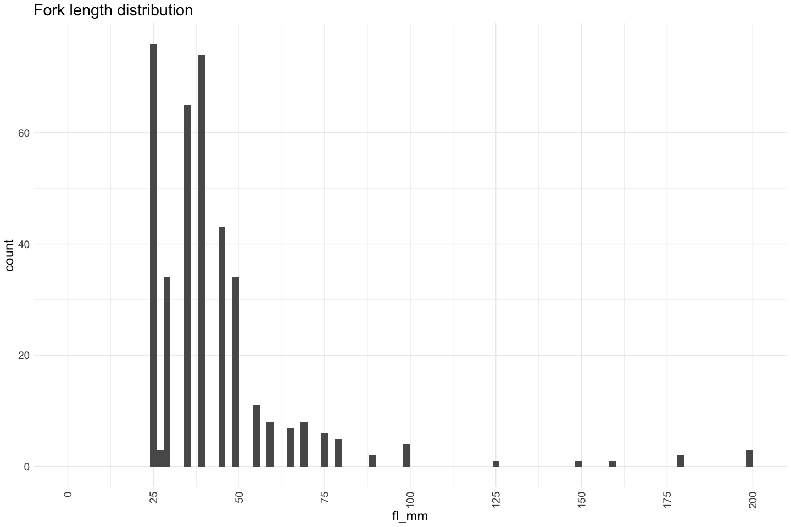
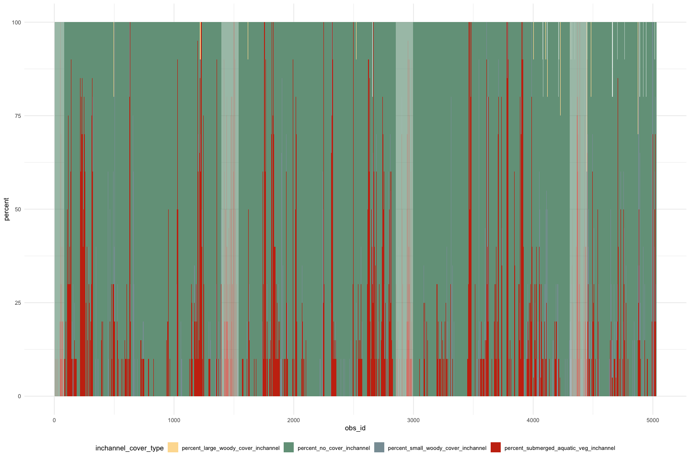
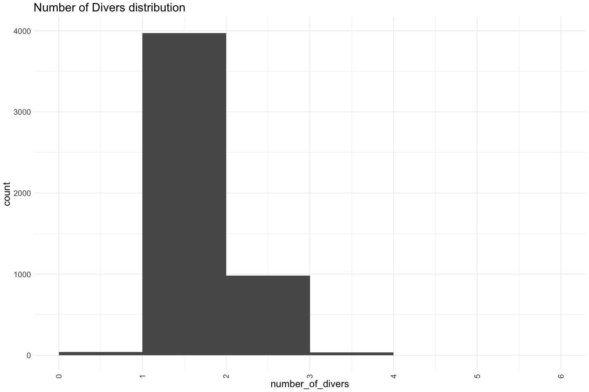

Feather River Mini Snorkel Data QC
================
Erin Cain
03/24

# Feather River Mini Snorkel Data

## Description of Monitoring Data

**Timeframe:** March 2001 - August 2001

**Completeness of Record throughout timeframe:** fairly complete

**Sampling Location:** Feather River

**Data Contact:** Ryon Kurth

## Questions

## Source Database pull

``` r
source("data-raw/query_4mac.R")
```

    ## Loading required package: lattice

    ## Loading required package: survival

    ## Loading required package: Formula

    ## 
    ## Attaching package: 'Hmisc'

    ## The following objects are masked from 'package:dplyr':
    ## 
    ##     src, summarize

    ## The following objects are masked from 'package:base':
    ## 
    ##     format.pval, units

    ## Rows: 378
    ## Columns: 31
    ## $ PhysDataTblID  <labelled> 11, 11, 11, 11, 11, 11, 11, 11, 11, 11, 11, 11, 11…
    ## $ Location       <labelled> "hatchery ditch", "hatchery ditch", "hatchery ditc…
    ## $ Date           <labelled> 2001-03-14, 2001-03-14, 2001-03-14, 2001-03-14, 20…
    ## $ RiverMile      <labelled> 66.6, 66.6, 66.6, 66.6, 66.6, 66.6, 66.6, 66.6, 66…
    ## $ SpeciesCode    <labelled> "CHN", "RBTS", "CHN", "CHN", "RBTS", "CHN", "CHN",…
    ## $ Count          <labelled> 1, 1, 50, 6, 3, 8, 15, 2, 5, 75, 2, 3, 1, 2, 3, 10…
    ## $ FL..mm.        <labelled> 40, 25, 40, 75, 25, 50, 40, 25, 45, 45, 35, 35, 25…
    ## $ DistToBottom   <labelled> 5.0, 1.0, 5.0, 5.0, 1.0, 1.0, 1.0, 1.0, 1.0, 5.0, …
    ## $ Focal.Velocity <labelled> 0.51, 0.64, 1.08, 0.80, 0.44, 0.18, 0.50, 0.50, 0.…
    ## $ TCode          <labelled> 3.4, 6.4, 6.4, 6.4, 9.4, 12.4, 12.4, 12.4, 18.4, 2…
    ## $ Depth          <labelled> 9, 37, 37, 37, 15, 19, 19, 19, 23, 13, 17, 17, 17,…
    ## $ Velocity       <labelled> 1.97, 0.91, 0.91, 0.91, 2.17, 1.01, 1.01, 1.01, 0.…
    ## $ Sub1           <labelled> 0, 0, 0, 0, 0, 0, 0, 0, 0, 0, 0, 0, 0, 0, 0, 0, 0,…
    ## $ Sub2           <labelled> 0, 65, 65, 65, 10, 40, 40, 40, 15, 0, 40, 40, 40, …
    ## $ Sub3           <labelled> 70, 25, 25, 25, 90, 60, 60, 60, 70, 85, 20, 20, 20…
    ## $ Sub4           <labelled> 30, 10, 10, 10, 0, 0, 0, 0, 15, 15, 30, 30, 30, 20…
    ## $ Sub5           <labelled> 0, 0, 0, 0, 0, 0, 0, 0, 0, 0, 10, 10, 10, 0, 0, 0,…
    ## $ Sub6           <labelled> 0, 0, 0, 0, 0, 0, 0, 0, 0, 0, 0, 0, 0, 0, 0, 0, 0,…
    ## $ IcovA          <labelled> 100, 100, 100, 100, 100, 100, 100, 100, 100, 90, 7…
    ## $ IcovB          <labelled> 0, 0, 0, 0, 0, 0, 0, 0, 0, 0, 15, 15, 15, 0, 20, 0…
    ## $ IcovC          <labelled> 0, 0, 0, 0, 0, 0, 0, 0, 0, 0, 0, 0, 0, 0, 40, 0, 0…
    ## $ IcovE          <labelled> 0, 0, 0, 0, 0, 0, 0, 0, 0, 10, 10, 10, 10, 0, 30, …
    ## $ IcovF          <labelled> 0, 0, 0, 0, 0, 0, 0, 0, 0, 0, 0, 0, 0, 0, 0, 0, 0,…
    ## $ Ocov0          <labelled> 100, 100, 100, 100, 100, 100, 100, 100, 100, 100, …
    ## $ Ocov1          <labelled> 0, 0, 0, 0, 0, 0, 0, 0, 0, 0, 0, 0, 0, 0, 0, 0, 0,…
    ## $ Ocov2          <labelled> 0, 0, 0, 0, 0, 0, 0, 0, 0, 0, 0, 0, 0, 0, 0, 0, 0,…
    ## $ SurTurb        <labelled> 10, 30, 30, 30, 20, 30, 30, 30, 10, 10, 20, 20, 20…
    ## $ CGU            <labelled> "g", "g", "g", "g", "g", "g", "g", "g", "g", "g", …
    ## $ Distance       <labelled> 4, 4, 4, 4, 4, 4, 4, 4, 4, 4, 1, 1, 1, 3, 1, 4, 4,…
    ## $ FishAge        <labelled> 0, 0, 0, 0, 0, 0, 0, 0, 0, 0, 0, 0, 0, 0, 0, 0, 0,…
    ## $ SpecAge        <labelled> "chn0", "rbt0", "chn0", "chn0", "rbt0", "chn0", "c…

    ## Rows: 378 Columns: 31

    ## ── Column specification ────────────────────────────────────────────────────────
    ## Delimiter: ","
    ## chr   (4): Location, SpeciesCode, CGU, SpecAge
    ## dbl  (26): PhysDataTblID, RiverMile, Count, FL..mm., DistToBottom, Focal.Vel...
    ## date  (1): Date
    ## 
    ## ℹ Use `spec()` to retrieve the full column specification for this data.
    ## ℹ Specify the column types or set `show_col_types = FALSE` to quiet this message.

    ## Rows: 378
    ## Columns: 31
    ## $ PhysDataTblID  <dbl> 11, 11, 11, 11, 11, 11, 11, 11, 11, 11, 11, 11, 11, 11,…
    ## $ Location       <chr> "hatchery ditch", "hatchery ditch", "hatchery ditch", "…
    ## $ Date           <date> 2001-03-14, 2001-03-14, 2001-03-14, 2001-03-14, 2001-0…
    ## $ RiverMile      <dbl> 66.6, 66.6, 66.6, 66.6, 66.6, 66.6, 66.6, 66.6, 66.6, 6…
    ## $ SpeciesCode    <chr> "CHN", "RBTS", "CHN", "CHN", "RBTS", "CHN", "CHN", "RBT…
    ## $ Count          <dbl> 1, 1, 50, 6, 3, 8, 15, 2, 5, 75, 2, 3, 1, 2, 3, 10, 20,…
    ## $ FL..mm.        <dbl> 40, 25, 40, 75, 25, 50, 40, 25, 45, 45, 35, 35, 25, 35,…
    ## $ DistToBottom   <dbl> 5.0, 1.0, 5.0, 5.0, 1.0, 1.0, 1.0, 1.0, 1.0, 5.0, 1.0, …
    ## $ Focal.Velocity <dbl> 0.51, 0.64, 1.08, 0.80, 0.44, 0.18, 0.50, 0.50, 0.50, 0…
    ## $ TCode          <dbl> 3.4, 6.4, 6.4, 6.4, 9.4, 12.4, 12.4, 12.4, 18.4, 24.4, …
    ## $ Depth          <dbl> 9, 37, 37, 37, 15, 19, 19, 19, 23, 13, 17, 17, 17, 19, …
    ## $ Velocity       <dbl> 1.97, 0.91, 0.91, 0.91, 2.17, 1.01, 1.01, 1.01, 0.78, 1…
    ## $ Sub1           <dbl> 0, 0, 0, 0, 0, 0, 0, 0, 0, 0, 0, 0, 0, 0, 0, 0, 0, 40, …
    ## $ Sub2           <dbl> 0, 65, 65, 65, 10, 40, 40, 40, 15, 0, 40, 40, 40, 30, 7…
    ## $ Sub3           <dbl> 70, 25, 25, 25, 90, 60, 60, 60, 70, 85, 20, 20, 20, 50,…
    ## $ Sub4           <dbl> 30, 10, 10, 10, 0, 0, 0, 0, 15, 15, 30, 30, 30, 20, 0, …
    ## $ Sub5           <dbl> 0, 0, 0, 0, 0, 0, 0, 0, 0, 0, 10, 10, 10, 0, 0, 0, 0, 0…
    ## $ Sub6           <dbl> 0, 0, 0, 0, 0, 0, 0, 0, 0, 0, 0, 0, 0, 0, 0, 0, 0, 0, 0…
    ## $ IcovA          <dbl> 100, 100, 100, 100, 100, 100, 100, 100, 100, 90, 75, 75…
    ## $ IcovB          <dbl> 0, 0, 0, 0, 0, 0, 0, 0, 0, 0, 15, 15, 15, 0, 20, 0, 0, …
    ## $ IcovC          <dbl> 0, 0, 0, 0, 0, 0, 0, 0, 0, 0, 0, 0, 0, 0, 40, 0, 0, 0, …
    ## $ IcovE          <dbl> 0, 0, 0, 0, 0, 0, 0, 0, 0, 10, 10, 10, 10, 0, 30, 0, 0,…
    ## $ IcovF          <dbl> 0, 0, 0, 0, 0, 0, 0, 0, 0, 0, 0, 0, 0, 0, 0, 0, 0, 0, 0…
    ## $ Ocov0          <dbl> 100, 100, 100, 100, 100, 100, 100, 100, 100, 100, 100, …
    ## $ Ocov1          <dbl> 0, 0, 0, 0, 0, 0, 0, 0, 0, 0, 0, 0, 0, 0, 0, 0, 0, 25, …
    ## $ Ocov2          <dbl> 0, 0, 0, 0, 0, 0, 0, 0, 0, 0, 0, 0, 0, 0, 0, 0, 0, 0, 0…
    ## $ SurTurb        <dbl> 10, 30, 30, 30, 20, 30, 30, 30, 10, 10, 20, 20, 20, 20,…
    ## $ CGU            <chr> "g", "g", "g", "g", "g", "g", "g", "g", "g", "g", "g", …
    ## $ Distance       <dbl> 4, 4, 4, 4, 4, 4, 4, 4, 4, 4, 1, 1, 1, 3, 1, 4, 4, 1, 2…
    ## $ FishAge        <dbl> 0, 0, 0, 0, 0, 0, 0, 0, 0, 0, 0, 0, 0, 0, 0, 0, 0, 0, 0…
    ## $ SpecAge        <chr> "chn0", "rbt0", "chn0", "chn0", "rbt0", "chn0", "chn0",…

    ## Rows: 136 Columns: 16
    ## ── Column specification ────────────────────────────────────────────────────────
    ## Delimiter: ","
    ## chr   (5): Location, StartTime, EndTime, Crew, GPS.Coordinate
    ## dbl  (10): PhysDataTblID, WaterTemp, Weather, RiverMile, Flow, NumberOfDiver...
    ## date  (1): Date
    ## 
    ## ℹ Use `spec()` to retrieve the full column specification for this data.
    ## ℹ Specify the column types or set `show_col_types = FALSE` to quiet this message.

    ## Rows: 136
    ## Columns: 16
    ## $ PhysDataTblID  <dbl> 92, 93, 94, 95, 96, 97, 98, 99, 100, 101, 102, 103, 104…
    ## $ Location       <chr> "Herringer Riffle", "Herringer Riffle", "Shallow Riffle…
    ## $ Date           <date> 2001-05-24, 2001-08-23, 2001-08-22, 2001-08-23, 2001-0…
    ## $ StartTime      <chr> "(12/30/99 13:35:00)", "(12/30/99 13:10:00)", "(12/30/9…
    ## $ EndTime        <chr> "(12/30/99 13:50:00)", "(NA NA)", "(12/30/99 12:15:00)"…
    ## $ Crew           <chr> "do,ph, at", "BR, CR, TV", "TV, BR, CR", "TV, BR, CR", …
    ## $ WaterTemp      <dbl> 0.0, 70.0, 68.0, 68.0, 52.5, 53.0, 69.0, 68.5, 68.5, 67…
    ## $ Weather        <dbl> 1, 1, 1, 1, 1, 1, 1, 1, 1, 1, 1, 1, 1, 1, 1, 1, 1, 1, 1…
    ## $ RiverMile      <dbl> 46.0, 0.0, 0.0, 0.0, 66.5, 66.5, 52.5, 54.5, 56.0, 56.0…
    ## $ Flow           <dbl> 2000, 0, 0, 0, 600, 600, 0, 2000, 2000, 2000, 2000, 200…
    ## $ NumberOfDivers <dbl> 3, 2, 2, 2, 2, 2, 2, 2, 2, 2, 2, 2, 2, 2, 2, 2, 2, 2, 2…
    ## $ ReachLength    <dbl> 25, 25, 25, 25, 25, 25, 25, 25, 25, 25, 25, 25, 25, 25,…
    ## $ ReachWidth     <dbl> 4, 4, 4, 4, 4, 4, 4, 4, 4, 4, 4, 4, 4, 4, 4, 4, 4, 4, 4…
    ## $ ChannelType    <dbl> 1, 0, 3, 2, 2, 2, 1, 1, 2, 1, 3, 2, 2, 2, 1, 1, 1, 3, 3…
    ## $ ChannelWidth   <dbl> 96, 115, 33, 48, 32, 51, 40, 73, 147, 33, 0, 0, 0, 20, …
    ## $ GPS.Coordinate <chr> "N 39° 19.14 W 121° 37.22'", "N 39°19.068\" W 121°37.25…
    ## Rows: 410
    ## Columns: 8
    ## $ PDatID         <labelled> 11, 11, 11, 11, 11, 11, 11, 11, 11, 11, 11, 11, 11…
    ## $ FishDataID     <labelled> 11, 12, 13, 14, 15, 16, 17, 18, 19, 20, 21, 22, 23…
    ## $ Species        <labelled> 3, 1, 3, 3, 1, 3, 3, 1, 3, 3, 3, 3, 1, 3, 1, 3, 3,…
    ## $ Count          <labelled> 1, 1, 50, 6, 3, 8, 15, 2, 5, 75, 2, 3, 1, 2, 3, 10…
    ## $ FL..mm.        <labelled> 40, 25, 40, 75, 25, 50, 40, 25, 45, 45, 35, 35, 25…
    ## $ DistToBottom   <labelled> 5.0, 1.0, 5.0, 5.0, 1.0, 1.0, 1.0, 1.0, 1.0, 5.0, …
    ## $ Focal.Velocity <labelled> 0.51, 0.64, 1.08, 0.80, 0.44, 0.18, 0.50, 0.50, 0.…
    ## $ TCode          <labelled> 3.4, 6.4, 6.4, 6.4, 9.4, 12.4, 12.4, 12.4, 18.4, 2…

    ## Rows: 410 Columns: 8
    ## ── Column specification ────────────────────────────────────────────────────────
    ## Delimiter: ","
    ## dbl (8): PDatID, FishDataID, Species, Count, FL..mm., DistToBottom, Focal.Ve...
    ## 
    ## ℹ Use `spec()` to retrieve the full column specification for this data.
    ## ℹ Specify the column types or set `show_col_types = FALSE` to quiet this message.

    ## Rows: 410
    ## Columns: 8
    ## $ PDatID         <dbl> 11, 11, 11, 11, 11, 11, 11, 11, 11, 11, 11, 11, 11, 11,…
    ## $ FishDataID     <dbl> 11, 12, 13, 14, 15, 16, 17, 18, 19, 20, 21, 22, 23, 24,…
    ## $ Species        <dbl> 3, 1, 3, 3, 1, 3, 3, 1, 3, 3, 3, 3, 1, 3, 1, 3, 3, 1, 3…
    ## $ Count          <dbl> 1, 1, 50, 6, 3, 8, 15, 2, 5, 75, 2, 3, 1, 2, 3, 10, 20,…
    ## $ FL..mm.        <dbl> 40, 25, 40, 75, 25, 50, 40, 25, 45, 45, 35, 35, 25, 35,…
    ## $ DistToBottom   <dbl> 5.0, 1.0, 5.0, 5.0, 1.0, 1.0, 1.0, 1.0, 1.0, 5.0, 1.0, …
    ## $ Focal.Velocity <dbl> 0.51, 0.64, 1.08, 0.80, 0.44, 0.18, 0.50, 0.50, 0.50, 0…
    ## $ TCode          <dbl> 3.4, 6.4, 6.4, 6.4, 9.4, 12.4, 12.4, 12.4, 18.4, 24.4, …
    ## Rows: 4,895
    ## Columns: 24
    ## $ MicroHabDataTblID <int> 18, 19, 20, 21, 22, 23, 24, 25, 26, 27, 28, 29, 30, …
    ## $ PDatID            <int> 11, 11, 11, 11, 11, 11, 11, 11, 11, 11, 11, 11, 11, …
    ## $ TCode             <dbl> 0.1, 0.2, 0.3, 0.4, 3.1, 3.2, 3.3, 3.4, 6.1, 6.2, 6.…
    ## $ Depth             <int> 17, 19, 11, 12, 11, 10, 8, 9, 10, 19, 19, 37, 16, 14…
    ## $ Velocity          <dbl> 0.22, 0.35, 1.95, 2.14, 1.19, 1.54, 1.26, 1.97, 0.75…
    ## $ Sub1              <int> 0, 0, 0, 0, 0, 0, 0, 0, 40, 0, 0, 0, 0, 0, 0, 0, 15,…
    ## $ Sub2              <int> 40, 50, 25, 0, 70, 30, 0, 0, 0, 60, 30, 65, 80, 0, 0…
    ## $ Sub3              <int> 20, 40, 75, 80, 30, 50, 60, 70, 40, 30, 50, 25, 20, …
    ## $ Sub4              <int> 30, 10, 0, 20, 0, 20, 40, 30, 20, 10, 20, 10, 0, 15,…
    ## $ Sub5              <int> 10, 0, 0, 0, 0, 0, 0, 0, 0, 0, 0, 0, 0, 0, 0, 0, 0, …
    ## $ Sub6              <int> 0, 0, 0, 0, 0, 0, 0, 0, 0, 0, 0, 0, 0, 0, 0, 0, 0, 0…
    ## $ IcovA             <int> 75, 100, 100, 100, 10, 100, 100, 100, 50, 100, 100, …
    ## $ IcovB             <int> 15, 0, 0, 0, 20, 0, 0, 0, 10, 0, 0, 0, 10, 0, 0, 0, …
    ## $ IcovC             <int> 0, 0, 0, 0, 40, 0, 0, 0, 0, 0, 0, 0, 0, 0, 0, 0, 0, …
    ## $ IcovE             <int> 10, 0, 0, 0, 30, 0, 0, 0, 40, 0, 0, 0, 0, 0, 0, 0, 0…
    ## $ IcovF             <int> 0, 0, 0, 0, 0, 0, 0, 0, 0, 0, 0, 0, 0, 0, 0, 0, 20, …
    ## $ Ocov0             <int> 100, 100, 100, 100, 100, 100, 100, 100, 75, 100, 100…
    ## $ Ocov1             <int> 0, 0, 0, 0, 0, 0, 0, 0, 25, 0, 0, 0, 50, 0, 0, 0, 0,…
    ## $ Ocov2             <int> 0, 0, 0, 0, 0, 0, 0, 0, 0, 0, 0, 0, 0, 0, 0, 0, 0, 0…
    ## $ SurTurb           <int> 20, 30, 30, 30, 10, 10, 10, 10, 0, 10, 20, 30, 0, 0,…
    ## $ CGU               <chr> "g", "g", "g", "g", "gm", "g", "g", "g", "gm", "gm",…
    ## $ SubSum            <int> 100, 100, 100, 100, 100, 100, 100, 100, 100, 100, 10…
    ## $ ICovSum           <int> 100, 100, 100, 100, 100, 100, 100, 100, 100, 100, 10…
    ## $ OCovSum           <int> 100, 100, 100, 100, 100, 100, 100, 100, 100, 100, 10…
    ## Rows: 136
    ## Columns: 12
    ## $ PhysDataTblID <int> 11, 12, 13, 14, 15, 16, 17, 18, 19, 20, 21, 22, 23, 24, …
    ## $ AvgOfDepth    <dbl> 14.72222, 31.19444, 40.05556, 12.50000, 21.02778, 20.277…
    ## $ AvgOfVelocity <dbl> 1.04222222, 0.14777778, 1.00833333, 0.75583333, 0.748888…
    ## $ AvgOfIcovA    <dbl> 91.52778, 42.91667, 90.13889, 89.44444, 86.38889, 96.666…
    ## $ AvgOfIcovB    <dbl> 3.3333333, 7.9166667, 4.4444444, 2.5000000, 0.6944444, 2…
    ## $ AvgOfIcovC    <dbl> 1.1428571, 1.6666667, 0.0000000, 0.2777778, 0.0000000, 0…
    ## $ AvgOfIcovE    <dbl> 2.9166667, 47.5000000, 4.0277778, 7.7777778, 12.9166667,…
    ## $ AvgOfIcovF    <dbl> 1.1111111, 0.0000000, 1.3888889, 0.0000000, 0.0000000, 0…
    ## $ AvgOfOcov0    <dbl> 90.69444, 93.47222, 91.25000, 95.55556, 100.00000, 97.77…
    ## $ AvgOfOcov1    <dbl> 4.3055556, 3.3333333, 5.0000000, 4.4444444, 0.0000000, 2…
    ## $ AvgOfOcov2    <dbl> 5.0000000, 3.1944444, 3.7500000, 0.0000000, 0.0000000, 0…
    ## $ AvgOfSurTurb  <dbl> 11.5277778, 0.0000000, 1.6666667, 0.0000000, 1.3888889, …
    ## Rows: 67
    ## Columns: 11
    ## $ PDatID        <int> 11, 13, 14, 15, 18, 19, 20, 21, 22, 17, 35, 36, 38, 40, …
    ## $ CanopyCoverID <int> 1, 2, 3, 4, 5, 6, 7, 8, 9, 10, 11, 12, 13, 14, 15, 16, 1…
    ## $ Canopy1       <int> 79, 4, 100, 0, 0, 0, 100, 0, 0, 0, 100, 18, 46, 0, 0, 0,…
    ## $ Canopy2       <int> 66, 25, 100, 0, 0, 0, 25, 84, 0, 0, 100, 22, 80, 3, 0, 4…
    ## $ Canopy3       <int> 68, 66, 80, 0, 0, 0, 85, 40, 0, 0, 100, 17, 20, 0, 0, 5,…
    ## $ Canopy4       <int> 48, 100, 75, 0, 0, 0, 100, 4, 0, 0, 100, 24, 0, 0, 0, 10…
    ## $ Canopy5       <int> 32, 75, 84, 0, 0, 0, 100, 24, 0, 0, 100, 40, 0, 0, 0, 90…
    ## $ Canopy6       <int> 64, 19, 48, 0, 0, 0, 0, 20, 0, 80, 95, 42, 17, 0, 6, 15,…
    ## $ Canopy7       <int> 88, 20, 50, 0, 0, 0, 10, 100, 0, 0, 85, 78, 0, 0, 7, 10,…
    ## $ Canopy8       <int> 48, 29, 70, 0, 0, 50, 40, 24, 0, 0, 100, 46, 16, 0, 10, …
    ## $ Canopy9       <int> 68, 50, 100, 0, 0, 80, 0, 4, 0, 0, 100, 49, 0, 100, 2, 0…
    ## Rows: 81
    ## Columns: 2
    ## $ PDatID   <int> 94, 95, 96, 97, 111, 112, 112, 112, 114, 114, 114, 115, 116, …
    ## $ Comments <chr> "No flow or river mile recorded", "Flow and river mile not re…

Read in data from google cloud, glimpse raw data and domain description
sheet:

``` r
# read in data to clean 
microhabitat |> glimpse()
```

    ## Rows: 4,895
    ## Columns: 24
    ## $ MicroHabDataTblID <int> 18, 19, 20, 21, 22, 23, 24, 25, 26, 27, 28, 29, 30, …
    ## $ PDatID            <int> 11, 11, 11, 11, 11, 11, 11, 11, 11, 11, 11, 11, 11, …
    ## $ TCode             <dbl> 0.1, 0.2, 0.3, 0.4, 3.1, 3.2, 3.3, 3.4, 6.1, 6.2, 6.…
    ## $ Depth             <int> 17, 19, 11, 12, 11, 10, 8, 9, 10, 19, 19, 37, 16, 14…
    ## $ Velocity          <dbl> 0.22, 0.35, 1.95, 2.14, 1.19, 1.54, 1.26, 1.97, 0.75…
    ## $ Sub1              <int> 0, 0, 0, 0, 0, 0, 0, 0, 40, 0, 0, 0, 0, 0, 0, 0, 15,…
    ## $ Sub2              <int> 40, 50, 25, 0, 70, 30, 0, 0, 0, 60, 30, 65, 80, 0, 0…
    ## $ Sub3              <int> 20, 40, 75, 80, 30, 50, 60, 70, 40, 30, 50, 25, 20, …
    ## $ Sub4              <int> 30, 10, 0, 20, 0, 20, 40, 30, 20, 10, 20, 10, 0, 15,…
    ## $ Sub5              <int> 10, 0, 0, 0, 0, 0, 0, 0, 0, 0, 0, 0, 0, 0, 0, 0, 0, …
    ## $ Sub6              <int> 0, 0, 0, 0, 0, 0, 0, 0, 0, 0, 0, 0, 0, 0, 0, 0, 0, 0…
    ## $ IcovA             <int> 75, 100, 100, 100, 10, 100, 100, 100, 50, 100, 100, …
    ## $ IcovB             <int> 15, 0, 0, 0, 20, 0, 0, 0, 10, 0, 0, 0, 10, 0, 0, 0, …
    ## $ IcovC             <int> 0, 0, 0, 0, 40, 0, 0, 0, 0, 0, 0, 0, 0, 0, 0, 0, 0, …
    ## $ IcovE             <int> 10, 0, 0, 0, 30, 0, 0, 0, 40, 0, 0, 0, 0, 0, 0, 0, 0…
    ## $ IcovF             <int> 0, 0, 0, 0, 0, 0, 0, 0, 0, 0, 0, 0, 0, 0, 0, 0, 20, …
    ## $ Ocov0             <int> 100, 100, 100, 100, 100, 100, 100, 100, 75, 100, 100…
    ## $ Ocov1             <int> 0, 0, 0, 0, 0, 0, 0, 0, 25, 0, 0, 0, 50, 0, 0, 0, 0,…
    ## $ Ocov2             <int> 0, 0, 0, 0, 0, 0, 0, 0, 0, 0, 0, 0, 0, 0, 0, 0, 0, 0…
    ## $ SurTurb           <int> 20, 30, 30, 30, 10, 10, 10, 10, 0, 10, 20, 30, 0, 0,…
    ## $ CGU               <chr> "g", "g", "g", "g", "gm", "g", "g", "g", "gm", "gm",…
    ## $ SubSum            <int> 100, 100, 100, 100, 100, 100, 100, 100, 100, 100, 10…
    ## $ ICovSum           <int> 100, 100, 100, 100, 100, 100, 100, 100, 100, 100, 10…
    ## $ OCovSum           <int> 100, 100, 100, 100, 100, 100, 100, 100, 100, 100, 10…

## Data transformations

### first table reviewd is the All Fish Observation Table

All of the substrate and cover lookups are not true look ups. Substrate
and cover column indicate a percentage of cover or substrate of each
type. I updated the column names to reflect this and utilized the lookup
tables to understand which substrate or cover type each column was
referring to.

Columns removed: - SpecAge removed - just a combination of species and
age - i_cov_sum - removed because sum of other columns - o_cov_sum -
removed because sum of other columns - sub_sum - removed because sum of
other columns - start_time - just a date that seemed wrong - end_time -
also just a date that seemed wrong - crew - specific crew names do not
need to be present on public EDI dataset

``` r
# For different excel sheets for each year read in and combine years here
joined_fish_obs <- microhabitat |> 
  left_join(fish_data, by = c("TCode" = "TCode", "PDatID" = "PDatID")) |> 
  left_join(species_code_lookup, by = c("Species" = "SpeciesCodeID")) |> # all codes are in the lookup
  select(-c(SpeciesCode, Species)) |>
  rename(species = Species.y, 
         percent_fine_substrate = Sub1, 
         percent_sand_substrate = Sub2, 
         percent_small_gravel_substrate = Sub3, 
         percent_large_gravel_substrate = Sub4, 
         percent_cobble_substrate = Sub5, 
         percent_boulder_substrate = Sub6,
         percent_no_cover_inchannel = IcovA, 
         percent_small_woody_cover_inchannel = IcovB, 
         percent_large_woody_cover_inchannel = IcovC, 
         percent_submerged_aquatic_veg_inchannel = IcovE, 
         percent_undercut_bank = IcovF,
         percent_no_cover_overhead = Ocov0,
         percent_cover_half_meter_overhead = Ocov1, 
         percent_cover_more_than_half_meter_overhead = Ocov2)|> 
  # Clean in separate file
  left_join(location_table, by = c("PDatID" = "PhysDataTblID")) |> 
  left_join(weather_code_lookup, by = c("Weather" = "WeatherCodeLookUpID")) |> # all codes are in the lookup
  select(-WeatherCode, -Weather) |> 
  rename(weather = Weather.y) |> 
  # note that there are 0 channel types which do not map to the lookup
  left_join(channel_lookup, by = c("ChannelType" = "ChannelTypeCode")) |> 
  select(-ChannelType, -ChannelTypeCodeID) |> 
  rename(channel_type = ChannelType.y) |> 
  janitor::clean_names() |> 
  # fixes issues with the codes so the CGU lookup will work
  mutate(cgu = tolower(cgu),
         cgu = case_when(cgu == "rm`" ~ "rm",
                         cgu == "gm." ~ "gm",
                         cgu == "" ~ NA,
                         T ~ cgu)) |> 
  left_join(cgu_code_lookup |> mutate(CGUCode = tolower(CGUCode)), by = c("cgu" = "CGUCode")) |> 
  select(-cgu, -CGUCodeID, -sub_sum, -i_cov_sum, -o_cov_sum, -start_time, -end_time, -crew) |> 
  rename(channel_geomorphic_unit = CGU) |> glimpse()
```

    ## Rows: 5,029
    ## Columns: 39
    ## $ micro_hab_data_tbl_id                       <int> 18, 18, 18, 19, 20, 21, 22…
    ## $ p_dat_id                                    <dbl> 11, 11, 11, 11, 11, 11, 11…
    ## $ t_code                                      <dbl> 0.1, 0.1, 0.1, 0.2, 0.3, 0…
    ## $ depth                                       <int> 17, 17, 17, 19, 11, 12, 11…
    ## $ velocity                                    <dbl> 0.22, 0.22, 0.22, 0.35, 1.…
    ## $ percent_fine_substrate                      <int> 0, 0, 0, 0, 0, 0, 0, 0, 0,…
    ## $ percent_sand_substrate                      <int> 40, 40, 40, 50, 25, 0, 70,…
    ## $ percent_small_gravel_substrate              <int> 20, 20, 20, 40, 75, 80, 30…
    ## $ percent_large_gravel_substrate              <int> 30, 30, 30, 10, 0, 20, 0, …
    ## $ percent_cobble_substrate                    <int> 10, 10, 10, 0, 0, 0, 0, 0,…
    ## $ percent_boulder_substrate                   <int> 0, 0, 0, 0, 0, 0, 0, 0, 0,…
    ## $ percent_no_cover_inchannel                  <int> 75, 75, 75, 100, 100, 100,…
    ## $ percent_small_woody_cover_inchannel         <int> 15, 15, 15, 0, 0, 0, 20, 0…
    ## $ percent_large_woody_cover_inchannel         <int> 0, 0, 0, 0, 0, 0, 40, 0, 0…
    ## $ percent_submerged_aquatic_veg_inchannel     <int> 10, 10, 10, 0, 0, 0, 30, 0…
    ## $ percent_undercut_bank                       <int> 0, 0, 0, 0, 0, 0, 0, 0, 0,…
    ## $ percent_no_cover_overhead                   <int> 100, 100, 100, 100, 100, 1…
    ## $ percent_cover_half_meter_overhead           <int> 0, 0, 0, 0, 0, 0, 0, 0, 0,…
    ## $ percent_cover_more_than_half_meter_overhead <int> 0, 0, 0, 0, 0, 0, 0, 0, 0,…
    ## $ sur_turb                                    <int> 20, 20, 20, 30, 30, 30, 10…
    ## $ fish_data_id                                <dbl> 21, 22, 23, NA, NA, NA, 25…
    ## $ count                                       <dbl> 2, 3, 1, NA, NA, NA, 3, NA…
    ## $ fl_mm                                       <dbl> 35, 35, 25, NA, NA, NA, 25…
    ## $ dist_to_bottom                              <dbl> 1.0, 1.5, 1.5, NA, NA, NA,…
    ## $ focal_velocity                              <dbl> 0.94, 0.16, 0.16, NA, NA, …
    ## $ species                                     <chr> "Chinook salmon", "Chinook…
    ## $ location                                    <chr> "hatchery ditch", "hatcher…
    ## $ date                                        <date> 2001-03-14, 2001-03-14, 2…
    ## $ water_temp                                  <dbl> 47, 47, 47, 47, 47, 47, 47…
    ## $ river_mile                                  <dbl> 66.6, 66.6, 66.6, 66.6, 66…
    ## $ flow                                        <dbl> 12, 12, 12, 12, 12, 12, 12…
    ## $ number_of_divers                            <dbl> 3, 3, 3, 3, 3, 3, 3, 3, 3,…
    ## $ reach_length                                <dbl> 25, 25, 25, 25, 25, 25, 25…
    ## $ reach_width                                 <dbl> 4, 4, 4, 4, 4, 4, 4, 4, 4,…
    ## $ channel_width                               <dbl> 7, 7, 7, 7, 7, 7, 7, 7, 7,…
    ## $ gps_coordinate                              <chr> NA, NA, NA, NA, NA, NA, NA…
    ## $ weather                                     <chr> "Direct Sunlight", "Direct…
    ## $ channel_type                                <chr> "Sidechannel", "Sidechanne…
    ## $ channel_geomorphic_unit                     <chr> "Glide", "Glide", "Glide",…

``` r
# HOW many have fish 
joined_fish_obs |> filter(count >= 0) |> nrow()
```

    ## [1] 393

## Explore Numeric Variables:

``` r
# Filter clean data to show only numeric variables 
joined_fish_obs %>% select_if(is.numeric) %>% colnames()
```

    ##  [1] "micro_hab_data_tbl_id"                      
    ##  [2] "p_dat_id"                                   
    ##  [3] "t_code"                                     
    ##  [4] "depth"                                      
    ##  [5] "velocity"                                   
    ##  [6] "percent_fine_substrate"                     
    ##  [7] "percent_sand_substrate"                     
    ##  [8] "percent_small_gravel_substrate"             
    ##  [9] "percent_large_gravel_substrate"             
    ## [10] "percent_cobble_substrate"                   
    ## [11] "percent_boulder_substrate"                  
    ## [12] "percent_no_cover_inchannel"                 
    ## [13] "percent_small_woody_cover_inchannel"        
    ## [14] "percent_large_woody_cover_inchannel"        
    ## [15] "percent_submerged_aquatic_veg_inchannel"    
    ## [16] "percent_undercut_bank"                      
    ## [17] "percent_no_cover_overhead"                  
    ## [18] "percent_cover_half_meter_overhead"          
    ## [19] "percent_cover_more_than_half_meter_overhead"
    ## [20] "sur_turb"                                   
    ## [21] "fish_data_id"                               
    ## [22] "count"                                      
    ## [23] "fl_mm"                                      
    ## [24] "dist_to_bottom"                             
    ## [25] "focal_velocity"                             
    ## [26] "water_temp"                                 
    ## [27] "river_mile"                                 
    ## [28] "flow"                                       
    ## [29] "number_of_divers"                           
    ## [30] "reach_length"                               
    ## [31] "reach_width"                                
    ## [32] "channel_width"

### Variable: `count`

**Plotting Count over Period of Record**

``` r
# Make whatever plot is appropriate 
# maybe 2+ plots are appropriate
joined_fish_obs %>% 
  ggplot(aes(x = rm, y = count, group = 1))+
  # geom_line()+
  geom_point(aes(x=date, y = count))+
  theme_minimal()+
  labs(title = "Count over Time",
       y = "Number of Fish Observations")
```

<!-- -->

**Numeric Summary of Count over Period of Record**

``` r
# Table with summary statistics
summary(joined_fish_obs$count)
```

    ##    Min. 1st Qu.  Median    Mean 3rd Qu.    Max.    NA's 
    ##    1.00    1.00    5.00   53.94   30.00 1500.00    4636

**NA and Unknown Values**

There are 4636 NA values

### Variable: `date`

**Plotting Date over Period of Record**

All observations are from 2001

``` r
# Make whatever plot is appropriate 
# maybe 2+ plots are appropriate
joined_fish_obs %>% 
  ggplot(aes(x = date, y = TRUE, group = 1))+
  # geom_line()+
  geom_point(aes(x=date, y = TRUE))+
  theme_minimal()+
  labs(title = "Dates Surveyed",
       y = "")
```

<!-- -->

**Numeric Summary of Count over Period of Record**

``` r
# Table with summary statistics
summary(joined_fish_obs$date)
```

    ##         Min.      1st Qu.       Median         Mean      3rd Qu.         Max. 
    ## "2001-03-13" "2001-04-11" "2001-06-11" "2001-06-04" "2001-07-16" "2001-08-23"

**NA and Unknown Values**

There are 0 NA values

### Variable: \`river_mile\`\`

**Plotting river_mile over Period of Record**

``` r
# Make whatever plot is appropriate 
# maybe 2+ plots are appropriate
joined_fish_obs %>% 
  ggplot(aes(x = river_mile, y = date, group = 1))+
  # geom_line()+
  geom_point(aes(x=river_mile, y = date))+
  theme_minimal()+
  labs(title = "Dates that River miles Surveyed",
       y = "")
```

<!-- -->

**Numeric Summary of river_mile over Period of Record**

``` r
# Table with summary statistics
summary(joined_fish_obs$river_mile)
```

    ##    Min. 1st Qu.  Median    Mean 3rd Qu.    Max. 
    ##    0.00   56.00   60.00   57.66   63.50   66.60

**NA and Unknown Values**

There are 0 NA values

### Variable: `fl_mm`

**Plotting fl_mm over Period of Record**

``` r
# Make whatever plot is appropriate 
# maybe 2+ plots are appropriate
joined_fish_obs |> 
  # filter(fork_length < 250) %>% # filter out 13 points so we can more clearly see distribution
  ggplot(aes(x = fl_mm)) + 
  geom_histogram(breaks=seq(0, 200, by=2)) + 
  scale_x_continuous(breaks=seq(0, 200, by=25)) +
  theme_minimal() +
  labs(title = "Fork length distribution") + 
  theme(text = element_text(size = 18),
        axis.text.x = element_text(angle = 90, vjust = 0.5, hjust=1)) 
```

<!-- -->

``` r
joined_fish_obs %>% 
  mutate(year = as.factor(year(date))) %>%
  ggplot(aes(x = fl_mm, y = species)) + 
  geom_boxplot() + 
  theme_minimal() +
  labs(title = "Fork length summarized by species") + 
  theme(text = element_text(size = 18),
        axis.text.x = element_text(angle = 90, vjust = 0.5, hjust=1)) 
```

<!-- -->

**Numeric Summary of fl_mm over Period of Record**

``` r
# Table with summary statistics
summary(joined_fish_obs$fl_mm)
```

    ##    Min. 1st Qu.  Median    Mean 3rd Qu.    Max.    NA's 
    ##   25.00   30.00   40.00   47.52   45.00  500.00    4636

**NA and Unknown Values**

There are 4636 NA values

### Variable: `dist_to_bottom`

**Plotting dist_to_bottom distribution**

``` r
# Make whatever plot is appropriate 
# maybe 2+ plots are appropriate
joined_fish_obs |> 
  # filter(fork_length < 250) %>% # filter out 13 points so we can more clearly see distribution
  ggplot(aes(x = dist_to_bottom)) + 
  geom_histogram(breaks=seq(0, 200, by=2)) + 
  scale_x_continuous(breaks=seq(0, 200, by=25)) +
  theme_minimal() +
  labs(title = "Distance to Bottom") + 
  theme(text = element_text(size = 18),
        axis.text.x = element_text(angle = 90, vjust = 0.5, hjust=1)) 
```

<!-- -->

``` r
joined_fish_obs %>% 
  mutate(year = as.factor(year(date))) %>%
  ggplot(aes(x = dist_to_bottom, y = as.factor(river_mile))) + 
  geom_boxplot() + 
  theme_minimal() +
  labs(title = "Distance to bottom summarized by river_mile") + 
  theme(text = element_text(size = 18),
        axis.text.x = element_text(angle = 90, vjust = 0.5, hjust=1)) 
```

<!-- -->

**Numeric Summary of dist_to_bottom over Period of Record**

``` r
# Table with summary statistics
summary(joined_fish_obs$river_mile)
```

    ##    Min. 1st Qu.  Median    Mean 3rd Qu.    Max. 
    ##    0.00   56.00   60.00   57.66   63.50   66.60

**NA and Unknown Values**

There are 0 NA values

### Variable: `focal_velocity` & `velocity`

**Plotting velocities over Period of Record**

``` r
joined_fish_obs |> 
  # filter(fork_length < 250) %>% # filter out 13 points so we can more clearly see distribution
  ggplot(aes(x = focal_velocity)) + 
  geom_histogram(breaks=seq(0, 10, by=1), group = "Focal velocity", fill = "blue", alpha = .2 ) + 
  geom_histogram(aes(x = velocity), breaks=seq(0, 10, by=1), group = "Focal velocity", fill = "red", alpha = .2 ) + 
  scale_x_continuous(breaks=seq(0, 10, by=1)) +
  theme_minimal() +
  labs(title = "Focal Velocity vs ") + 
  theme(text = element_text(size = 18),
        axis.text.x = element_text(angle = 90, vjust = 0.5, hjust=1)) 
```

<!-- -->

Looks like velocity and focal velocity have similar distributions

**Numeric Summary of focal_velocity over Period of Record**

``` r
# Table with summary statistics
summary(joined_fish_obs$focal_velocity)
```

    ##    Min. 1st Qu.  Median    Mean 3rd Qu.    Max.    NA's 
    ##   0.000   0.000   0.000   0.353   0.560   3.440    4645

``` r
summary(joined_fish_obs$velocity)
```

    ##    Min. 1st Qu.  Median    Mean 3rd Qu.    Max.    NA's 
    ##  0.0000  0.0000  0.0000  0.5344  0.8700  5.7300      80

**NA and Unknown Values**

There are 4645 NA values There are 80 NA values

### Variable: `t_code`

**Plotting t_code over Period of Record**

``` r
joined_fish_obs |> 
  # filter(fork_length < 250) %>% # filter out 13 points so we can more clearly see distribution
  ggplot(aes(x = t_code)) + 
  geom_histogram(breaks=seq(0, 30, by=1)) + 
  scale_x_continuous(breaks=seq(0, 30, by=1)) +
  theme_minimal() +
  labs(title = "T code distribution") + 
  theme(text = element_text(size = 18),
        axis.text.x = element_text(angle = 90, vjust = 0.5, hjust=1)) 
```

<!-- -->

**Numeric Summary of t_code over Period of Record**

``` r
# Table with summary statistics
summary(joined_fish_obs$t_code)
```

    ##    Min. 1st Qu.  Median    Mean 3rd Qu.    Max. 
    ##    0.10    6.20   12.20   12.28   18.40   24.40

**NA and Unknown Values**

There are 0 NA values

### Variable: `depth`

**Plotting depth over Period of Record**

``` r
joined_fish_obs |> 
  # filter(fork_length < 250) %>% # filter out 13 points so we can more clearly see distribution
  ggplot(aes(x = depth)) + 
  geom_histogram(breaks=seq(0, 250, by=1)) + 
  scale_x_continuous(breaks=seq(0, 200, by=50)) +
  theme_minimal() +
  labs(title = "T code distribution") + 
  theme(text = element_text(size = 18),
        axis.text.x = element_text(angle = 90, vjust = 0.5, hjust=1)) 
```

<!-- -->

**Numeric Summary of depth over Period of Record**

``` r
# Table with summary statistics
summary(joined_fish_obs$depth)
```

    ##    Min. 1st Qu.  Median    Mean 3rd Qu.    Max. 
    ##    1.00   15.00   25.00   30.54   40.00  200.00

**NA and Unknown Values**

There are 0 NA values

### Variable: `substrate`

**Plotting substrate over Period of Record**

``` r
# Make whatever plot is appropriate 
# maybe 2+ plots are appropriate
joined_fish_obs |> 
  arrange(river_mile) |> 
  mutate(obs_id = 1:nrow(joined_fish_obs)) |> 
  select(obs_id, 
         percent_fine_substrate,
         percent_sand_substrate,
         percent_small_gravel_substrate,
         percent_large_gravel_substrate,
         percent_cobble_substrate,
         percent_boulder_substrate) |> 
  pivot_longer(cols = percent_fine_substrate:percent_boulder_substrate, 
               names_to = "substrate_type", values_to = "percent") |> 
  ggplot(aes(x = obs_id, y = percent, fill = substrate_type)) +
  geom_col() +
  scale_fill_manual(values = colors_small) +
  theme_minimal() +
  theme(legend.position = "bottom")
```

<!-- -->

**Numeric Summary of substrate over Period of Record**

``` r
# Table with summary statistics
summary(joined_fish_obs$percent_fine_substrate)
```

    ##    Min. 1st Qu.  Median    Mean 3rd Qu.    Max. 
    ##   0.000   0.000   0.000   3.558   0.000 100.000

``` r
summary(joined_fish_obs$percent_sand_substrate)
```

    ##    Min. 1st Qu.  Median    Mean 3rd Qu.    Max. 
    ##    0.00    0.00    0.00   17.33   20.00  100.00

``` r
summary(joined_fish_obs$percent_small_gravel_substrate)
```

    ##    Min. 1st Qu.  Median    Mean 3rd Qu.    Max. 
    ##    0.00    0.00   20.00   32.68   60.00  100.00

``` r
summary(joined_fish_obs$percent_large_gravel_substrate)
```

    ##    Min. 1st Qu.  Median    Mean 3rd Qu.    Max. 
    ##    0.00    0.00   20.00   29.86   50.00  100.00

``` r
summary(joined_fish_obs$percent_boulder_substrate)
```

    ##    Min. 1st Qu.  Median    Mean 3rd Qu.    Max. 
    ##   0.000   0.000   0.000   3.236   0.000 100.000

``` r
summary(joined_fish_obs$percent_cobble_substrate)
```

    ##    Min. 1st Qu.  Median    Mean 3rd Qu.    Max. 
    ##    0.00    0.00    0.00   13.34   20.00  100.00

**NA and Unknown Values**

There are 0 NA values There are 0 NA values There are 0 NA values There
are 0 NA values There are 0 NA values There are 0 NA values

### Variable: `inchannel cover`

**Plotting inchannel cover over Period of Record**

Notes: - some cover totals less than 100%

``` r
joined_fish_obs |> 
  arrange(river_mile) |> 
  mutate(obs_id = 1:nrow(joined_fish_obs)) |> 
  select(obs_id, 
         percent_no_cover_inchannel,
         percent_small_woody_cover_inchannel,
         percent_large_woody_cover_inchannel,
         percent_submerged_aquatic_veg_inchannel) |> 
  pivot_longer(cols = percent_no_cover_inchannel:percent_submerged_aquatic_veg_inchannel, 
               names_to = "inchannel_cover_type", values_to = "percent") |> 
  ggplot(aes(x = obs_id, y = percent, fill = inchannel_cover_type)) +
  geom_col() +
  scale_fill_manual(values = colors_small[4:7]) +
  theme_minimal() +
  theme(legend.position = "bottom")
```

<!-- -->

**Numeric Summary of inchannel cover over Period of Record**

``` r
# Table with summary statistics
summary(joined_fish_obs$percent_no_cover_inchannel)
```

    ##    Min. 1st Qu.  Median    Mean 3rd Qu.    Max. 
    ##    0.00   75.00  100.00   82.95  100.00  100.00

``` r
summary(joined_fish_obs$percent_small_woody_cover_inchannel)
```

    ##    Min. 1st Qu.  Median    Mean 3rd Qu.    Max. 
    ##   0.000   0.000   0.000   4.197   0.000 100.000

``` r
summary(joined_fish_obs$percent_large_woody_cover_inchannel)
```

    ##     Min.  1st Qu.   Median     Mean  3rd Qu.     Max.     NA's 
    ##   0.0000   0.0000   0.0000   0.2894   0.0000 100.0000        2

``` r
summary(joined_fish_obs$percent_submerged_aquatic_veg_inchannel)
```

    ##    Min. 1st Qu.  Median    Mean 3rd Qu.    Max. 
    ##    0.00    0.00    0.00   12.29   10.00  100.00

**NA and Unknown Values**

There are 0 NA values There are 0 NA values There are 2 NA values There
are 0 NA values

### Variable: `overhead cover`

**Plotting overhead cover over Period of Record**

Notes: - some cover totals more than 100%

``` r
joined_fish_obs |> 
  arrange(river_mile) |> 
  mutate(obs_id = 1:nrow(joined_fish_obs)) |> 
  select(obs_id, 
         percent_undercut_bank,
         percent_no_cover_overhead,
         percent_cover_half_meter_overhead,
         percent_cover_more_than_half_meter_overhead) |> 
  pivot_longer(cols = percent_undercut_bank:percent_cover_more_than_half_meter_overhead, 
               names_to = "overhead_cover_type", values_to = "percent") |> 
  ggplot(aes(x = obs_id, y = percent, fill = overhead_cover_type)) +
  geom_col() +
  scale_fill_manual(values = colors_small[4:7]) +
  theme_minimal() +
  theme(legend.position = "bottom")
```

<!-- -->

**Numeric Summary of overhead cover over Period of Record**

``` r
# Table with summary statistics
summary(joined_fish_obs$percent_undercut_bank)
```

    ##    Min. 1st Qu.  Median    Mean 3rd Qu.    Max. 
    ##  0.0000  0.0000  0.0000  0.2724  0.0000 50.0000

``` r
summary(joined_fish_obs$percent_no_cover_overhead)
```

    ##    Min. 1st Qu.  Median    Mean 3rd Qu.    Max. 
    ##    0.00  100.00  100.00   89.88  100.00  100.00

``` r
summary(joined_fish_obs$percent_cover_half_meter_overhead)
```

    ##    Min. 1st Qu.  Median    Mean 3rd Qu.    Max. 
    ##   0.000   0.000   0.000   5.215   0.000 100.000

``` r
summary(joined_fish_obs$percent_cover_more_than_half_meter_overhead)
```

    ##    Min. 1st Qu.  Median    Mean 3rd Qu.    Max. 
    ##   0.000   0.000   0.000   4.901   0.000 100.000

**NA and Unknown Values**

There are 0 NA values There are 0 NA values There are 0 NA values There
are 0 NA values

### Variable: `sur_turb`

**Plotting sur_turb over Period of Record**

``` r
joined_fish_obs |> 
  # filter(fork_length < 250) %>% # filter out 13 points so we can more clearly see distribution
  ggplot(aes(x = sur_turb)) + 
  geom_histogram(breaks=seq(0, 75, by=1)) + 
  scale_x_continuous(breaks=seq(0, 75, by=5)) +
  theme_minimal() +
  labs(title = "Surface turbidity distribution") + 
  theme(text = element_text(size = 18),
        axis.text.x = element_text(angle = 90, vjust = 0.5, hjust=1)) 
```

<!-- -->

**Numeric Summary of sur_turb over Period of Record**

``` r
# Table with summary statistics
summary(joined_fish_obs$sur_turb)
```

    ##    Min. 1st Qu.  Median    Mean 3rd Qu.    Max. 
    ##   0.000   0.000   0.000   3.433   0.000  85.000

**NA and Unknown Values**

There are 0 NA values

### Variable: `dist_to_bottom`

**Plotting dist_to_bottom over Period of Record**

``` r
joined_fish_obs |> 
  # filter(fork_length < 250) %>% # filter out 13 points so we can more clearly see distribution
  ggplot(aes(x = dist_to_bottom)) + 
  geom_histogram(breaks=seq(0, 5, by=1)) + 
  scale_x_continuous(breaks=seq(0, 5, by=1)) +
  theme_minimal() +
  labs(title = "Distance") + 
  theme(text = element_text(size = 18),
        axis.text.x = element_text(angle = 90, vjust = 0.5, hjust=1)) 
```

<!-- -->

**Numeric Summary of dist_to_bottom over Period of Record**

``` r
# Table with summary statistics
summary(joined_fish_obs$dist_to_bottom)
```

    ##    Min. 1st Qu.  Median    Mean 3rd Qu.    Max.    NA's 
    ##   0.000   1.500   5.000   9.989  10.000 110.000    4636

**NA and Unknown Values**

There are 4636 NA values

### Variable: `fish_data_id`

Looks like there are one more unique fish data id than there is number
of rows where joined fish has a count greater than o

``` r
nrow(joined_fish_obs |> filter(count > 0)) == length(unique(joined_fish_obs$fish_data_id))
```

    ## [1] FALSE

**Numeric Summary of fish_data_id over Period of Record**

``` r
# Table with summary statistics
summary(joined_fish_obs$fish_data_id)
```

    ##    Min. 1st Qu.  Median    Mean 3rd Qu.    Max.    NA's 
    ##    11.0   110.0   209.0   213.6   323.0   424.0    4636

**NA and Unknown Values**

There are 4636 NA values

### Variable: `micro_hab_data_tbl_id`

There are more observations than unique micro hab ids so there are some
micro habitat transects that have more than one row in the table

``` r
nrow(joined_fish_obs) == length(unique(joined_fish_obs$micro_hab_data_tbl_id))
```

    ## [1] FALSE

**Numeric Summary of micro_hab_data_tbl_id over Period of Record**

``` r
# Table with summary statistics
summary(joined_fish_obs$micro_hab_data_tbl_id)
```

    ##    Min. 1st Qu.  Median    Mean 3rd Qu.    Max. 
    ##      18    1248    2471    2471    3689    4919

**NA and Unknown Values**

There are 0 NA values

### Variable: `water_temp`

**Plotting water_temp over Period of Record**

``` r
joined_fish_obs |> 
  # filter(fork_length < 250) %>% # filter out 13 points so we can more clearly see distribution
  ggplot(aes(x = water_temp)) + 
  geom_histogram(breaks=seq(0, 90, by=1)) + 
  scale_x_continuous(breaks=seq(0, 90, by=5)) +
  theme_minimal() +
  labs(title = "Temperature distribution") + 
  theme(text = element_text(size = 18),
        axis.text.x = element_text(angle = 90, vjust = 0.5, hjust=1)) 
```

<!-- -->

**Numeric Summary of water_temp over Period of Record**

``` r
# Table with summary statistics
summary(joined_fish_obs$water_temp)
```

    ##    Min. 1st Qu.  Median    Mean 3rd Qu.    Max.    NA's 
    ##    0.00   56.00   60.00   59.12   67.00   75.00      77

**NA and Unknown Values**

There are 77 NA values

### Variable: `flow`

**Plotting flow over Period of Record**

``` r
joined_fish_obs |> 
  # filter(fork_length < 250) %>% # filter out 13 points so we can more clearly see distribution
  ggplot(aes(x = flow)) + 
  geom_histogram(breaks=seq(0, 3500, by=50)) + 
  scale_x_continuous(breaks=seq(0, 3500, by=1000)) +
  theme_minimal() +
  labs(title = "Flow distribution") + 
  theme(text = element_text(size = 18),
        axis.text.x = element_text(angle = 90, vjust = 0.5, hjust=1)) 
```

<!-- -->

**Numeric Summary of flow over Period of Record**

``` r
# Table with summary statistics
summary(joined_fish_obs$flow)
```

    ##    Min. 1st Qu.  Median    Mean 3rd Qu.    Max. 
    ##       0     600     600    1061    1900    2000

**NA and Unknown Values**

There are 0 NA values

### Variable: `number_of_divers`

**Plotting number_of_divers over Period of Record**

``` r
joined_fish_obs |> 
  ggplot(aes(x = number_of_divers)) + 
  geom_histogram(breaks=seq(0, 6, by=1)) + 
  scale_x_continuous(breaks=seq(0, 6, by=1)) +
  theme_minimal() +
  labs(title = "Number of Divers distribution") + 
  theme(text = element_text(size = 18),
        axis.text.x = element_text(angle = 90, vjust = 0.5, hjust=1)) 
```

<!-- -->

**Numeric Summary of number_of_divers over Period of Record**

``` r
# Table with summary statistics
summary(joined_fish_obs$number_of_divers)
```

    ##    Min. 1st Qu.  Median    Mean 3rd Qu.    Max. 
    ##   1.000   2.000   2.000   2.202   2.000   4.000

**NA and Unknown Values**

There are 0 NA values

### Variable: `reach_length`

All of the reach lengths are 25 (m?)

**Plotting reach_length over Period of Record**

``` r
joined_fish_obs |> 
  ggplot(aes(x = reach_length)) + 
  geom_histogram(breaks=seq(0, 100, by=1)) + 
  scale_x_continuous(breaks=seq(0, 100, by=25)) +
  theme_minimal() +
  labs(title = "Reach Length distribution") + 
  theme(text = element_text(size = 18),
        axis.text.x = element_text(angle = 90, vjust = 0.5, hjust=1)) 
```

<!-- -->

**Numeric Summary of reach_length over Period of Record**

``` r
# Table with summary statistics
summary(joined_fish_obs$reach_length)
```

    ##    Min. 1st Qu.  Median    Mean 3rd Qu.    Max. 
    ##      25      25      25      25      25      25

**NA and Unknown Values**

There are 0 NA values

### Variable: `reach_width`

All of the reach widths are 4 meters

**Plotting reach_width over Period of Record**

``` r
joined_fish_obs |> 
  ggplot(aes(x = reach_width)) + 
  geom_histogram(breaks=seq(0, 10, by=1)) + 
  scale_x_continuous(breaks=seq(0, 10, by=1)) +
  theme_minimal() +
  labs(title = "Reach Width distribution") + 
  theme(text = element_text(size = 18),
        axis.text.x = element_text(angle = 90, vjust = 0.5, hjust=1)) 
```

<!-- -->

**Numeric Summary of reach_width over Period of Record**

``` r
# Table with summary statistics
summary(joined_fish_obs$reach_width)
```

    ##    Min. 1st Qu.  Median    Mean 3rd Qu.    Max. 
    ##       4       4       4       4       4       4

**NA and Unknown Values**

There are 0 NA values

### Variable: `chanel_width`

**Plotting chanel_width over Period of Record**

Even through reach width measured is only ever 4 meters sometimes
channel width is much larger

``` r
joined_fish_obs |> 
  ggplot(aes(x = channel_width)) + 
  geom_histogram(breaks=seq(0, 170, by=1)) + 
  scale_x_continuous(breaks=seq(0, 170, by=50)) +
  theme_minimal() +
  labs(title = "Channel Width distribution") + 
  theme(text = element_text(size = 18),
        axis.text.x = element_text(angle = 90, vjust = 0.5, hjust=1)) 
```

<!-- -->

**Numeric Summary of chanel_width over Period of Record**

``` r
# Table with summary statistics
summary(joined_fish_obs$channel_width)
```

    ##    Min. 1st Qu.  Median    Mean 3rd Qu.    Max.    NA's 
    ##    0.00   19.00   34.00   38.18   54.00  160.00      74

**NA and Unknown Values**

There are 0 NA values

## Explore Categorical variables:

``` r
# Filter clean data to show only categorical variables 
joined_fish_obs %>% select_if(is.character) %>% colnames()
```

    ## [1] "species"                 "location"               
    ## [3] "gps_coordinate"          "weather"                
    ## [5] "channel_type"            "channel_geomorphic_unit"

### Variable: `location`

``` r
table(joined_fish_obs$location) 
```

    ## 
    ##   Across Big Hole Island ( River Right)                    Across from Big Hole 
    ##                                      38                                      36 
    ##          Across From Big Hole Boat Ramp                             Alec Riffle 
    ##                                      36                                      36 
    ##                            Aleck Riffle                              Auditorium 
    ##                                     111                                      74 
    ##                       Auditorium Riffle                                 Bedrock 
    ##                                     120                                      37 
    ##                            Bedrock Park                  Bedrock Park, Unit #50 
    ##                                      36                                      37 
    ##                          Bedrock Riffle                                 big bar 
    ##                                      72                                      36 
    ##                                 Big Bar     Big Bar - Middle Island River Right 
    ##                                     108                                      36 
    ##                                Big Hole                         Big Hole Island 
    ##                                      72                                      36 
    ##                               East G 95                              Eye Riffle 
    ##                                      36                                     144 
    ##                 Eye Riffle Main Channel                         Eye Riffle Side 
    ##                                      36                                      37 
    ##                 Eye Riffle Side Channel                   Eye Riffle, Unit #208 
    ##                                      41                                      36 
    ##                        Eye Side Channel                                    G 95 
    ##                                      72                                      36 
    ##                       G-95 Side Channel                                     G95 
    ##                                      36                                     144 
    ##                              G95 (Area)                                G95 East 
    ##                                      36                                      36 
    ##                  g95 rr downstream head                   G95 West Side Channel 
    ##                                      37                                      36 
    ##                            goose riffle                            Goose Riffle 
    ##                                      36                                     144 
    ##                          gridley riffle                          Gridley Riffle 
    ##                                      39                                     144 
    ##                    Gridley Side Channel                         Hatchery  Ditch 
    ##                                      36                                      42 
    ##                          hatchery ditch                          Hatchery ditch 
    ##                                      57                                      38 
    ##                          Hatchery Ditch                         Hatchery riffle 
    ##                                     149                                      80 
    ##                         Hatchery Riffle                               Herringer 
    ##                                     150                                      36 
    ##               herringer main river left                        Herringer Riffle 
    ##                                      36                                      72 
    ##                                Hour Bar                               Hour Bars 
    ##                                     109                                      36 
    ##                             hour riffle                             Hour Riffle 
    ##                                      36                                      36 
    ##                                Junkyard                         Junkyard Riffle 
    ##                                      36                                     108 
    ##                          Lower Big Hole                              Lower Hole 
    ##                                      72                                      36 
    ##                              Lower Hour                 Lower Hour Side Channel 
    ##                                      72                                      36 
    ##                          Lower Robinson                       macfarland riffle 
    ##                                      37                                      36 
    ##                       Macfarland Riffle                          Mathews Riffle 
    ##                                      72                                      72 
    ##                          MATHEWS RIFFLE                         Matthews Riffle 
    ##                                      37                                      36 
    ##                       McFarland Riffle`      River Right Below Vance Ave Bridge 
    ##                                      36                                      36 
    ##                   Robinson Main Channel                         Robinson riffle 
    ##                                      36                                      36 
    ##                         Robinson Riffle                   Robinson Side Channel 
    ##                                     109                                     144 
    ##                   ROBINSON SIDE CHANNEL                                 Shallow 
    ##                                      36                                      36 
    ##                          shallow riffle                          Shallow Riffle 
    ##                                      43                                      72 
    ##                     Shallow Riffle Side                            Steep Riffle 
    ##                                      36                                     181 
    ##                      Steep side channel                      Steep Side Channel 
    ##                                      39                                     111 
    ##                       Steep Side Riffle                            Trailer Park 
    ##                                      36                                      36 
    ##                            TRAILER PARK                     Trailer Park Riffle 
    ##                                      35                                      72 
    ##                  Trailer Park, Unit #98                          Upper Big Hole 
    ##                                      37                                      36 
    ## Vance (300 yards below-RR-right channel                            Vance Avenue 
    ##                                      36                                      36 
    ##            Vance Avenue BL - River Left                                    Weir 
    ##                                      36                                      36 
    ##                             Weir Riffle 
    ##                                      72

Fix inconsistencies with spelling, capitalization, and abbreviations.

``` r
# Fix any inconsistencies with categorical variables
joined_fish_obs$location <- tolower(joined_fish_obs$location)
table(joined_fish_obs$location) 
```

    ## 
    ##   across big hole island ( river right)                    across from big hole 
    ##                                      38                                      36 
    ##          across from big hole boat ramp                             alec riffle 
    ##                                      36                                      36 
    ##                            aleck riffle                              auditorium 
    ##                                     111                                      74 
    ##                       auditorium riffle                                 bedrock 
    ##                                     120                                      37 
    ##                            bedrock park                  bedrock park, unit #50 
    ##                                      36                                      37 
    ##                          bedrock riffle                                 big bar 
    ##                                      72                                     144 
    ##     big bar - middle island river right                                big hole 
    ##                                      36                                      72 
    ##                         big hole island                               east g 95 
    ##                                      36                                      36 
    ##                              eye riffle                 eye riffle main channel 
    ##                                     144                                      36 
    ##                         eye riffle side                 eye riffle side channel 
    ##                                      37                                      41 
    ##                   eye riffle, unit #208                        eye side channel 
    ##                                      36                                      72 
    ##                                    g 95                       g-95 side channel 
    ##                                      36                                      36 
    ##                                     g95                              g95 (area) 
    ##                                     144                                      36 
    ##                                g95 east                  g95 rr downstream head 
    ##                                      36                                      37 
    ##                   g95 west side channel                            goose riffle 
    ##                                      36                                     180 
    ##                          gridley riffle                    gridley side channel 
    ##                                     183                                      36 
    ##                         hatchery  ditch                          hatchery ditch 
    ##                                      42                                     244 
    ##                         hatchery riffle                               herringer 
    ##                                     230                                      36 
    ##               herringer main river left                        herringer riffle 
    ##                                      36                                      72 
    ##                                hour bar                               hour bars 
    ##                                     109                                      36 
    ##                             hour riffle                                junkyard 
    ##                                      72                                      36 
    ##                         junkyard riffle                          lower big hole 
    ##                                     108                                      72 
    ##                              lower hole                              lower hour 
    ##                                      36                                      72 
    ##                 lower hour side channel                          lower robinson 
    ##                                      36                                      37 
    ##                       macfarland riffle                          mathews riffle 
    ##                                     108                                     109 
    ##                         matthews riffle                       mcfarland riffle` 
    ##                                      36                                      36 
    ##      river right below vance ave bridge                   robinson main channel 
    ##                                      36                                      36 
    ##                         robinson riffle                   robinson side channel 
    ##                                     145                                     180 
    ##                                 shallow                          shallow riffle 
    ##                                      36                                     115 
    ##                     shallow riffle side                            steep riffle 
    ##                                      36                                     181 
    ##                      steep side channel                       steep side riffle 
    ##                                     150                                      36 
    ##                            trailer park                     trailer park riffle 
    ##                                      71                                      72 
    ##                  trailer park, unit #98                          upper big hole 
    ##                                      37                                      36 
    ## vance (300 yards below-rr-right channel                            vance avenue 
    ##                                      36                                      36 
    ##            vance avenue bl - river left                                    weir 
    ##                                      36                                      36 
    ##                             weir riffle 
    ##                                      72

``` r
joined_fish_obs <- joined_fish_obs |> 
  mutate(location = case_when(location %in% c("aleck riffle", "alec riffle") ~ "aleck riffle",
                              location == "hatchery  ditch" ~ "hatchery ditch",
                              location %in% c("hour bars", "hour bar") ~ "hour bars",
         T ~ location))
unique(joined_fish_obs$location)
```

    ##  [1] "hatchery ditch"                         
    ##  [2] "hour bars"                              
    ##  [3] "hatchery riffle"                        
    ##  [4] "trailer park riffle"                    
    ##  [5] "bedrock park"                           
    ##  [6] "steep riffle"                           
    ##  [7] "robinson side channel"                  
    ##  [8] "steep side channel"                     
    ##  [9] "robinson riffle"                        
    ## [10] "upper big hole"                         
    ## [11] "lower big hole"                         
    ## [12] "g95"                                    
    ## [13] "g95 east"                               
    ## [14] "lower hole"                             
    ## [15] "gridley riffle"                         
    ## [16] "big bar"                                
    ## [17] "goose riffle"                           
    ## [18] "macfarland riffle"                      
    ## [19] "shallow"                                
    ## [20] "herringer"                              
    ## [21] "junkyard"                               
    ## [22] "auditorium riffle"                      
    ## [23] "bedrock riffle"                         
    ## [24] "eye side channel"                       
    ## [25] "mathews riffle"                         
    ## [26] "eye riffle"                             
    ## [27] "lower hour"                             
    ## [28] "lower hour side channel"                
    ## [29] "junkyard riffle"                        
    ## [30] "shallow riffle"                         
    ## [31] "trailer park"                           
    ## [32] "aleck riffle"                           
    ## [33] "robinson main channel"                  
    ## [34] "steep side riffle"                      
    ## [35] "weir riffle"                            
    ## [36] "vance avenue bl - river left"           
    ## [37] "big hole island"                        
    ## [38] "across from big hole boat ramp"         
    ## [39] "g95 (area)"                             
    ## [40] "bedrock"                                
    ## [41] "lower robinson"                         
    ## [42] "eye riffle main channel"                
    ## [43] "eye riffle side"                        
    ## [44] "big hole"                               
    ## [45] "g95 west side channel"                  
    ## [46] "hour riffle"                            
    ## [47] "shallow riffle side"                    
    ## [48] "herringer riffle"                       
    ## [49] "g 95"                                   
    ## [50] "east g 95"                              
    ## [51] "vance avenue"                           
    ## [52] "auditorium"                             
    ## [53] "weir"                                   
    ## [54] "eye riffle side channel"                
    ## [55] "vance (300 yards below-rr-right channel"
    ## [56] "across big hole island ( river right)"  
    ## [57] "across from big hole"                   
    ## [58] "g-95 side channel"                      
    ## [59] "mcfarland riffle`"                      
    ## [60] "gridley side channel"                   
    ## [61] "herringer main river left"              
    ## [62] "g95 rr downstream head"                 
    ## [63] "bedrock park, unit #50"                 
    ## [64] "trailer park, unit #98"                 
    ## [65] "matthews riffle"                        
    ## [66] "eye riffle, unit #208"                  
    ## [67] "river right below vance ave bridge"     
    ## [68] "big bar - middle island river right"

``` r
# FIX aleck riffle and alec riffle
# FIX hatchery  ditch and hatchery ditch
```

**NA and Unknown Values**

There are 0 NA values

### Variable: `species`

``` r
table(joined_fish_obs$species) 
```

    ## 
    ##             Chinook salmon       Sacramento squawfish 
    ##                        205                         11 
    ##              Speckled dace     Steelhead trout (wild) 
    ##                          6                        165 
    ## Steelhead trout, (clipped)                 Tule perch 
    ##                          3                          3

Fix inconsistencies with spelling, capitalization, and abbreviations.

**NA and Unknown Values**

There are 4636 NA values

### Variable: `channel_geomorphic_unit`

``` r
table(joined_fish_obs$channel_geomorphic_unit) 
```

    ## 
    ##        Backwater            Glide  Glide Edgewater             Pool 
    ##               36             1130             1593             1085 
    ##           Riffle Riffle Edgewater 
    ##              338              389

**NA and Unknown Values**

There are 458 NA values

### Variable: `gps_coordinate`

``` r
table(joined_fish_obs$gps_coordinate) 
```

    ## 
    ##                             70     N 31º 29.68  W 121º 34.765 
    ##                             35                             36 
    ##      N 39* 19.055, W 21*37.394  N 39* 19.056'  W 121* 37.394' 
    ##                             36                             36 
    ##  N 39* 19.757'  W 121* 37.841'   N 39* 20.733'  W 121* 37.574 
    ##                             36                             36 
    ##  N 39* 22.523'  W 121* 37.945'  N 39* 27.755', W 121* 36.201' 
    ##                             36                             39 
    ##  N 39* 27.804', W 121* 36.240'   N 39* 27.979', W 121* 35.922 
    ##                             36                             36 
    ##    N 39* 30.537' W121* 30.315'      N 39* 30.783, W 21*34.089 
    ##                             36                             36 
    ##    N 39* 30.952,  W 21* 33.215      N 39*23.154' W121*37.723' 
    ##                             38                             36 
    ##   N 39*27.758', w 121* 36.263'       n 39*30.950, w 21*33.212 
    ##                             36                             36 
    ##      N 39° 19.14 W 121° 37.22'     N 39° 19.743 W 121° 37.741 
    ##                             36                             36 
    ##         N 39° 20.8 W 121° 37.6    N 39° 22.50'  W 121° 37.94' 
    ##                             36                             36 
    ##  N 39° 23.188'  W 121° 37.671'  N 39° 24.197'  W 121° 37.094' 
    ##                             36                             36 
    ##    N 39° 24.27'  W 121° 37.02'    N 39° 24.95'  W 121° 37.60' 
    ##                             36                             36 
    ##    N 39° 25.24'  W 121° 37.54'    N 39° 25.75'  W 121° 37.57' 
    ##                             36                             36 
    ##  N 39° 25.863'  W 121° 37.934'  N 39° 25.882'  W 121° 37.932' 
    ##                             36                             36 
    ##     N 39° 26.24'  W 121° 38.28    N 39° 26.24'  W 121° 38.28' 
    ##                             36                             36 
    ##  N 39° 26.289'  W 121° 38.260'  N 39° 26.362'  W 121° 38.220' 
    ##                             36                             36 
    ##  N 39° 26.592'  W 121° 38.209'  N 39° 26.592'  W 121° 38.212' 
    ##                             36                             36 
    ##  N 39° 26.601'  W 121° 38.228'  N 39° 27.435'  W 121° 36.834' 
    ##                             36                             36 
    ##  N 39° 27.452'  W 121° 36.788'  N 39° 27.705'  W 121° 36.387' 
    ##                             36                             36 
    ##  N 39° 27.754'  W 121° 36.194'  N 39° 27.795'  W 121° 36.241' 
    ##                             36                             36 
    ##  N 39° 27.796'  W 121° 36.242'   N 39° 27.895'  W 121° 35.857 
    ##                             36                             36 
    ##  N 39° 27.976'  W 121° 35.981'  N 39° 29.012'  W 121° 34.740' 
    ##                             36                             73 
    ##  N 39° 29.052'  W 121° 34.755'  N 39° 29.103'  W 121* 34.740' 
    ##                             36                             36 
    ##  N 39° 30.750'  W 121° 34.166'   N 39° 30.906'  W 121° 33.600 
    ##                             37                             36 
    ##    N 39° 30.92'  W 121° 33.54'    N 39° 30.94'  W 121° 33.28' 
    ##                             44                             38 
    ##   N 39° 30.987'  W 121° 33.46'      N 39°19.068" W 121°37.256 
    ##                             36                             36 
    ##     N 39°19.734' W 121°37.791'       N 39°21.261 W 121°37.779 
    ##                             36                             36 
    ##      N 39°22.503 W 121° 37.942   N 39º 19.139'  W 121º 37.216 
    ##                             36                             36 
    ##   N 39º 24.319'  W 121º 36.976    N 39º 27.814  W 121º 36.234 
    ##                             36                             36 
    ##   N 39º 27.962'  W121º 35.980'   N 39º 27.982'  W 121º 35.920 
    ##                             36                             36 
    ##    N 39º 27.983  W 121º 35.919   N 39º 29.066'  W121º 34.739' 
    ##                             36                             39 
    ## N 39º 29.575'   W 121º 34.795'     N 39º 29.642, W121º 34.801 
    ##                             36                             36 
    ##   N 39º 30.519'  W 121º 30.288   N 39º 30.961'  W 121º 33.529 
    ##                             36                             37 
    ##       N39*19.765', W121*37.72'      N39*21.247', W121*37.835' 
    ##                             36                             36 
    ##        N39*23.155  W121*37.722         N39*24.340 W121*37.029 
    ##                             36                             36 
    ##    N39º 20.738', W121º 37.576'     N39º 24.321', W121º 36.982 
    ##                             36                             36 
    ##                           None                      not taken 
    ##                            108                             36

**NA and Unknown Values**

There are 2237 NA values

### Variable: `weather`

``` r
table(joined_fish_obs$weather) 
```

    ## 
    ## Direct Sunlight        Overcast 
    ##            4517             512

**NA and Unknown Values**

There are 0 NA values

### Variable: `channel_type`

``` r
table(joined_fish_obs$channel_type) 
```

    ## 
    ##        Mainchannel Mainchannel Branch        Sidechannel 
    ##               2251               1211               1458

**NA and Unknown Values**

There are 109 NA values

## Summary of identified issues

- percent cover that is \> or \< 100%
- did some location name clean up but could be better
- remove sac squawfish
- other?

``` r
microhabitat_with_fish_detections <- joined_fish_obs |> 
  rename(transect_code = t_code,
         location_table_id = p_dat_id,
         surface_turbidity = sur_turb) |> 
  mutate(species = tolower(species),
         species = ifelse(species == "sacramento squawfish","sacramento pikeminnow", species),
         count = ifelse(is.na(count), 0, count),
         channel_geomorphic_unit = tolower(channel_geomorphic_unit)) |> 
  select(micro_hab_data_tbl_id, location_table_id, transect_code, fish_data_id, date, count, species, fl_mm, dist_to_bottom, depth, focal_velocity, velocity, surface_turbidity, percent_fine_substrate, percent_sand_substrate, percent_small_gravel_substrate, percent_large_gravel_substrate, percent_cobble_substrate, percent_boulder_substrate, percent_no_cover_inchannel, percent_small_woody_cover_inchannel, percent_large_woody_cover_inchannel, percent_submerged_aquatic_veg_inchannel, percent_undercut_bank, percent_no_cover_overhead, percent_cover_half_meter_overhead, percent_cover_more_than_half_meter_overhead, channel_geomorphic_unit)
  
# TODO make sure the location names that we end with are lowercase
survey_locations <- joined_fish_obs |> 
  rename(transect_code = t_code,
         location_table_id = p_dat_id) |> 
  mutate(weather = tolower(weather),
         channel_type = tolower(channel_type),
         location_revised = case_when(location %in% c("across big hole island ( river right)", "across from big hole", "across from big hole boat ramp", "big hole island") ~ "big hole",
                              location == "auditorium" ~ "auditorium riffle",
                              location %in% c("bedrock", "bedrock park", "bedrock park, unit #50") ~ "bedrock riffle",
                              location == "big bar - middle island river right" ~ "big bar",
                              grepl("eye riffle", location) ~ "eye riffle",
                              location %in% c("east g 95", "g 95", "g-95 side channel", "g95", "g95 (area)", "g95 east", "g95 rr downstream head", "g95 west side channel") ~ "g95",
                              location == "gridley side channel" ~ "gridley riffle",
                              grepl("herringer", location) ~ "herringer riffle",
                              location == "junkyard" ~ "junkyard riffle",
                              location == "lower hole" ~ "lower big hole",
                              location == "lower hour side channel" ~ "lower hour",
                              location == "mathews riffle" ~ "matthews riffle",
                              location == "mcfarland riffle`" ~ "mcfarland riffle",
                              grepl("trailer park", location) ~ "trailer park riffle",
                              grepl("robinson", location) ~ "robinson riffle",
                              grepl("shallow", location) ~ "shallow riffle",
                              grepl("steep", location) ~ "steep riffle",
                              grepl("vance", location) ~ "vance riffle",
                              grepl("weir", location) ~ "weir riffle",
                              T ~ location)) |> 
  select(location_table_id, date, location, location_revised, water_temp, 
        weather, river_mile, flow, number_of_divers, 
        reach_length, reach_width, channel_width, 
        channel_type, gps_coordinate) |> 
  distinct()
  
sort(unique(survey_locations$location))
```

    ##  [1] "across big hole island ( river right)"  
    ##  [2] "across from big hole"                   
    ##  [3] "across from big hole boat ramp"         
    ##  [4] "aleck riffle"                           
    ##  [5] "auditorium"                             
    ##  [6] "auditorium riffle"                      
    ##  [7] "bedrock"                                
    ##  [8] "bedrock park"                           
    ##  [9] "bedrock park, unit #50"                 
    ## [10] "bedrock riffle"                         
    ## [11] "big bar"                                
    ## [12] "big bar - middle island river right"    
    ## [13] "big hole"                               
    ## [14] "big hole island"                        
    ## [15] "east g 95"                              
    ## [16] "eye riffle"                             
    ## [17] "eye riffle main channel"                
    ## [18] "eye riffle side"                        
    ## [19] "eye riffle side channel"                
    ## [20] "eye riffle, unit #208"                  
    ## [21] "eye side channel"                       
    ## [22] "g 95"                                   
    ## [23] "g-95 side channel"                      
    ## [24] "g95"                                    
    ## [25] "g95 (area)"                             
    ## [26] "g95 east"                               
    ## [27] "g95 rr downstream head"                 
    ## [28] "g95 west side channel"                  
    ## [29] "goose riffle"                           
    ## [30] "gridley riffle"                         
    ## [31] "gridley side channel"                   
    ## [32] "hatchery ditch"                         
    ## [33] "hatchery riffle"                        
    ## [34] "herringer"                              
    ## [35] "herringer main river left"              
    ## [36] "herringer riffle"                       
    ## [37] "hour bars"                              
    ## [38] "hour riffle"                            
    ## [39] "junkyard"                               
    ## [40] "junkyard riffle"                        
    ## [41] "lower big hole"                         
    ## [42] "lower hole"                             
    ## [43] "lower hour"                             
    ## [44] "lower hour side channel"                
    ## [45] "lower robinson"                         
    ## [46] "macfarland riffle"                      
    ## [47] "mathews riffle"                         
    ## [48] "matthews riffle"                        
    ## [49] "mcfarland riffle`"                      
    ## [50] "river right below vance ave bridge"     
    ## [51] "robinson main channel"                  
    ## [52] "robinson riffle"                        
    ## [53] "robinson side channel"                  
    ## [54] "shallow"                                
    ## [55] "shallow riffle"                         
    ## [56] "shallow riffle side"                    
    ## [57] "steep riffle"                           
    ## [58] "steep side channel"                     
    ## [59] "steep side riffle"                      
    ## [60] "trailer park"                           
    ## [61] "trailer park riffle"                    
    ## [62] "trailer park, unit #98"                 
    ## [63] "upper big hole"                         
    ## [64] "vance (300 yards below-rr-right channel"
    ## [65] "vance avenue"                           
    ## [66] "vance avenue bl - river left"           
    ## [67] "weir"                                   
    ## [68] "weir riffle"

## Save cleaned data to data/

``` r
# Save to data folder
# Name file [watershed]_[data type].csv
write_csv(microhabitat_with_fish_detections, "data/microhabitat_with_fish_observations.csv")
write_csv(survey_locations, "data/survey_locations.csv")

# create list of existing locations and revised locations for casey and ryon to check
check_locations <- survey_locations |> 
  select(location, location_revised) |> 
  rename(existing_location_name = location,
         revised_location_name = location_revised)
write_csv(check_locations, "data-raw/check_locations_4ryon.csv")
# TODO add coordinates for survey locations
# From Casey kmz we have the following: aleck riffle, auditorium riffle, bedrock riffle, eye riffle, eye side channel, g95, goose riffle, gridley riffle, hatchery riffle, junkyard riffle, matthews riffle, robinson riffle, steep riffle, trailer park riffle, vance riffle
# Missing big bar, big hole, hatchery ditch, herringer riffle, hour bars, hour riffle, lower big hole, lower hour, mcfarland riffle, shallow riffle, upper big hole, weir riffle
```
