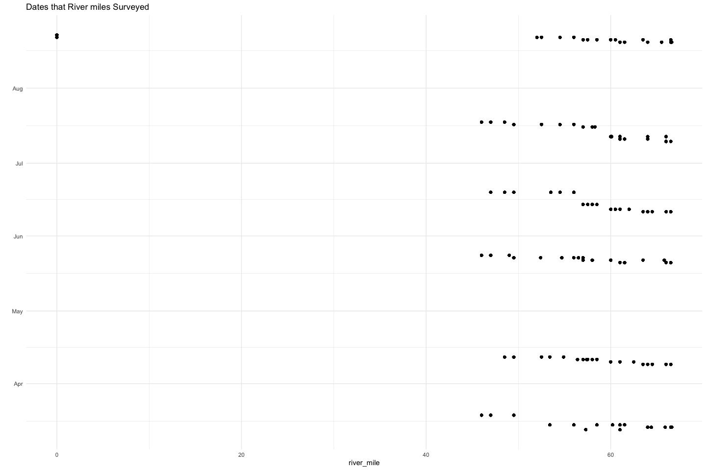
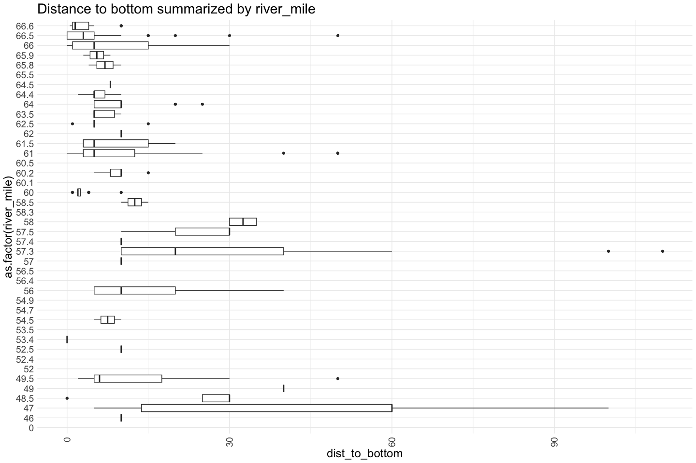
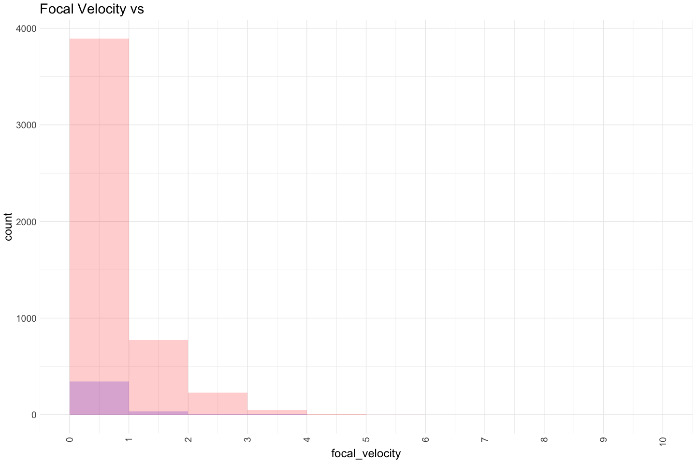
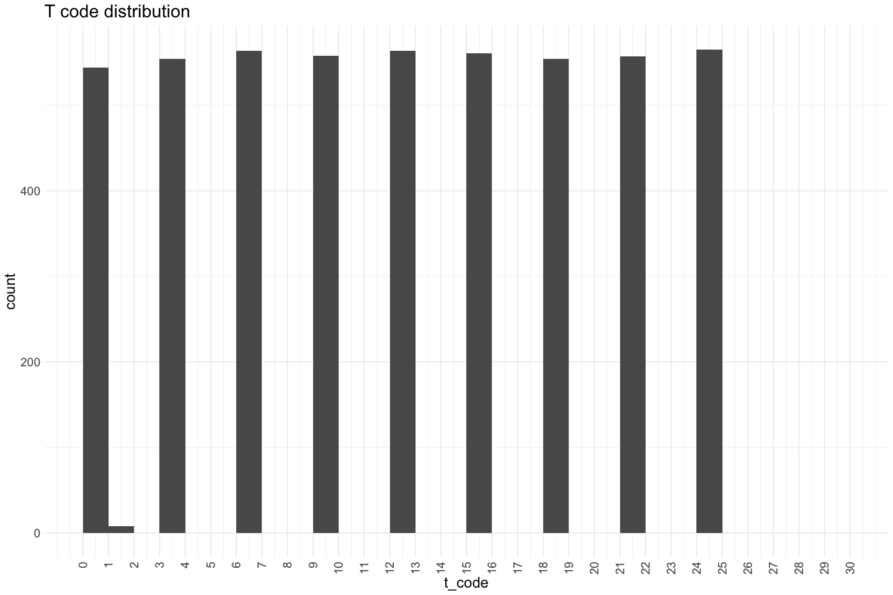
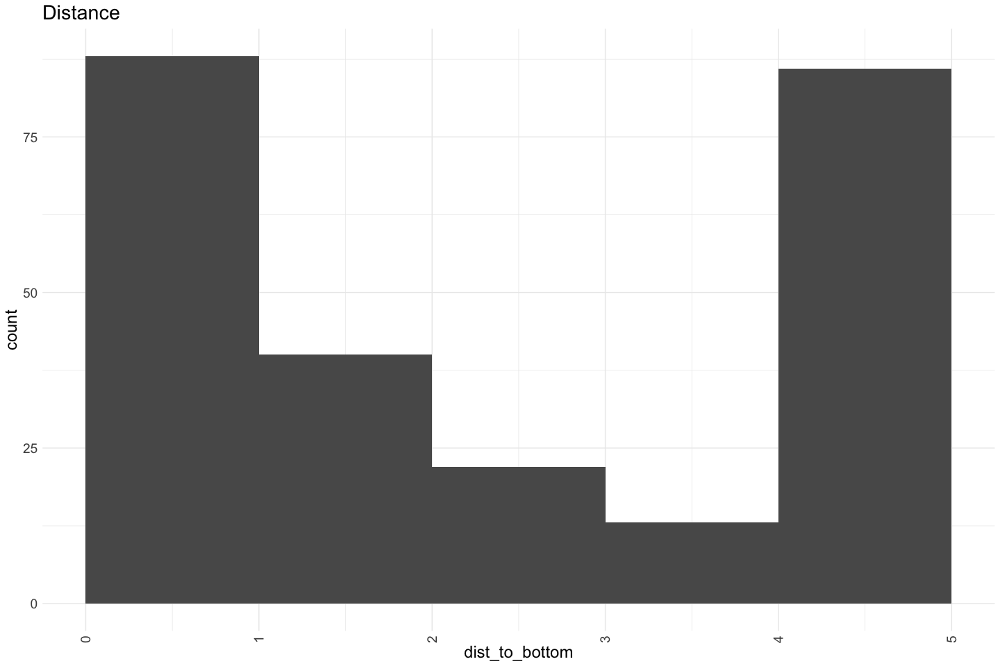

Feather River Mini Snorkel Data QC
================
Erin Cain
03/24

# Feather River Mini Snorkel Data

## Description of Monitoring Data

**Timeframe:** March 2001 - August 2001

**Completeness of Record throughout timeframe:** fairly complete

**Sampling Location:** Feather River

**Data Contact:** Ryon Kurth

## Questions

- what is distance
- what is t_code

## Source Database pull

``` r
source("data-raw/query_4mac.R")
```

    ## 
    ## Attaching package: 'Hmisc'

    ## The following objects are masked from 'package:dplyr':
    ## 
    ##     src, summarize

    ## The following objects are masked from 'package:base':
    ## 
    ##     format.pval, units

    ## Rows: 378
    ## Columns: 31
    ## $ PhysDataTblID  <labelled> 11, 11, 11, 11, 11, 11, 11, 11, 11, 11, 11, 11, 11…
    ## $ Location       <labelled> "hatchery ditch", "hatchery ditch", "hatchery ditc…
    ## $ Date           <labelled> 2001-03-14, 2001-03-14, 2001-03-14, 2001-03-14, 20…
    ## $ RiverMile      <labelled> 66.6, 66.6, 66.6, 66.6, 66.6, 66.6, 66.6, 66.6, 66…
    ## $ SpeciesCode    <labelled> "CHN", "RBTS", "CHN", "CHN", "RBTS", "CHN", "CHN",…
    ## $ Count          <labelled> 1, 1, 50, 6, 3, 8, 15, 2, 5, 75, 2, 3, 1, 2, 3, 10…
    ## $ FL..mm.        <labelled> 40, 25, 40, 75, 25, 50, 40, 25, 45, 45, 35, 35, 25…
    ## $ DistToBottom   <labelled> 5.0, 1.0, 5.0, 5.0, 1.0, 1.0, 1.0, 1.0, 1.0, 5.0, …
    ## $ Focal.Velocity <labelled> 0.51, 0.64, 1.08, 0.80, 0.44, 0.18, 0.50, 0.50, 0.…
    ## $ TCode          <labelled> 3.4, 6.4, 6.4, 6.4, 9.4, 12.4, 12.4, 12.4, 18.4, 2…
    ## $ Depth          <labelled> 9, 37, 37, 37, 15, 19, 19, 19, 23, 13, 17, 17, 17,…
    ## $ Velocity       <labelled> 1.97, 0.91, 0.91, 0.91, 2.17, 1.01, 1.01, 1.01, 0.…
    ## $ Sub1           <labelled> 0, 0, 0, 0, 0, 0, 0, 0, 0, 0, 0, 0, 0, 0, 0, 0, 0,…
    ## $ Sub2           <labelled> 0, 65, 65, 65, 10, 40, 40, 40, 15, 0, 40, 40, 40, …
    ## $ Sub3           <labelled> 70, 25, 25, 25, 90, 60, 60, 60, 70, 85, 20, 20, 20…
    ## $ Sub4           <labelled> 30, 10, 10, 10, 0, 0, 0, 0, 15, 15, 30, 30, 30, 20…
    ## $ Sub5           <labelled> 0, 0, 0, 0, 0, 0, 0, 0, 0, 0, 10, 10, 10, 0, 0, 0,…
    ## $ Sub6           <labelled> 0, 0, 0, 0, 0, 0, 0, 0, 0, 0, 0, 0, 0, 0, 0, 0, 0,…
    ## $ IcovA          <labelled> 100, 100, 100, 100, 100, 100, 100, 100, 100, 90, 7…
    ## $ IcovB          <labelled> 0, 0, 0, 0, 0, 0, 0, 0, 0, 0, 15, 15, 15, 0, 20, 0…
    ## $ IcovC          <labelled> 0, 0, 0, 0, 0, 0, 0, 0, 0, 0, 0, 0, 0, 0, 40, 0, 0…
    ## $ IcovE          <labelled> 0, 0, 0, 0, 0, 0, 0, 0, 0, 10, 10, 10, 10, 0, 30, …
    ## $ IcovF          <labelled> 0, 0, 0, 0, 0, 0, 0, 0, 0, 0, 0, 0, 0, 0, 0, 0, 0,…
    ## $ Ocov0          <labelled> 100, 100, 100, 100, 100, 100, 100, 100, 100, 100, …
    ## $ Ocov1          <labelled> 0, 0, 0, 0, 0, 0, 0, 0, 0, 0, 0, 0, 0, 0, 0, 0, 0,…
    ## $ Ocov2          <labelled> 0, 0, 0, 0, 0, 0, 0, 0, 0, 0, 0, 0, 0, 0, 0, 0, 0,…
    ## $ SurTurb        <labelled> 10, 30, 30, 30, 20, 30, 30, 30, 10, 10, 20, 20, 20…
    ## $ CGU            <labelled> "g", "g", "g", "g", "g", "g", "g", "g", "g", "g", …
    ## $ Distance       <labelled> 4, 4, 4, 4, 4, 4, 4, 4, 4, 4, 1, 1, 1, 3, 1, 4, 4,…
    ## $ FishAge        <labelled> 0, 0, 0, 0, 0, 0, 0, 0, 0, 0, 0, 0, 0, 0, 0, 0, 0,…
    ## $ SpecAge        <labelled> "chn0", "rbt0", "chn0", "chn0", "rbt0", "chn0", "c…

    ## Rows: 378 Columns: 31

    ## ── Column specification ────────────────────────────────────────────────────────
    ## Delimiter: ","
    ## chr   (4): Location, SpeciesCode, CGU, SpecAge
    ## dbl  (26): PhysDataTblID, RiverMile, Count, FL..mm., DistToBottom, Focal.Vel...
    ## date  (1): Date
    ## 
    ## ℹ Use `spec()` to retrieve the full column specification for this data.
    ## ℹ Specify the column types or set `show_col_types = FALSE` to quiet this message.

    ## Rows: 378
    ## Columns: 31
    ## $ PhysDataTblID  <dbl> 11, 11, 11, 11, 11, 11, 11, 11, 11, 11, 11, 11, 11, 11,…
    ## $ Location       <chr> "hatchery ditch", "hatchery ditch", "hatchery ditch", "…
    ## $ Date           <date> 2001-03-14, 2001-03-14, 2001-03-14, 2001-03-14, 2001-0…
    ## $ RiverMile      <dbl> 66.6, 66.6, 66.6, 66.6, 66.6, 66.6, 66.6, 66.6, 66.6, 6…
    ## $ SpeciesCode    <chr> "CHN", "RBTS", "CHN", "CHN", "RBTS", "CHN", "CHN", "RBT…
    ## $ Count          <dbl> 1, 1, 50, 6, 3, 8, 15, 2, 5, 75, 2, 3, 1, 2, 3, 10, 20,…
    ## $ FL..mm.        <dbl> 40, 25, 40, 75, 25, 50, 40, 25, 45, 45, 35, 35, 25, 35,…
    ## $ DistToBottom   <dbl> 5.0, 1.0, 5.0, 5.0, 1.0, 1.0, 1.0, 1.0, 1.0, 5.0, 1.0, …
    ## $ Focal.Velocity <dbl> 0.51, 0.64, 1.08, 0.80, 0.44, 0.18, 0.50, 0.50, 0.50, 0…
    ## $ TCode          <dbl> 3.4, 6.4, 6.4, 6.4, 9.4, 12.4, 12.4, 12.4, 18.4, 24.4, …
    ## $ Depth          <dbl> 9, 37, 37, 37, 15, 19, 19, 19, 23, 13, 17, 17, 17, 19, …
    ## $ Velocity       <dbl> 1.97, 0.91, 0.91, 0.91, 2.17, 1.01, 1.01, 1.01, 0.78, 1…
    ## $ Sub1           <dbl> 0, 0, 0, 0, 0, 0, 0, 0, 0, 0, 0, 0, 0, 0, 0, 0, 0, 40, …
    ## $ Sub2           <dbl> 0, 65, 65, 65, 10, 40, 40, 40, 15, 0, 40, 40, 40, 30, 7…
    ## $ Sub3           <dbl> 70, 25, 25, 25, 90, 60, 60, 60, 70, 85, 20, 20, 20, 50,…
    ## $ Sub4           <dbl> 30, 10, 10, 10, 0, 0, 0, 0, 15, 15, 30, 30, 30, 20, 0, …
    ## $ Sub5           <dbl> 0, 0, 0, 0, 0, 0, 0, 0, 0, 0, 10, 10, 10, 0, 0, 0, 0, 0…
    ## $ Sub6           <dbl> 0, 0, 0, 0, 0, 0, 0, 0, 0, 0, 0, 0, 0, 0, 0, 0, 0, 0, 0…
    ## $ IcovA          <dbl> 100, 100, 100, 100, 100, 100, 100, 100, 100, 90, 75, 75…
    ## $ IcovB          <dbl> 0, 0, 0, 0, 0, 0, 0, 0, 0, 0, 15, 15, 15, 0, 20, 0, 0, …
    ## $ IcovC          <dbl> 0, 0, 0, 0, 0, 0, 0, 0, 0, 0, 0, 0, 0, 0, 40, 0, 0, 0, …
    ## $ IcovE          <dbl> 0, 0, 0, 0, 0, 0, 0, 0, 0, 10, 10, 10, 10, 0, 30, 0, 0,…
    ## $ IcovF          <dbl> 0, 0, 0, 0, 0, 0, 0, 0, 0, 0, 0, 0, 0, 0, 0, 0, 0, 0, 0…
    ## $ Ocov0          <dbl> 100, 100, 100, 100, 100, 100, 100, 100, 100, 100, 100, …
    ## $ Ocov1          <dbl> 0, 0, 0, 0, 0, 0, 0, 0, 0, 0, 0, 0, 0, 0, 0, 0, 0, 25, …
    ## $ Ocov2          <dbl> 0, 0, 0, 0, 0, 0, 0, 0, 0, 0, 0, 0, 0, 0, 0, 0, 0, 0, 0…
    ## $ SurTurb        <dbl> 10, 30, 30, 30, 20, 30, 30, 30, 10, 10, 20, 20, 20, 20,…
    ## $ CGU            <chr> "g", "g", "g", "g", "g", "g", "g", "g", "g", "g", "g", …
    ## $ Distance       <dbl> 4, 4, 4, 4, 4, 4, 4, 4, 4, 4, 1, 1, 1, 3, 1, 4, 4, 1, 2…
    ## $ FishAge        <dbl> 0, 0, 0, 0, 0, 0, 0, 0, 0, 0, 0, 0, 0, 0, 0, 0, 0, 0, 0…
    ## $ SpecAge        <chr> "chn0", "rbt0", "chn0", "chn0", "rbt0", "chn0", "chn0",…
    ## Rows: 1,619
    ## Columns: 27
    ## $ PhysDataTblID <int> 11, 11, 11, 11, 11, 11, 11, 11, 11, 11, 11, 11, 11, 11, …
    ## $ Location      <chr> "hatchery ditch", "hatchery ditch", "hatchery ditch", "h…
    ## $ Date          <date> 2001-03-14, 2001-03-14, 2001-03-14, 2001-03-14, 2001-03…
    ## $ RiverMile     <dbl> 66.6, 66.6, 66.6, 66.6, 66.6, 66.6, 66.6, 66.6, 66.6, 66…
    ## $ Depth         <int> 17, 19, 11, 12, 11, 10, 8, 9, 10, 19, 19, 37, 16, 14, 15…
    ## $ Velocity      <dbl> 0.22, 0.35, 1.95, 2.14, 1.19, 1.54, 1.26, 1.97, 0.75, 0.…
    ## $ Sub1          <int> 0, 0, 0, 0, 0, 0, 0, 0, 40, 0, 0, 0, 0, 0, 0, 0, 15, 0, …
    ## $ Sub2          <int> 40, 50, 25, 0, 70, 30, 0, 0, 0, 60, 30, 65, 80, 0, 0, 10…
    ## $ Sub3          <int> 20, 40, 75, 80, 30, 50, 60, 70, 40, 30, 50, 25, 20, 85, …
    ## $ Sub4          <int> 30, 10, 0, 20, 0, 20, 40, 30, 20, 10, 20, 10, 0, 15, 30,…
    ## $ Sub5          <int> 10, 0, 0, 0, 0, 0, 0, 0, 0, 0, 0, 0, 0, 0, 0, 0, 0, 0, 0…
    ## $ Sub6          <int> 0, 0, 0, 0, 0, 0, 0, 0, 0, 0, 0, 0, 0, 0, 0, 0, 0, 0, 0,…
    ## $ IcovA         <int> 75, 100, 100, 100, 10, 100, 100, 100, 50, 100, 100, 100,…
    ## $ IcovB         <int> 15, 0, 0, 0, 20, 0, 0, 0, 10, 0, 0, 0, 10, 0, 0, 0, 40, …
    ## $ IcovC         <int> 0, 0, 0, 0, 40, 0, 0, 0, 0, 0, 0, 0, 0, 0, 0, 0, 0, 0, 0…
    ## $ IcovE         <int> 10, 0, 0, 0, 30, 0, 0, 0, 40, 0, 0, 0, 0, 0, 0, 0, 0, 0,…
    ## $ IcovF         <int> 0, 0, 0, 0, 0, 0, 0, 0, 0, 0, 0, 0, 0, 0, 0, 0, 20, 0, 0…
    ## $ Ocov0         <int> 100, 100, 100, 100, 100, 100, 100, 100, 75, 100, 100, 10…
    ## $ Ocov1         <int> 0, 0, 0, 0, 0, 0, 0, 0, 25, 0, 0, 0, 50, 0, 0, 0, 0, 0, …
    ## $ Ocov2         <int> 0, 0, 0, 0, 0, 0, 0, 0, 0, 0, 0, 0, 0, 0, 0, 0, 0, 0, 0,…
    ## $ SurTurb       <int> 20, 30, 30, 30, 10, 10, 10, 10, 0, 10, 20, 30, 0, 0, 10,…
    ## $ CGU           <chr> "g", "g", "g", "g", "gm", "g", "g", "g", "gm", "gm", "g"…
    ## $ SubSum        <int> 100, 100, 100, 100, 100, 100, 100, 100, 100, 100, 100, 1…
    ## $ ICovSum       <int> 100, 100, 100, 100, 100, 100, 100, 100, 100, 100, 100, 1…
    ## $ OCovSum       <int> 100, 100, 100, 100, 100, 100, 100, 100, 100, 100, 100, 1…
    ## $ SpecAge       <chr> "chn0", "chn0", "chn0", "chn0", "chn0", "chn0", "chn0", …
    ## $ TCode         <dbl> 0.1, 0.2, 0.3, 0.4, 3.1, 3.2, 3.3, 3.4, 6.1, 6.2, 6.3, 6…
    ## Rows: 410
    ## Columns: 8
    ## $ PDatID         <labelled> 11, 11, 11, 11, 11, 11, 11, 11, 11, 11, 11, 11, 11…
    ## $ FishDataID     <labelled> 11, 12, 13, 14, 15, 16, 17, 18, 19, 20, 21, 22, 23…
    ## $ Species        <labelled> 3, 1, 3, 3, 1, 3, 3, 1, 3, 3, 3, 3, 1, 3, 1, 3, 3,…
    ## $ Count          <labelled> 1, 1, 50, 6, 3, 8, 15, 2, 5, 75, 2, 3, 1, 2, 3, 10…
    ## $ FL..mm.        <labelled> 40, 25, 40, 75, 25, 50, 40, 25, 45, 45, 35, 35, 25…
    ## $ DistToBottom   <labelled> 5.0, 1.0, 5.0, 5.0, 1.0, 1.0, 1.0, 1.0, 1.0, 5.0, …
    ## $ Focal.Velocity <labelled> 0.51, 0.64, 1.08, 0.80, 0.44, 0.18, 0.50, 0.50, 0.…
    ## $ TCode          <labelled> 3.4, 6.4, 6.4, 6.4, 9.4, 12.4, 12.4, 12.4, 18.4, 2…
    ## Rows: 81
    ## Columns: 2
    ## $ PDatID   <int> 94, 95, 96, 97, 111, 112, 112, 112, 114, 114, 114, 115, 116, …
    ## $ Comments <chr> "No flow or river mile recorded", "Flow and river mile not re…

Read in data from google cloud, glimpse raw data and domain description
sheet:

``` r
# read in data to clean 
all_fish_obs |> glimpse()
```

    ## Rows: 378
    ## Columns: 31
    ## $ PhysDataTblID  <dbl> 11, 11, 11, 11, 11, 11, 11, 11, 11, 11, 11, 11, 11, 11,…
    ## $ Location       <chr> "hatchery ditch", "hatchery ditch", "hatchery ditch", "…
    ## $ Date           <date> 2001-03-14, 2001-03-14, 2001-03-14, 2001-03-14, 2001-0…
    ## $ RiverMile      <dbl> 66.6, 66.6, 66.6, 66.6, 66.6, 66.6, 66.6, 66.6, 66.6, 6…
    ## $ SpeciesCode    <chr> "CHN", "RBTS", "CHN", "CHN", "RBTS", "CHN", "CHN", "RBT…
    ## $ Count          <dbl> 1, 1, 50, 6, 3, 8, 15, 2, 5, 75, 2, 3, 1, 2, 3, 10, 20,…
    ## $ FL..mm.        <dbl> 40, 25, 40, 75, 25, 50, 40, 25, 45, 45, 35, 35, 25, 35,…
    ## $ DistToBottom   <dbl> 5.0, 1.0, 5.0, 5.0, 1.0, 1.0, 1.0, 1.0, 1.0, 5.0, 1.0, …
    ## $ Focal.Velocity <dbl> 0.51, 0.64, 1.08, 0.80, 0.44, 0.18, 0.50, 0.50, 0.50, 0…
    ## $ TCode          <dbl> 3.4, 6.4, 6.4, 6.4, 9.4, 12.4, 12.4, 12.4, 18.4, 24.4, …
    ## $ Depth          <dbl> 9, 37, 37, 37, 15, 19, 19, 19, 23, 13, 17, 17, 17, 19, …
    ## $ Velocity       <dbl> 1.97, 0.91, 0.91, 0.91, 2.17, 1.01, 1.01, 1.01, 0.78, 1…
    ## $ Sub1           <dbl> 0, 0, 0, 0, 0, 0, 0, 0, 0, 0, 0, 0, 0, 0, 0, 0, 0, 40, …
    ## $ Sub2           <dbl> 0, 65, 65, 65, 10, 40, 40, 40, 15, 0, 40, 40, 40, 30, 7…
    ## $ Sub3           <dbl> 70, 25, 25, 25, 90, 60, 60, 60, 70, 85, 20, 20, 20, 50,…
    ## $ Sub4           <dbl> 30, 10, 10, 10, 0, 0, 0, 0, 15, 15, 30, 30, 30, 20, 0, …
    ## $ Sub5           <dbl> 0, 0, 0, 0, 0, 0, 0, 0, 0, 0, 10, 10, 10, 0, 0, 0, 0, 0…
    ## $ Sub6           <dbl> 0, 0, 0, 0, 0, 0, 0, 0, 0, 0, 0, 0, 0, 0, 0, 0, 0, 0, 0…
    ## $ IcovA          <dbl> 100, 100, 100, 100, 100, 100, 100, 100, 100, 90, 75, 75…
    ## $ IcovB          <dbl> 0, 0, 0, 0, 0, 0, 0, 0, 0, 0, 15, 15, 15, 0, 20, 0, 0, …
    ## $ IcovC          <dbl> 0, 0, 0, 0, 0, 0, 0, 0, 0, 0, 0, 0, 0, 0, 40, 0, 0, 0, …
    ## $ IcovE          <dbl> 0, 0, 0, 0, 0, 0, 0, 0, 0, 10, 10, 10, 10, 0, 30, 0, 0,…
    ## $ IcovF          <dbl> 0, 0, 0, 0, 0, 0, 0, 0, 0, 0, 0, 0, 0, 0, 0, 0, 0, 0, 0…
    ## $ Ocov0          <dbl> 100, 100, 100, 100, 100, 100, 100, 100, 100, 100, 100, …
    ## $ Ocov1          <dbl> 0, 0, 0, 0, 0, 0, 0, 0, 0, 0, 0, 0, 0, 0, 0, 0, 0, 25, …
    ## $ Ocov2          <dbl> 0, 0, 0, 0, 0, 0, 0, 0, 0, 0, 0, 0, 0, 0, 0, 0, 0, 0, 0…
    ## $ SurTurb        <dbl> 10, 30, 30, 30, 20, 30, 30, 30, 10, 10, 20, 20, 20, 20,…
    ## $ CGU            <chr> "g", "g", "g", "g", "g", "g", "g", "g", "g", "g", "g", …
    ## $ Distance       <dbl> 4, 4, 4, 4, 4, 4, 4, 4, 4, 4, 1, 1, 1, 3, 1, 4, 4, 1, 2…
    ## $ FishAge        <dbl> 0, 0, 0, 0, 0, 0, 0, 0, 0, 0, 0, 0, 0, 0, 0, 0, 0, 0, 0…
    ## $ SpecAge        <chr> "chn0", "rbt0", "chn0", "chn0", "rbt0", "chn0", "chn0",…

## Data transformations

### first table reviewd is the All Fish Observation Table

All of the substrate and cover lookups are not true look ups. Substrate
and cover column indicate a percentage of cover or substrate of each
type. I updated the column names to reflect this and utilized the lookup
tables to understand which substrate or cover type each column was
referring to.

Columns removed: - SpecAge removed - just a combination of species and
age

``` r
# For different excel sheets for each year read in and combine years here
joined_fish_obs <- all_fish_obs |> 
  left_join(species_code_lookup) |> 
  select(-c(SpeciesCodeID, SpeciesCode)) |>
  rename(percent_fine_substrate = Sub1, 
         percent_sand_substrate = Sub2, 
         percent_small_gravel_substrate = Sub3, 
         percent_large_gravel_substrate = Sub4, 
         percent_cobble_substrate = Sub5, 
         percent_boulder_substrate = Sub6,
         percent_no_cover_inchannel = IcovA, 
         percent_small_woody_cover_inchannel = IcovB, 
         percent_large_woody_cover_inchannel = IcovC, 
         percent_submerged_aquatic_veg_inchannel = IcovE, 
         percent_undercut_bank = IcovF,
         percent_no_cover_overhead = Ocov0,
         percent_cover_half_meter_overhead = Ocov1, 
         percent_cover_more_than_half_meter_overhead = Ocov2)|> 
  janitor::clean_names() |> 
  select(-spec_age) |> #same as species + age
  left_join(cgu_code_lookup |> mutate(CGUCode = tolower(CGUCode)), by = c("cgu" = "CGUCode")) |> 
  select(-cgu, -CGUCodeID) |> 
  rename(channel_geomorphic_unit = CGU) |> 
  glimpse()
```

    ## Joining with `by = join_by(SpeciesCode)`

    ## Rows: 378
    ## Columns: 30
    ## $ phys_data_tbl_id                            <dbl> 11, 11, 11, 11, 11, 11, 11…
    ## $ location                                    <chr> "hatchery ditch", "hatcher…
    ## $ date                                        <date> 2001-03-14, 2001-03-14, 2…
    ## $ river_mile                                  <dbl> 66.6, 66.6, 66.6, 66.6, 66…
    ## $ count                                       <dbl> 1, 1, 50, 6, 3, 8, 15, 2, …
    ## $ fl_mm                                       <dbl> 40, 25, 40, 75, 25, 50, 40…
    ## $ dist_to_bottom                              <dbl> 5.0, 1.0, 5.0, 5.0, 1.0, 1…
    ## $ focal_velocity                              <dbl> 0.51, 0.64, 1.08, 0.80, 0.…
    ## $ t_code                                      <dbl> 3.4, 6.4, 6.4, 6.4, 9.4, 1…
    ## $ depth                                       <dbl> 9, 37, 37, 37, 15, 19, 19,…
    ## $ velocity                                    <dbl> 1.97, 0.91, 0.91, 0.91, 2.…
    ## $ percent_fine_substrate                      <dbl> 0, 0, 0, 0, 0, 0, 0, 0, 0,…
    ## $ percent_sand_substrate                      <dbl> 0, 65, 65, 65, 10, 40, 40,…
    ## $ percent_small_gravel_substrate              <dbl> 70, 25, 25, 25, 90, 60, 60…
    ## $ percent_large_gravel_substrate              <dbl> 30, 10, 10, 10, 0, 0, 0, 0…
    ## $ percent_cobble_substrate                    <dbl> 0, 0, 0, 0, 0, 0, 0, 0, 0,…
    ## $ percent_boulder_substrate                   <dbl> 0, 0, 0, 0, 0, 0, 0, 0, 0,…
    ## $ percent_no_cover_inchannel                  <dbl> 100, 100, 100, 100, 100, 1…
    ## $ percent_small_woody_cover_inchannel         <dbl> 0, 0, 0, 0, 0, 0, 0, 0, 0,…
    ## $ percent_large_woody_cover_inchannel         <dbl> 0, 0, 0, 0, 0, 0, 0, 0, 0,…
    ## $ percent_submerged_aquatic_veg_inchannel     <dbl> 0, 0, 0, 0, 0, 0, 0, 0, 0,…
    ## $ percent_undercut_bank                       <dbl> 0, 0, 0, 0, 0, 0, 0, 0, 0,…
    ## $ percent_no_cover_overhead                   <dbl> 100, 100, 100, 100, 100, 1…
    ## $ percent_cover_half_meter_overhead           <dbl> 0, 0, 0, 0, 0, 0, 0, 0, 0,…
    ## $ percent_cover_more_than_half_meter_overhead <dbl> 0, 0, 0, 0, 0, 0, 0, 0, 0,…
    ## $ sur_turb                                    <dbl> 10, 30, 30, 30, 20, 30, 30…
    ## $ distance                                    <dbl> 4, 4, 4, 4, 4, 4, 4, 4, 4,…
    ## $ fish_age                                    <dbl> 0, 0, 0, 0, 0, 0, 0, 0, 0,…
    ## $ species                                     <chr> "Chinook salmon", "Steelhe…
    ## $ channel_geomorphic_unit                     <chr> "Glide", "Glide", "Glide",…

## Explore Numeric Variables:

``` r
# Filter clean data to show only numeric variables 
joined_fish_obs %>% select_if(is.numeric) %>% colnames()
```

    ##  [1] "phys_data_tbl_id"                           
    ##  [2] "river_mile"                                 
    ##  [3] "count"                                      
    ##  [4] "fl_mm"                                      
    ##  [5] "dist_to_bottom"                             
    ##  [6] "focal_velocity"                             
    ##  [7] "t_code"                                     
    ##  [8] "depth"                                      
    ##  [9] "velocity"                                   
    ## [10] "percent_fine_substrate"                     
    ## [11] "percent_sand_substrate"                     
    ## [12] "percent_small_gravel_substrate"             
    ## [13] "percent_large_gravel_substrate"             
    ## [14] "percent_cobble_substrate"                   
    ## [15] "percent_boulder_substrate"                  
    ## [16] "percent_no_cover_inchannel"                 
    ## [17] "percent_small_woody_cover_inchannel"        
    ## [18] "percent_large_woody_cover_inchannel"        
    ## [19] "percent_submerged_aquatic_veg_inchannel"    
    ## [20] "percent_undercut_bank"                      
    ## [21] "percent_no_cover_overhead"                  
    ## [22] "percent_cover_half_meter_overhead"          
    ## [23] "percent_cover_more_than_half_meter_overhead"
    ## [24] "sur_turb"                                   
    ## [25] "distance"                                   
    ## [26] "fish_age"

### Variable: `count`

**Plotting Count over Period of Record**

``` r
# Make whatever plot is appropriate 
# maybe 2+ plots are appropriate
joined_fish_obs %>% 
  ggplot(aes(x = date, y = count, group = 1))+
  # geom_line()+
  geom_point(aes(x=date, y = count))+
  theme_minimal()+
  labs(title = "Count over Time",
       y = "Number of Fish Observations")
```

<!-- -->

**Numeric Summary of Count over Period of Record**

``` r
# Table with summary statistics
summary(joined_fish_obs$count)
```

    ##    Min. 1st Qu.  Median    Mean 3rd Qu.    Max. 
    ##    1.00    1.00    5.00   54.65   35.00 1500.00

**NA and Unknown Values**

There are 0 NA values

### Variable: `date`

**Plotting Date over Period of Record**

All observations are from 2001

``` r
# Make whatever plot is appropriate 
# maybe 2+ plots are appropriate
joined_fish_obs %>% 
  ggplot(aes(x = date, y = TRUE, group = 1))+
  # geom_line()+
  geom_point(aes(x=date, y = TRUE))+
  theme_minimal()+
  labs(title = "Dates Surveyed",
       y = "")
```

<!-- -->

**Numeric Summary of Count over Period of Record**

``` r
# Table with summary statistics
summary(joined_fish_obs$date)
```

    ##         Min.      1st Qu.       Median         Mean      3rd Qu.         Max. 
    ## "2001-03-13" "2001-03-14" "2001-04-09" "2001-04-18" "2001-05-21" "2001-08-22"

**NA and Unknown Values**

There are 0 NA values

### Variable: \`river_mile\`\`

**Plotting river_mile over Period of Record**

``` r
# Make whatever plot is appropriate 
# maybe 2+ plots are appropriate
joined_fish_obs %>% 
  ggplot(aes(x = river_mile, y = date, group = 1))+
  # geom_line()+
  geom_point(aes(x=river_mile, y = date))+
  theme_minimal()+
  labs(title = "Dates that River miles Surveyed",
       y = "")
```

<!-- -->

**Numeric Summary of river_mile over Period of Record**

``` r
# Table with summary statistics
summary(joined_fish_obs$river_mile)
```

    ##    Min. 1st Qu.  Median    Mean 3rd Qu.    Max. 
    ##   46.00   61.00   66.00   62.81   66.50   66.60

**NA and Unknown Values**

There are 0 NA values

### Variable: `fl_mm`

**Plotting fl_mm over Period of Record**

``` r
# Make whatever plot is appropriate 
# maybe 2+ plots are appropriate
joined_fish_obs |> 
  # filter(fork_length < 250) %>% # filter out 13 points so we can more clearly see distribution
  ggplot(aes(x = fl_mm)) + 
  geom_histogram(breaks=seq(0, 200, by=2)) + 
  scale_x_continuous(breaks=seq(0, 200, by=25)) +
  theme_minimal() +
  labs(title = "Fork length distribution") + 
  theme(text = element_text(size = 18),
        axis.text.x = element_text(angle = 90, vjust = 0.5, hjust=1)) 
```

<!-- -->

``` r
joined_fish_obs %>% 
  mutate(year = as.factor(year(date))) %>%
  ggplot(aes(x = fl_mm, y = species)) + 
  geom_boxplot() + 
  theme_minimal() +
  labs(title = "Fork length summarized by species") + 
  theme(text = element_text(size = 18),
        axis.text.x = element_text(angle = 90, vjust = 0.5, hjust=1)) 
```

<!-- -->

**Numeric Summary of fl_mm over Period of Record**

``` r
# Table with summary statistics
summary(joined_fish_obs$fl_mm)
```

    ##    Min. 1st Qu.  Median    Mean 3rd Qu.    Max. 
    ##   25.00   30.00   40.00   47.68   45.00  500.00

**NA and Unknown Values**

There are 0 NA values

### Variable: `dist_to_bottom`

**Plotting dist_to_bottom distribution**

``` r
# Make whatever plot is appropriate 
# maybe 2+ plots are appropriate
joined_fish_obs |> 
  # filter(fork_length < 250) %>% # filter out 13 points so we can more clearly see distribution
  ggplot(aes(x = dist_to_bottom)) + 
  geom_histogram(breaks=seq(0, 200, by=2)) + 
  scale_x_continuous(breaks=seq(0, 200, by=25)) +
  theme_minimal() +
  labs(title = "Distance to Bottom") + 
  theme(text = element_text(size = 18),
        axis.text.x = element_text(angle = 90, vjust = 0.5, hjust=1)) 
```

<!-- -->

``` r
joined_fish_obs %>% 
  mutate(year = as.factor(year(date))) %>%
  ggplot(aes(x = dist_to_bottom, y = as.factor(river_mile))) + 
  geom_boxplot() + 
  theme_minimal() +
  labs(title = "Distance to bottom summarized by river_mile") + 
  theme(text = element_text(size = 18),
        axis.text.x = element_text(angle = 90, vjust = 0.5, hjust=1)) 
```

<!-- -->

**Numeric Summary of dist_to_bottom over Period of Record**

``` r
# Table with summary statistics
summary(joined_fish_obs$river_mile)
```

    ##    Min. 1st Qu.  Median    Mean 3rd Qu.    Max. 
    ##   46.00   61.00   66.00   62.81   66.50   66.60

**NA and Unknown Values**

There are 0 NA values

### Variable: `focal_velocity` & `velocity`

**Plotting velocities over Period of Record**

``` r
joined_fish_obs |> 
  # filter(fork_length < 250) %>% # filter out 13 points so we can more clearly see distribution
  ggplot(aes(x = focal_velocity)) + 
  geom_histogram(breaks=seq(0, 10, by=1), group = "Focal velocity", fill = "blue", alpha = .2 ) + 
  geom_histogram(aes(x = velocity), breaks=seq(0, 10, by=1), group = "Focal velocity", fill = "red", alpha = .2 ) + 
  scale_x_continuous(breaks=seq(0, 10, by=1)) +
  theme_minimal() +
  labs(title = "Focal Velocity vs ") + 
  theme(text = element_text(size = 18),
        axis.text.x = element_text(angle = 90, vjust = 0.5, hjust=1)) 
```

<!-- -->

Looks like velocity and focal velocity have similar distributions

**Numeric Summary of focal_velocity over Period of Record**

``` r
# Table with summary statistics
summary(joined_fish_obs$focal_velocity)
```

    ##    Min. 1st Qu.  Median    Mean 3rd Qu.    Max. 
    ##  0.0000  0.0000  0.0000  0.3557  0.5750  3.4400

``` r
summary(joined_fish_obs$velocity)
```

    ##    Min. 1st Qu.  Median    Mean 3rd Qu.    Max. 
    ##  0.0000  0.0000  0.1800  0.4795  0.7600  3.3800

**NA and Unknown Values**

There are 0 NA values There are 0 NA values

### Variable: `t_code`

**Plotting t_code over Period of Record**

``` r
joined_fish_obs |> 
  # filter(fork_length < 250) %>% # filter out 13 points so we can more clearly see distribution
  ggplot(aes(x = t_code)) + 
  geom_histogram(breaks=seq(0, 30, by=1)) + 
  scale_x_continuous(breaks=seq(0, 30, by=1)) +
  theme_minimal() +
  labs(title = "T code distribution") + 
  theme(text = element_text(size = 18),
        axis.text.x = element_text(angle = 90, vjust = 0.5, hjust=1)) 
```

<!-- -->

**Numeric Summary of t_code over Period of Record**

``` r
# Table with summary statistics
summary(joined_fish_obs$t_code)
```

    ##    Min. 1st Qu.  Median    Mean 3rd Qu.    Max. 
    ##    0.10    6.30   12.30   12.73   18.30   24.40

**NA and Unknown Values**

There are 0 NA values

### Variable: `depth`

**Plotting depth over Period of Record**

``` r
joined_fish_obs |> 
  # filter(fork_length < 250) %>% # filter out 13 points so we can more clearly see distribution
  ggplot(aes(x = depth)) + 
  geom_histogram(breaks=seq(0, 250, by=1)) + 
  scale_x_continuous(breaks=seq(0, 200, by=50)) +
  theme_minimal() +
  labs(title = "T code distribution") + 
  theme(text = element_text(size = 18),
        axis.text.x = element_text(angle = 90, vjust = 0.5, hjust=1)) 
```

<!-- -->

**Numeric Summary of depth over Period of Record**

``` r
# Table with summary statistics
summary(joined_fish_obs$depth)
```

    ##    Min. 1st Qu.  Median    Mean 3rd Qu.    Max. 
    ##    3.00   15.00   24.00   31.79   37.00  200.00

**NA and Unknown Values**

There are 0 NA values

### Variable: `substrate`

**Plotting substrate over Period of Record**

``` r
# Make whatever plot is appropriate 
# maybe 2+ plots are appropriate
joined_fish_obs |> 
  arrange(river_mile) |> 
  mutate(obs_id = 1:nrow(joined_fish_obs)) |> 
  select(obs_id, 
         percent_fine_substrate,
         percent_sand_substrate,
         percent_small_gravel_substrate,
         percent_large_gravel_substrate,
         percent_cobble_substrate,
         percent_boulder_substrate) |> 
  pivot_longer(cols = percent_fine_substrate:percent_boulder_substrate, 
               names_to = "substrate_type", values_to = "percent") |> 
  ggplot(aes(x = obs_id, y = percent, fill = substrate_type)) +
  geom_col() +
  scale_fill_manual(values = colors_small) +
  theme_minimal() +
  theme(legend.position = "bottom")
```

<!-- -->

**Numeric Summary of substrate over Period of Record**

``` r
# Table with summary statistics
summary(joined_fish_obs$percent_fine_substrate)
```

    ##    Min. 1st Qu.  Median    Mean 3rd Qu.    Max. 
    ##   0.000   0.000   0.000   7.474   0.000 100.000

``` r
summary(joined_fish_obs$percent_sand_substrate)
```

    ##    Min. 1st Qu.  Median    Mean 3rd Qu.    Max. 
    ##    0.00    0.00    0.00   25.67   40.00  100.00

``` r
summary(joined_fish_obs$percent_small_gravel_substrate)
```

    ##    Min. 1st Qu.  Median    Mean 3rd Qu.    Max. 
    ##    0.00    0.00   15.00   23.51   30.00  100.00

``` r
summary(joined_fish_obs$percent_large_gravel_substrate)
```

    ##    Min. 1st Qu.  Median    Mean 3rd Qu.    Max. 
    ##    0.00    0.00   15.00   26.12   50.00  100.00

``` r
summary(joined_fish_obs$percent_boulder_substrate)
```

    ##    Min. 1st Qu.  Median    Mean 3rd Qu.    Max. 
    ##   0.000   0.000   0.000   4.286   0.000 100.000

``` r
summary(joined_fish_obs$percent_cobble_substrate)
```

    ##    Min. 1st Qu.  Median    Mean 3rd Qu.    Max. 
    ##    0.00    0.00    0.00   12.94   20.00  100.00

**NA and Unknown Values**

There are 0 NA values There are 0 NA values There are 0 NA values There
are 0 NA values There are 0 NA values There are 0 NA values

### Variable: `inchannel cover`

**Plotting inchannel cover over Period of Record**

Notes: - some cover totals less than 100%

``` r
joined_fish_obs |> 
  arrange(river_mile) |> 
  mutate(obs_id = 1:nrow(joined_fish_obs)) |> 
  select(obs_id, 
         percent_no_cover_inchannel,
         percent_small_woody_cover_inchannel,
         percent_large_woody_cover_inchannel,
         percent_submerged_aquatic_veg_inchannel) |> 
  pivot_longer(cols = percent_no_cover_inchannel:percent_submerged_aquatic_veg_inchannel, 
               names_to = "inchannel_cover_type", values_to = "percent") |> 
  ggplot(aes(x = obs_id, y = percent, fill = inchannel_cover_type)) +
  geom_col() +
  scale_fill_manual(values = colors_small[4:7]) +
  theme_minimal() +
  theme(legend.position = "bottom")
```

<!-- -->

**Numeric Summary of inchannel cover over Period of Record**

``` r
# Table with summary statistics
summary(joined_fish_obs$percent_no_cover_inchannel)
```

    ##    Min. 1st Qu.  Median    Mean 3rd Qu.    Max. 
    ##    0.00   55.00   80.00   73.82  100.00  100.00

``` r
summary(joined_fish_obs$percent_small_woody_cover_inchannel)
```

    ##    Min. 1st Qu.  Median    Mean 3rd Qu.    Max. 
    ##    0.00    0.00    0.00   11.67   10.00  100.00

``` r
summary(joined_fish_obs$percent_large_woody_cover_inchannel)
```

    ##    Min. 1st Qu.  Median    Mean 3rd Qu.    Max.    NA's 
    ##    0.00    0.00    0.00    1.17    0.00   40.00       2

``` r
summary(joined_fish_obs$percent_submerged_aquatic_veg_inchannel)
```

    ##    Min. 1st Qu.  Median    Mean 3rd Qu.    Max. 
    ##    0.00    0.00    0.00   12.16   15.00  100.00

**NA and Unknown Values**

There are 0 NA values There are 0 NA values There are 2 NA values There
are 0 NA values

### Variable: `overhead cover`

**Plotting overhead cover over Period of Record**

Notes: - some cover totals more than 100%

``` r
joined_fish_obs |> 
  arrange(river_mile) |> 
  mutate(obs_id = 1:nrow(joined_fish_obs)) |> 
  select(obs_id, 
         percent_undercut_bank,
         percent_no_cover_overhead,
         percent_cover_half_meter_overhead,
         percent_cover_more_than_half_meter_overhead) |> 
  pivot_longer(cols = percent_undercut_bank:percent_cover_more_than_half_meter_overhead, 
               names_to = "overhead_cover_type", values_to = "percent") |> 
  ggplot(aes(x = obs_id, y = percent, fill = overhead_cover_type)) +
  geom_col() +
  scale_fill_manual(values = colors_small[4:7]) +
  theme_minimal() +
  theme(legend.position = "bottom")
```

<!-- -->

**Numeric Summary of overhead cover over Period of Record**

``` r
# Table with summary statistics
summary(joined_fish_obs$percent_undercut_bank)
```

    ##    Min. 1st Qu.  Median    Mean 3rd Qu.    Max. 
    ##    0.00    0.00    0.00    1.19    0.00   20.00

``` r
summary(joined_fish_obs$percent_no_cover_overhead)
```

    ##    Min. 1st Qu.  Median    Mean 3rd Qu.    Max. 
    ##    0.00   50.00  100.00   73.27  100.00  100.00

``` r
summary(joined_fish_obs$percent_cover_half_meter_overhead)
```

    ##    Min. 1st Qu.  Median    Mean 3rd Qu.    Max. 
    ##    0.00    0.00    0.00   10.95   15.00   75.00

``` r
summary(joined_fish_obs$percent_cover_more_than_half_meter_overhead)
```

    ##    Min. 1st Qu.  Median    Mean 3rd Qu.    Max. 
    ##    0.00    0.00    0.00   15.78   20.00  100.00

**NA and Unknown Values**

There are 0 NA values There are 0 NA values There are 0 NA values There
are 0 NA values

### Variable: `sur_turb`

**Plotting sur_turb over Period of Record**

``` r
joined_fish_obs |> 
  # filter(fork_length < 250) %>% # filter out 13 points so we can more clearly see distribution
  ggplot(aes(x = sur_turb)) + 
  geom_histogram(breaks=seq(0, 75, by=1)) + 
  scale_x_continuous(breaks=seq(0, 75, by=5)) +
  theme_minimal() +
  labs(title = "Surface turbidity distribution") + 
  theme(text = element_text(size = 18),
        axis.text.x = element_text(angle = 90, vjust = 0.5, hjust=1)) 
```

<!-- -->

**Numeric Summary of sur_turb over Period of Record**

``` r
# Table with summary statistics
summary(joined_fish_obs$sur_turb)
```

    ##    Min. 1st Qu.  Median    Mean 3rd Qu.    Max. 
    ##   0.000   0.000   0.000   4.762  10.000  50.000

**NA and Unknown Values**

There are 0 NA values

### Variable: `distance`

**Plotting distance over Period of Record**

``` r
joined_fish_obs |> 
  # filter(fork_length < 250) %>% # filter out 13 points so we can more clearly see distribution
  ggplot(aes(x = distance)) + 
  geom_histogram(breaks=seq(0, 5, by=1)) + 
  scale_x_continuous(breaks=seq(0, 5, by=1)) +
  theme_minimal() +
  labs(title = "Distance") + 
  theme(text = element_text(size = 18),
        axis.text.x = element_text(angle = 90, vjust = 0.5, hjust=1)) 
```

<!-- -->

**Numeric Summary of distance over Period of Record**

``` r
# Table with summary statistics
summary(joined_fish_obs$distance)
```

    ##    Min. 1st Qu.  Median    Mean 3rd Qu.    Max. 
    ##   1.000   1.000   2.000   2.241   3.000   4.000

**NA and Unknown Values**

There are 0 NA values

### Variable: `fish_age`

**Plotting fish_age over Period of Record**

``` r
joined_fish_obs |> 
  # filter(fork_length < 250) %>% # filter out 13 points so we can more clearly see distribution
  ggplot(aes(x = fish_age)) + 
  geom_histogram(breaks=seq(0, 5, by=.25)) + 
  scale_x_continuous(breaks=seq(0, 5, by=1)) +
  theme_minimal() +
  labs(title = "Distance") + 
  theme(text = element_text(size = 18),
        axis.text.x = element_text(angle = 90, vjust = 0.5, hjust=1)) 
```

<!-- -->

**Numeric Summary of fish_age over Period of Record**

``` r
# Table with summary statistics
summary(joined_fish_obs$fish_age)
```

    ##    Min. 1st Qu.  Median    Mean 3rd Qu.    Max. 
    ## 0.00000 0.00000 0.00000 0.04497 0.00000 1.00000

**NA and Unknown Values**

There are 0 NA values

## Explore Categorical variables:

``` r
# Filter clean data to show only categorical variables 
joined_fish_obs %>% select_if(is.character) %>% colnames()
```

    ## [1] "location"                "species"                
    ## [3] "channel_geomorphic_unit"

### Variable: `location`

``` r
table(joined_fish_obs$location) 
```

    ## 
    ##   Across Big Hole Island ( River Right)                             Alec Riffle 
    ##                                       4                                       4 
    ##                            Aleck Riffle                              Auditorium 
    ##                                      10                                       9 
    ##                       Auditorium Riffle                                 Bedrock 
    ##                                      33                                       2 
    ##                  Bedrock Park, Unit #50     Big Bar - Middle Island River Right 
    ##                                       2                                       1 
    ##                 Eye Riffle Main Channel                         Eye Riffle Side 
    ##                                       1                                       3 
    ##                   Eye Riffle, Unit #208                                     G95 
    ##                                       5                                       1 
    ##                  g95 rr downstream head                            Goose Riffle 
    ##                                      14                                       2 
    ##                          gridley riffle                    Gridley Side Channel 
    ##                                       9                                       2 
    ##                         Hatchery  Ditch                          hatchery ditch 
    ##                                      13                                      41 
    ##                          Hatchery ditch                          Hatchery Ditch 
    ##                                       6                                      73 
    ##                         Hatchery riffle                         Hatchery Riffle 
    ##                                      15                                      19 
    ##               herringer main river left                                Hour Bar 
    ##                                       1                                       6 
    ##                                Junkyard                         Junkyard Riffle 
    ##                                       1                                       5 
    ##                          Lower Big Hole                              Lower Hour 
    ##                                       3                                       1 
    ##                 Lower Hour Side Channel                          Lower Robinson 
    ##                                       2                                       3 
    ##                          Mathews Riffle                          MATHEWS RIFFLE 
    ##                                       1                                       5 
    ##                         Matthews Riffle                       McFarland Riffle` 
    ##                                       7                                       1 
    ##      River Right Below Vance Ave Bridge                         Robinson Riffle 
    ##                                       1                                      11 
    ##                   Robinson Side Channel                   ROBINSON SIDE CHANNEL 
    ##                                       6                                       1 
    ##                          shallow riffle                            Steep Riffle 
    ##                                      14                                      12 
    ##                      Steep side channel                      Steep Side Channel 
    ##                                       5                                       9 
    ##                       Steep Side Riffle                            TRAILER PARK 
    ##                                       1                                       1 
    ##                  Trailer Park, Unit #98 Vance (300 yards below-RR-right channel 
    ##                                       9                                       1 
    ##                             Weir Riffle 
    ##                                       2

Fix inconsistencies with spelling, capitalization, and abbreviations.

``` r
# Fix any inconsistencies with categorical variables
joined_fish_obs$location <- tolower(joined_fish_obs$location)
table(joined_fish_obs$location) 
```

    ## 
    ##   across big hole island ( river right)                             alec riffle 
    ##                                       4                                       4 
    ##                            aleck riffle                              auditorium 
    ##                                      10                                       9 
    ##                       auditorium riffle                                 bedrock 
    ##                                      33                                       2 
    ##                  bedrock park, unit #50     big bar - middle island river right 
    ##                                       2                                       1 
    ##                 eye riffle main channel                         eye riffle side 
    ##                                       1                                       3 
    ##                   eye riffle, unit #208                                     g95 
    ##                                       5                                       1 
    ##                  g95 rr downstream head                            goose riffle 
    ##                                      14                                       2 
    ##                          gridley riffle                    gridley side channel 
    ##                                       9                                       2 
    ##                         hatchery  ditch                          hatchery ditch 
    ##                                      13                                     120 
    ##                         hatchery riffle               herringer main river left 
    ##                                      34                                       1 
    ##                                hour bar                                junkyard 
    ##                                       6                                       1 
    ##                         junkyard riffle                          lower big hole 
    ##                                       5                                       3 
    ##                              lower hour                 lower hour side channel 
    ##                                       1                                       2 
    ##                          lower robinson                          mathews riffle 
    ##                                       3                                       6 
    ##                         matthews riffle                       mcfarland riffle` 
    ##                                       7                                       1 
    ##      river right below vance ave bridge                         robinson riffle 
    ##                                       1                                      11 
    ##                   robinson side channel                          shallow riffle 
    ##                                       7                                      14 
    ##                            steep riffle                      steep side channel 
    ##                                      12                                      14 
    ##                       steep side riffle                            trailer park 
    ##                                       1                                       1 
    ##                  trailer park, unit #98 vance (300 yards below-rr-right channel 
    ##                                       9                                       1 
    ##                             weir riffle 
    ##                                       2

``` r
# FIX aleck riffle and alec riffle
# FIX hatchery  ditch and hatchery ditch
```

**NA and Unknown Values**

There are 0 NA values

### Variable: `species`

``` r
table(joined_fish_obs$species) 
```

    ## 
    ##             Chinook salmon       Sacramento squawfish 
    ##                        192                         11 
    ##              Speckled dace     Steelhead trout (wild) 
    ##                          5                        164 
    ## Steelhead trout, (clipped)                 Tule perch 
    ##                          3                          3

Fix inconsistencies with spelling, capitalization, and abbreviations.

**NA and Unknown Values**

There are 0 NA values

### Variable: `channel_geomorphic_unit`

``` r
table(joined_fish_obs$channel_geomorphic_unit) 
```

    ## 
    ##  Glide   Pool Riffle 
    ##    248     89     41

**NA and Unknown Values**

There are 0 NA values

## Summary of identified issues

- percent cover that is \> or \< 100%
- location variables that I need to change

## Save cleaned data to data/

``` r
# Save to data folder
# Name file [watershed]_[data type].csv
```
